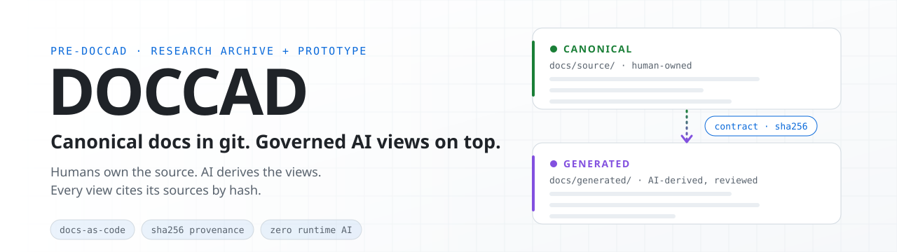
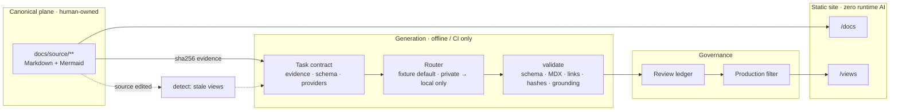

<div align="center">

<picture>
  <source media="(prefers-color-scheme: dark)" srcset=".github/assets/banner-dark.svg">
  <source media="(prefers-color-scheme: light)" srcset=".github/assets/banner-light.svg">
  
</picture>

<br>

[](https://github.com/w7-mgfcode/doCCAD_pre/actions/workflows/ci.yml)
[](https://w7-mgfcode.github.io/doCCAD_pre/)
[](prototype/planning/PROGRESS.md)
[](prototype/package.json)
[](prototype/package.json)
[](prototype/.nvmrc)
[](prototype/requirements.txt)
<br>
[](LICENSE)
[](LICENSE-docs)
[](prototype/i18n/hu)

**[Live site](https://w7-mgfcode.github.io/doCCAD_pre/)** · **[Quick start](#-quick-start)** · **[How it works](#-how-it-works)** · **[What's proven](#-whats-proven-and-what-isnt)** · **[Roadmap](#-roadmap)** · **[Repository map](#-repository-map)**

</div>

---

**DOCCAD** is a GitHub-native, AI-augmented documentation system. People write and own the
documentation in a git repository. An AI layer then derives **governed views** from it: recruiter
summaries, interview prep and answers to specific questions. Each view records the hash of every
source it used, is checked against a contract, goes through review, and is published as a
static site.

This repository is **PRE-DOCCAD**. It holds the research and design archive that defined the system,
plus a **runnable local prototype** that demonstrates it end to end, with no API keys needed.

> [!IMPORTANT]
> This is a prototype. Generation uses a deterministic `fixture` provider by default, and the review
> state `approved-for-demo` is a **simulated** approval. It is never treated as human sign-off, and
> production builds refuse to publish anything that carries it, so on the
> [live site](https://w7-mgfcode.github.io/doCCAD_pre/) the generated views show a publication hold
> until a code owner approves them; run [`DEMO.md`](prototype/DEMO.md) locally to see them. See
> [`prototype/LIMITATIONS.md`](prototype/LIMITATIONS.md) for exactly what is verified and what is not.

## ✨ Highlights

- 🧱 **Two content planes**: canonical pages (`/docs`, written by people) and generated views
  (`/views`, derived by AI) live in separate Docusaurus plugins, and `validate` enforces the boundary.
- 🔗 **Provenance by hash**: every generated page records the `sha256` of the sources it used.
  Edit a source and `detect` names exactly which views are stale.
- 📜 **Task contracts**: each generation task declares the evidence it may use, its output schema
  and its provider chain, and validation checks the output against those declarations.
- 🔒 **Private stays local**: `privacy: private` routes only to a local model. If that fails, the run
  stops; it never falls back to a cloud provider.
- 🛡️ **Security gates**: blocks executable MDX, allowlists external links, scans context for secrets,
  and keeps private content out of builds.
- 🎯 **Grounding gate**: every citation must resolve to a source the page recorded, quoted spans must
  appear in it, and recruiter technology claims must be evidenced, checked before a page is written
  and again by `validate`.
- 🔌 **Live providers behind the default**: Anthropic, Gemini, OpenAI and local adapters with retry,
  fallback on transport errors, per-run token and call budgets, and explicit `--provider` selection.
  `fixture` stays the default, and the tests never leave `127.0.0.1`.
- 🌐 **Static and bilingual**: English and Hungarian, offline search, and no model calls at runtime.

## 🚀 Quick start

```bash
git clone https://github.com/w7-mgfcode/doCCAD_pre.git
cd doCCAD_pre/prototype
npm ci && pip install -r requirements.txt

npm run validate   # schemas, planes, provenance hashes, security gates
npm run test       # unittest suite
npm run build      # static site, en + hu
npm run serve      # → http://localhost:3000/doCCAD_pre/
```

Needs Node ≥ 24.14 and Python 3. Ask the toolchain a question with no keys and no network:

```bash
python3 scripts/generate_question.py --question "How does DOCCAD detect drift?" --audience developer
```

<details>
<summary><b>All commands</b> (run from <code>prototype/</code>)</summary>

| Command | Does |
| --- | --- |
| `npm run start` | Dev server with live reload (`-- --locale hu` for Hungarian) |
| `npm run build` | Static build, `en` + `hu` |
| `npm run typecheck` | `tsc` |
| `npm run validate` | Frontmatter schemas, plane separation, ID uniqueness, provenance hashes, links, MDX safety |
| `npm run detect` | Drift report. Always exits 0, so read the output. Rewrites `.docs-manifest.json` and `impact.json` |
| `npm run test` | `unittest` suite |
| `npm run build:production` | Holds back drafts and demo-approved views, then builds. Run `build:demo` afterwards to restore them |

The full guide, including the review CLI and regeneration, is in [`prototype/README.md`](prototype/README.md). A 10-minute
walkthrough for four reader roles is in [`prototype/DEMO.md`](prototype/DEMO.md).

</details>

## 🧭 How it works



| Route | What's there |
| --- | --- |
| `/docs` | 29 canonical pages: architecture, 9 ADRs, security, operations, validation |
| `/views/recruiter/…` | Recruiter view in 30-second, 2-minute and deep-dive modes, with links back to the evidence |
| `/views/interview/…` | Interview prep: concepts, tradeoffs, likely questions |
| `/views/questions/…` | Five answered questions, plus one honest `insufficient_evidence` page |
| `/workbench` · `/inspector` · `/explorer` | Question workbench, drift inspector, knowledge explorer |

## ✅ What's proven and what isn't

| | |
| --- | --- |
| **Verified by tests** | Plane separation, deterministic retrieval, hash drift and targeted regeneration, the review state machine, the production filter, private-routing hard-fail, MDX, link and secret gates, the grounding gate, prompt-injection fixtures, and provider retry, fallback, request shapes and budgets against loopback stub servers |
| **Simulated** | The `fixture` provider (not an LLM), `approved-for-demo` review, and the in-browser workbench |
| **Running on GitHub** | CI gate (`validate-and-build`) on every PR, Pages deployment with a smoke check, weekly drift check, Dependabot |
| **Run once by the owner** | Live Gemini generation (`gemini-3.1-flash-lite`, 2026-10-06): both contracts passed validation and the build locally, and one recruiter page passed in CI through `generate.yml` and the `generation` environment, pushed as a draft `docs-gen/*` branch ([`VALIDATION.md` §7](prototype/VALIDATION.md)) |
| **Not yet run** | Live Anthropic, OpenAI and local model calls (decision E5), automated browser and mobile checks, real approval of a generated view (workflow ready; waits on the owner creating the DOCCAD GitHub App, E8) |

The requirement-by-requirement record (REQ-001…016) is in [`prototype/LIMITATIONS.md`](prototype/LIMITATIONS.md#3-requirement-to-evidence-matrix).

## 🗺️ Roadmap

- [x] **Phase 0: baseline stabilization.** Validation gates, security gates, Hungarian UI and 75 tests ([progress log](prototype/planning/PROGRESS.md))
- [ ] **Phase 1: deployable and governed.**
  - [x] Infrastructure live: CI gate, GitHub Pages, CODEOWNERS, ruleset, approval record checked against GitHub
  - [ ] First real approval of a generated view, end to end (bot-PR workflow ready; waits on the DOCCAD GitHub App, E8)
- [ ] **Phase 2: live AI behind the fixture default.** ([handoff pack](docs/phase-2/README.md))
  - [x] Implemented and stub-tested: provider adapters, retry and fallback, structured output, budgets, grounding gate, injection fixtures, `generate.yml` provider input (PR #7)
  - [x] First live provider call: Gemini owner smoke test passed; its two findings fixed (PR #9)
  - [x] First live generation in CI: Gemini through `generate.yml` and the `generation` environment (2026-10-06, PR #11)
  - [x] Closeout: run usage report, absent visibility fails closed, adapter errors propagate, one tested dispatch script, unique `docs-gen/*` branch per run, read-only workflow permissions; 190 tests (P2-13…P2-20, PR #14, [handoff pack](docs/phase-2-closeout/README.md))
  - [ ] Remaining providers (decision E5)
- [ ] **Phase 3: beyond the prototype.** Scoped in [`docs/next-phase/`](docs/next-phase/README.md)

## 📁 Repository map

```text
doCCAD_pre/
├── prototype/                 runnable DOCCAD prototype
│   ├── docs/source/           canonical pages      → /docs
│   ├── docs/generated/        AI-derived views     → /views
│   ├── ai/  ai.config.yaml    provider router (fixture default)
│   ├── contracts/ schemas/ prompts/
│   ├── scripts/               validate · detect · generate · dispatch · grounding · review · build filter
│   ├── src/                   site components and pages
│   ├── tests/                 unittest suite + grounding golden set
│   └── planning/              concept, acceptance, progress
└── docs/
    ├── primary-inputs/        research + design archive (sections 00–12)
    ├── prototype-planning/    how the prototype prompt was derived
    ├── next-phase/            plan, acceptance and research for phases 0–3
    ├── phase-2/               handoff pack and record of the Phase 2 run
    └── phase-2-closeout/      handoff pack for the Phase 2 closeout (P2-13…P2-20)
```

The archive is **preserve-first**. The raw archive and the historical prompts are never edited; newer
artifacts supersede them instead. Start at [`docs/primary-inputs/README.md`](docs/primary-inputs/README.md).

## 🤝 Contributing

- Canonical pages are written by people.
- Generated pages are produced only by the scripts in `prototype/scripts/` and are never hand-edited.
- Before opening a PR, run `npm run validate && npm run test` and read the `npm run detect` output.
- Agent and contributor conventions are in [`AGENTS.md`](AGENTS.md).

## 📄 License

Code is under the [MIT License](LICENSE). Documentation, diagrams and research notes are under
[CC BY 4.0](LICENSE-docs). Third-party reference material in `docs/primary-inputs/10_EXTERNAL_ARTIFACTS/` is
excluded and keeps its original terms.
