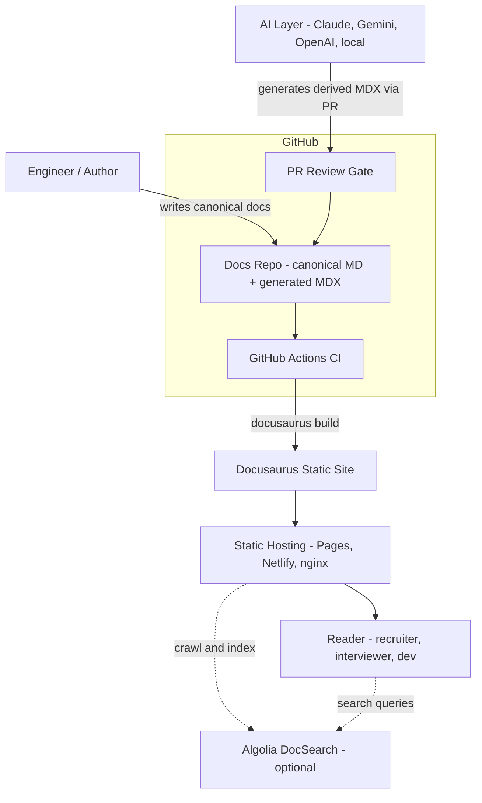
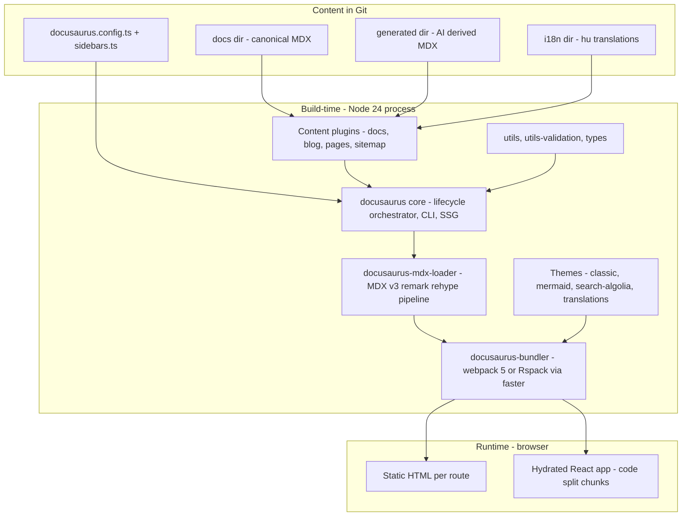
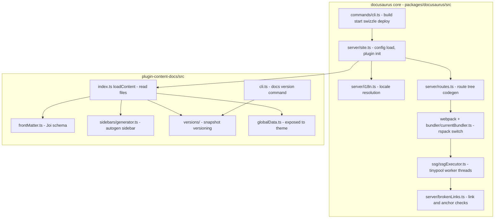
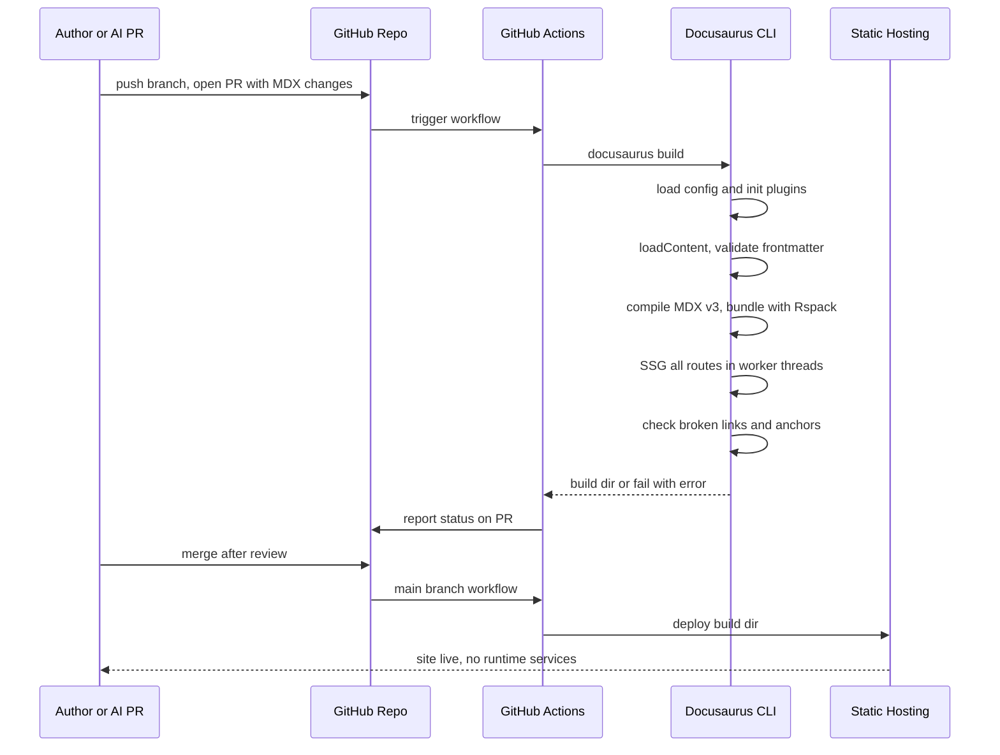
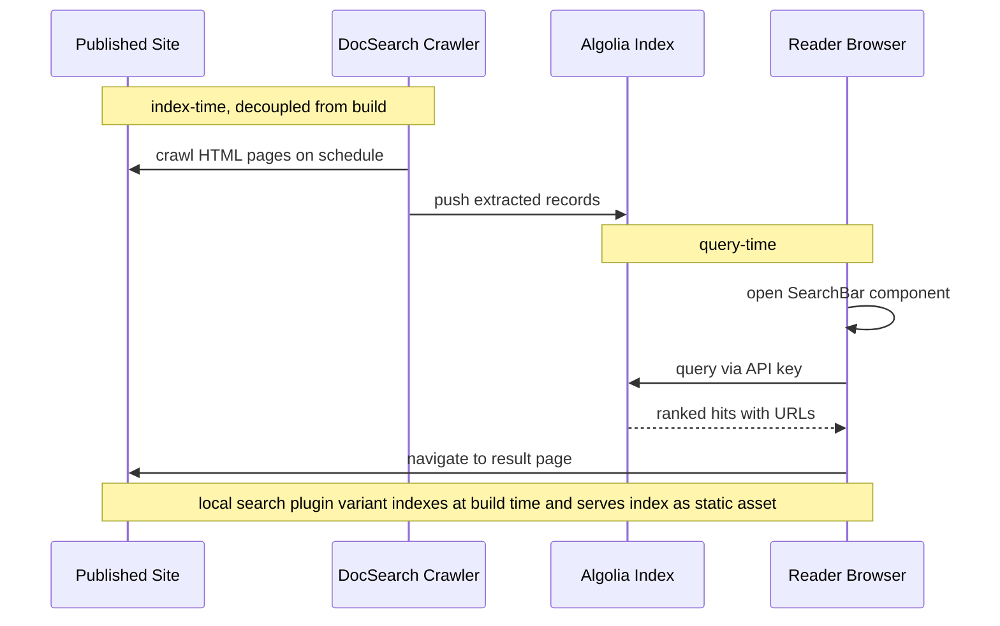

# Solution Architecture Document — Docusaurus

**Analyst scope:** Docusaurus v3.10.x (facebook/docusaurus) as the presentation/publishing foundation for a GitHub-native, AI-augmented documentation ecosystem.
**Evidence basis:** shallow clone of https://github.com/facebook/docusaurus at commit `3f483e80e326` (2026-08-07), inspected at `/tmp/docusaurus`; official site and npm registry. Collected 2026-08-12. All claims tagged per the evidence rules.

---

## Executive Summary

Docusaurus is Meta's MIT-licensed, React-based static documentation generator, currently at v3.10.2 (npm, 2026-07-10) with active weekly commit activity and ~65k GitHub stars [VERIFIED-OFFICIAL]. It is a pnpm/Lerna monorepo of ~38 packages: a core orchestrator (`packages/docusaurus`), content plugins (`docusaurus-plugin-content-docs/blog/pages`), an MDX v3 compilation pipeline (`docusaurus-mdx-loader`), a themable React presentation layer (`docusaurus-theme-classic`), and first-party plugins for sitemap, Algolia search, Mermaid, PWA, and redirects [VERIFIED-REPO].

For the target ecosystem — Git as canonical source, AI-derived views generated as files, static-first delivery, one-engineer operation — Docusaurus is an exceptionally strong fit. Everything is files: Markdown/MDX with Joi-validated frontmatter, sidebars as code, config as a single TypeScript file. The docs plugin is explicitly multi-instance (`options.id`, dogfooded in the project's own website config), which cleanly separates canonical docs from AI-generated derived views under distinct routes, sidebars, and even versioning policies [VERIFIED-REPO]. Mermaid is first-party (`@docusaurus/theme-mermaid`, mermaid ≥11.14). Build performance on medium corpora is a solved problem in 2026: the `@docusaurus/faster` package swaps webpack for Rspack with persistent caching, SWC, and Lightning CSS, plus SSG worker threads — all opt-in via `future.faster` flags and slated to become default in v4 [VERIFIED-REPO]. i18n is filesystem-based and supports EN/HU; Hungarian theme translations exist but are only ~50% complete (82/163 keys in `theme-common.json`), requiring a small one-time contribution [VERIFIED-REPO]. Output is plain static HTML/JS/CSS — trivially self-hosted; no AI or server runtime is ever needed to serve content.

Main honest caveats: it is a React SPA-hydration architecture (heavier client JS than pure-HTML SSGs), the dependency surface is large, Node ≥24.14 is required, local search needs a community plugin (Algolia DocSearch is the first-party path), and MDX v3 is stricter than CommonMark, which matters for AI-generated content and must be handled by CI compile checks. Weighted score: **88.6/100** — recommend as the primary platform candidate.

---

## HU: Vezetői összefoglaló

A Docusaurus a Meta nyílt forráskódú, MIT licencű, React-alapú statikus dokumentációgenerátora, jelenleg a 3.10.2-es verziónál tart (2026. július), aktív fejlesztéssel és körülbelül 65 ezer GitHub-csillaggal. A rendszer teljes egészében fájlalapú: Markdown/MDX tartalom, validált frontmatter metaadatok, kódként kezelt oldalsávok és egyetlen TypeScript konfigurációs fájl — ezért természetes módon illeszkedik a GitHub-központú, „docs-as-code" munkafolyamathoz, ahol a Git az egyetlen igazságforrás.

A célrendszer szempontjából kiemelt erősség, hogy a docs bővítmény több példányban futtatható, így a kanonikus dokumentáció és az MI által generált származtatott nézetek (toborzói oldalak, interjú-felkészítő szekciók) tisztán elválaszthatók külön útvonalakon és oldalsávokon. A Mermaid diagramtámogatás első osztályú, hivatalos csomaggal. A build-teljesítmény a 2026-os állapotban erős: az opcionális „faster" csomag Rspack fordítót, perzisztens gyorsítótárat és párhuzamos SSG-t ad. A kimenet tisztán statikus, bármilyen webszerveren üzemeltethető, MI-szolgáltatás nem szükséges a kiszolgáláshoz.

Gyengeségek: a kliensoldali React hidratáció miatt nehezebb JavaScript-teher, nagy npm-függőségi felület, Node 24 követelmény, valamint a magyar felületi fordítások hiányosak (kb. 50%), ezt egyszeri kiegészítéssel pótolni kell. Összesített súlyozott pontszám: 88,6/100 — a platform elsődleges jelöltként ajánlott.

---

## Business & Functional Fit

Docusaurus targets exactly the "developer documentation website from Markdown in Git" problem class. It is not a CMS, not a SaaS, and has no server component: business fit for a GitHub-native ecosystem is therefore structural, not incidental. The project is operated by Meta Open Source with a dedicated lead maintainer and a public roadmap toward v4 (`FutureV4Config` flags in `packages/docusaurus-types/src/config.d.ts` — `fasterByDefault`, `useCssCascadeLayers`, `mdx1CompatDisabledByDefault`) [VERIFIED-REPO]. Adoption risk is low: the GitHub page reports "Used by 12.2k" public projects [VERIFIED-OFFICIAL], and migration away is mitigated by content remaining CommonMark-compatible MDX plus frontmatter.

Functional fit highlights for this ecosystem:

- **Canonical content = files in Git.** No database, no content API required; `loadContent()` in every content plugin reads from the filesystem (`packages/docusaurus-plugin-content-docs/src/index.ts`) [VERIFIED-REPO].
- **Derived AI content = more files in Git.** A second docs-plugin instance (e.g. `id: 'interview-prep'`) pointed at a `generated/` directory ships derived content through the identical build/validation pipeline. Multi-instance is dogfooded at `website/docusaurus.config.ts:369` (`id: 'community'`) [VERIFIED-REPO].
- **Static-first delivery.** SSG emits one HTML file per route (`packages/docusaurus/src/ssg/`) [VERIFIED-REPO]; AI is never on the serving path.
- **One-engineer operability.** One config file, one CLI (`docusaurus build/start/serve/deploy/swizzle/write-translations`, `packages/docusaurus/src/commands/cli.ts`) [VERIFIED-REPO].

## Functional Requirements

How Docusaurus meets the ecosystem's functional requirements:

1. **Markdown + MDX authoring** — MDX v3 (`@mdx-js/mdx ^3.1.1` in `packages/docusaurus-mdx-loader/package.json`), with a curated remark pipeline (headings, TOC, admonitions, link/image resolution, Mermaid) in `packages/docusaurus-mdx-loader/src/processor.ts` [VERIFIED-REPO]. `.md` vs `.mdx` format detection with configurable `format` (`format.ts`) [VERIFIED-REPO].
2. **Frontmatter metadata** — Joi-validated schema per content type; docs support `id`, `slug`, `title`, `description`, `tags`, `sidebar_position`, `sidebar_label`, `sidebar_custom_props`, `draft`/`unlisted` (via `ContentVisibilitySchema`), `last_update`, plus `.unknown()` passthrough for custom keys (e.g. `ai_generated: true`, `source_hash`) (`packages/docusaurus-plugin-content-docs/src/frontMatter.ts`) [VERIFIED-REPO].
3. **Custom components (InterviewPrep)** — React components usable in MDX either by import or registered globally via the `MDXComponents` theme mapping (`packages/docusaurus-theme-classic/src/theme/MDXComponents/index.tsx`); generated `.mdx` then needs zero import boilerplate [VERIFIED-REPO].
4. **Diagrams-as-code** — `@docusaurus/theme-mermaid` renders ```` ```mermaid ```` fences client-side; requires `mermaid >=11.14.0`, optional ELK layouts via `@mermaid-js/layout-elk` peer (`packages/docusaurus-theme-mermaid/package.json`) [VERIFIED-REPO].
5. **Navigation/IA** — autogenerated or explicit sidebars (`packages/docusaurus-plugin-content-docs/src/sidebars/generator.ts`), category index pages, tags, breadcrumbs [VERIFIED-REPO].
6. **Versioning** — snapshot-based (`docs:version` CLI registered per plugin instance, `src/index.ts` lines ~182-191; `versions/` module) [VERIFIED-REPO]. Optional for this ecosystem.
7. **Search** — first-party Algolia DocSearch theme (`packages/docusaurus-theme-search-algolia`); local search only via community plugins [VERIFIED-REPO].
8. **i18n EN/HU** — built-in locale model; see Localization section.
9. **Link integrity** — build-time broken link/anchor detection (`packages/docusaurus/src/server/brokenLinks.ts`; `onBrokenLinks`/`onBrokenAnchors`/`onBrokenMarkdownLinks` severities in `config.d.ts`) [VERIFIED-REPO].
10. **SEO** — sitemap plugin, per-page meta/head, hreflang alternates in `theme-classic/src/theme/SiteMetadata/index.tsx` [VERIFIED-REPO].

## Non-functional Requirements

- **Performance (build):** medium corpora (hundreds to low thousands of pages) build in minutes; the `future.faster` flag set (`swcJsLoader`, `swcJsMinimizer`, `lightningCssMinimizer`, `mdxCrossCompilerCache`, `rspackBundler`, `rspackPersistentCache`, `ssgWorkerThreads`, `gitEagerVcs` — `packages/docusaurus-types/src/config.d.ts`) materially reduces cold and warm build times; SSG parallelizes via tinypool worker threads (`packages/docusaurus/src/ssg/ssgExecutor.ts`) [VERIFIED-REPO]. The repo runs a `build-perf.yml` CI benchmark workflow [VERIFIED-REPO]. Absolute numbers for the target corpus: [UNKNOWN] until prototyped.
- **Performance (runtime):** static files + hydrated React SPA; route-based code splitting via `react-loadable` fork [VERIFIED-REPO]. Heavier JS payload than no-JS SSGs [OBSERVED].
- **Availability:** equal to the hosting platform (GitHub Pages/Netlify/any nginx); no runtime dependencies [VERIFIED-REPO by output model].
- **Scalability:** static CDN scaling; build memory is the practical ceiling for very large sites (worker recycling logic notes memory limits, `ssgExecutor.ts`) [VERIFIED-REPO].
- **Security:** no server code in production; attack surface = build toolchain + npm supply chain (see Security Architecture).
- **Maintainability:** Node `>=24.14` and React `^19.2.5` required (`packages/docusaurus/package.json`) [VERIFIED-REPO] — pinning discipline needed in CI.
- **Portability:** content is MDX + frontmatter; config is one file; exit cost is moderate (MDX-specific JSX and admonition syntax needs transformation on exit) [INFERRED].

## C4 L1 — System Context



## C4 L2 — Containers

Grounded in the monorepo package layout (`/tmp/docusaurus/packages/`) [VERIFIED-REPO].



## C4 L3 — Components

Component view of the two most decision-relevant containers: the core build engine and the docs content plugin [VERIFIED-REPO, paths cited].



## Author → Build → Publish sequence



## Search/indexing sequence

Algolia DocSearch variant (first-party path, `packages/docusaurus-theme-search-algolia`) [VERIFIED-REPO].



## Deployment & Infrastructure

The production artifact is a directory of static files (`build/`) [VERIFIED-REPO — `docusaurus build` writes static output; `serve` command serves it via `serve-handler`]. Deployment options, all validated by the project's own tooling:

- **GitHub Pages** — first-party `docusaurus deploy` command (`packages/docusaurus/src/commands/deploy.ts`) [VERIFIED-REPO].
- **Netlify/Vercel** — used by the project itself (Netlify badges and deploy-preview scripts in root `package.json`) [VERIFIED-REPO].
- **Self-hosted nginx/Caddy/S3+CDN** — nothing beyond static file serving is required [VERIFIED-REPO by output model]. A `hash` router mode exists for serverless/offline distribution (`experimental_router` in `config.d.ts`) [VERIFIED-REPO].

Build infrastructure: any CI with Node ≥24.14 and ~2-4 GB RAM for medium sites ([INFERRED] from worker memory-recycling code and community practice; exact figure to be measured). No databases, no runtime secrets. The only external runtime dependency is optional Algolia.

## Security Architecture

- **Serving plane:** static files only — no injection surface, no auth, no server-side code [VERIFIED-REPO by architecture]. Security controls (TLS, headers, CSP) live in the hosting layer, not Docusaurus.
- **Build plane:** the real surface. Large npm dependency tree (webpack/rspack, swc, mermaid, react ecosystem) [VERIFIED-REPO — lockfile `pnpm-lock.yaml`]. Mitigate with lockfile pinning, provenance checks, and Dependabot; the upstream repo itself runs `codeql-analysis.yml`, `dependency-review.yml`, and `security-supply-chain.yml` workflows [VERIFIED-REPO — `.github/workflows/`].
- **Content plane:** MDX is executable — JSX in a doc runs at build and in the browser. AI-generated MDX therefore must be treated as code and pass PR review; this aligns with the ecosystem's validation gate but must be enforced (no auto-merge of generated MDX). [INFERRED from MDX semantics, VERIFIED-REPO that MDX compiles to React components.]
- **Project security policy:** no `SECURITY.md` in the repo root [VERIFIED-REPO — absent from clone]; Meta handles reports via its Whitehat/bug bounty program [VERIFIED-OFFICIAL — referenced in Meta OSS docs; specifics not re-verified: MEDIUM confidence].

## Threat Model

Top threats for this platform in the target ecosystem (STRIDE-lite):

1. **Malicious/compromised npm dependency at build time** → supply-chain code execution in CI. Mitigation: pinned lockfile, `--frozen-lockfile`, minimal CI token scopes, dependency review gate.
2. **AI-generated MDX containing active JSX/script-like content** → stored XSS-equivalent shipped to readers. Mitigation: PR review gate, MDX lint/AST policy check (deny raw `<script>`, unknown JSX components), component allow-list via `MDXComponents` mapping.
3. **Prompt-injected content in canonical docs poisoning derived views** → wrong/harmful derived pages. Mitigation: validation stage + human PR review of derived output (ecosystem-level control).
4. **CI secret leakage (Algolia admin key, deploy tokens)** → index tampering/defacement. Mitigation: scoped keys (search-only key in client; crawler key server-side), environment protection rules.
5. **Broken deploy of localized site (partial locale build)** → HU or EN 404s. Mitigation: build all locales in one pipeline; smoke-test both locale roots post-deploy.
6. **Typosquatting of community plugins (local search)** → build-time compromise. Mitigation: vet exact package names, pin versions, prefer first-party packages.

## Operational Model

Designed for one engineer. Steady-state operations are: merge PRs, let CI rebuild, occasionally bump dependencies. There are no servers to patch, no databases to back up (Git is the backup for content; Algolia index is regenerable). Upgrades follow the minor-release train (3.7 → 3.8 → 3.9 → 3.10 over 2025-2026, roughly one minor per 4-6 months per npm timestamps [VERIFIED-OFFICIAL]); breaking changes are gated behind `future` flags so v4 adoption can be rehearsed incrementally by enabling `future.v4` today (`config.d.ts`) [VERIFIED-REPO]. Failure modes are build-time and loud: frontmatter validation errors, MDX compile errors, broken-link failures — all fail the PR, not production. See the runbook for procedures.

## Extensibility / Plugin Architecture

The plugin lifecycle is a well-defined TypeScript contract (`packages/docusaurus-types/src/plugin.d.ts`) [VERIFIED-REPO]: `loadContent()` → `contentLoaded({content, actions})` (create routes, set global data) → `allContentLoaded()` (cross-plugin awareness) → `postBuild()`; plus `configureWebpack()` (works for both webpack and Rspack via `ConfigureWebpackUtils`), `getThemePath()`, `getPathsToWatch()`, `extendCli()`, `injectHtmlTags()`, `translateContent()`. Plugins are plain functions declarable inline in `docusaurus.config.ts` — the project's own site defines an inline plugin and a local changelog plugin this way (`website/docusaurus.config.ts` ~line 304 and `./src/plugins/changelog`) [VERIFIED-REPO]. Theme extensibility is via **swizzling** (`docusaurus swizzle` ejects or wraps any of the 69 theme-classic components, `packages/docusaurus-theme-classic/src/theme/`) [VERIFIED-REPO]. For this ecosystem, a custom lifecycle plugin is the natural integration point for AI-metadata surfacing (e.g., reading `ai_generated` frontmatter into global data and rendering provenance banners via a wrapped `DocItem`).

## Developer Experience

Strong: `create-docusaurus` scaffolding, TypeScript config with full types, hot-reload dev server, descriptive build errors, `docusaurus-logger` for consistent CLI output, and a debug plugin (`docusaurus-plugin-debug`) exposing site metadata [VERIFIED-REPO]. Friction points: Node ≥24.14 requirement is aggressive [VERIFIED-REPO — `engines`]; MDX v3 strictness (`{`, `<` are syntax) trips authors migrating from plain Markdown — partially mitigated by `mdx1Compat` options and the `format: 'detect'` handling in `docusaurus-mdx-loader/src/format.ts` [VERIFIED-REPO]; swizzled components can break on theme upgrades (the project mitigates with a swizzle CI test, `tests-swizzle.yml`) [VERIFIED-REPO].

## Writer / Content UX

Writers work in any editor on `.md`/`.mdx` files; no proprietary tooling. Admonitions (`:::note`), tabs, code blocks with highlighting, and TOC are theme-provided. Frontmatter is validated with helpful errors, and unknown keys are permitted (`.unknown()` in `frontMatter.ts`) — important for the ecosystem's custom metadata [VERIFIED-REPO]. `draft`/`unlisted` visibility states support staged publication [VERIFIED-REPO — `ContentVisibilitySchema`]. There is no WYSIWYG or web editor: non-technical contributors must use GitHub's web editor or a PR-based flow [OBSERVED]. For a single-engineer ecosystem this is acceptable; for recruiter-facing stakeholders, published output is read-only anyway.

## Localization

Filesystem-based i18n, no SaaS required [VERIFIED-REPO — `packages/docusaurus/src/server/i18n.ts`, `packages/docusaurus-utils/src/i18nUtils.ts` `getPluginI18nPath`]. Model: default locale content lives in `docs/`; translations live under `i18n/<locale>/docusaurus-plugin-content-docs/current/...` as full file copies; theme UI strings come from `@docusaurus/theme-translations` with `docusaurus write-translations` extracting overridable JSON. **Hungarian status:** `locales/hu/` exists but covers only part of the surface — `theme-common.json` has 82 of 163 base keys translated, and no `hu` file exists for some bundles [VERIFIED-REPO — `packages/docusaurus-theme-translations/locales/hu/`]. Missing strings fall back to English; the gap is closable locally via `write-translations` output without waiting for upstream. Each locale is built as a separate site variant (per-locale builds; `build --locale en` script visible in root `package.json`) [VERIFIED-REPO], roughly doubling build time for EN+HU [INFERRED]. Locale dropdown and hreflang alternates are theme-built-in (`LocaleDropdownNavbarItem`, `SiteMetadata`) [VERIFIED-REPO]. Translation content duplication (copy per locale) is the main operational cost; for a two-locale site it is manageable, and AI-assisted translation fits naturally as another generate-into-files pipeline.

## SEO

Full static HTML per route (crawlers need no JS for content, though hydration mismatch bugs are possible) [VERIFIED-REPO — SSG model]. First-party `@docusaurus/plugin-sitemap` generates `sitemap.xml` with lastmod support (`createSitemapItem.ts`, uses VCS last-update info) [VERIFIED-REPO]. Per-page `<head>` control via frontmatter (`title`, `description`, `keywords`, `image`) and `<Head>` in MDX [VERIFIED-REPO — `frontMatter.ts`, `MDXComponents` maps `Head`]. hreflang alternate links emitted for locales [VERIFIED-REPO — `SiteMetadata/index.tsx`]. Canonical URLs, trailing-slash policy, and broken-link enforcement (`onBrokenLinks: 'throw'`) protect SEO hygiene at build time [VERIFIED-REPO]. Lighthouse CI runs upstream (`lighthouse-report.yml`) [VERIFIED-REPO].

## Search

Two viable paths:

1. **Algolia DocSearch (first-party):** `@docusaurus/theme-search-algolia` ships SearchBar/SearchPage components and DocSearch v3/v4 support, including a conditional "Ask AI" DocSearch integration visible in the project's own config (`website/docusaurus.config.ts` ~line 676-680) [VERIFIED-REPO]. Free for open-source docs via the DocSearch program; index lives in Algolia's SaaS (external dependency, crawler-based, index lag vs deploys) [VERIFIED-OFFICIAL].
2. **Local search (community):** no first-party offline search exists in the repo [VERIFIED-REPO — absence]; community plugins (e.g. `@easyops-cn/docusaurus-search-local`, `docusaurus-lunr-search`) build a static index at build time [VERIFIED-OFFICIAL — listed in official docs' search page; exact plugin quality varies: MEDIUM confidence]. This path keeps the ecosystem fully self-contained and provider-independent.

Recommendation for the target ecosystem: start with local search (zero external dependency, static-first purity), keep Algolia as an upgrade path.

## GitHub Integration

Excellent and native: content, config, sidebars, translations, and theme customizations are all repo files. `editUrl` support generates "Edit this page" links to GitHub (`EditThisPage` theme component) [VERIFIED-REPO]. Git history drives `last_update` metadata, with a 2026-era pluggable VCS abstraction (`experimental_vcs`, presets `git-eager`/`git-ad-hoc`, `gitEagerVcs` faster flag) that pre-reads the repo for fast lastUpdate resolution — directly relevant to build performance on CI shallow clones (`packages/docusaurus-types/src/config.d.ts`, `packages/docusaurus-utils/src/vcs/`) [VERIFIED-REPO]. `docusaurus deploy` targets GitHub Pages natively [VERIFIED-REPO]. The upstream project's own CI is GitHub Actions with 19 workflows — a template library for adopters [VERIFIED-REPO — `.github/workflows/`].

## Mermaid Support

First-party via `@docusaurus/theme-mermaid`: a remark plugin converts ```` ```mermaid ```` fences to a `<Mermaid>` component (`packages/docusaurus-mdx-loader/src/remark/mermaid`), rendered client-side with lazy-loaded mermaid ≥11.14.0; dark/light theme aware (`validateThemeConfig.ts` themeConfig.mermaid options); optional ELK layout engine via `@mermaid-js/layout-elk` peer dependency [VERIFIED-REPO]. Caveat: rendering is client-side JavaScript — diagrams are not server-rendered into static SVG, so they do not appear for no-JS crawlers/readers and add mermaid's bundle weight on pages using diagrams [VERIFIED-REPO — `client/loadMermaid.ts` dynamic import; INFERRED consequence]. For Mermaid-as-code ecosystems this is the best-integrated option among mainstream doc platforms.

## AI Integration Suitability

Docusaurus has no built-in AI features (the only AI touchpoint is the optional DocSearch "Ask AI" search UI) [VERIFIED-REPO]. For this ecosystem that is the correct shape: the AI layer lives outside the platform and emits files. Suitability facts:

- Generated `.mdx` + frontmatter is indistinguishable from authored content to the build; unknown frontmatter keys pass validation, enabling provenance metadata (`ai_generated`, `source_ref`, `model`, `generated_at`) [VERIFIED-REPO — `.unknown()` schema].
- The build is deterministic and CI-runnable — the validation gate for AI output is simply `docusaurus build` (MDX compile + frontmatter + broken links) plus custom lint [VERIFIED-REPO].
- Global `MDXComponents` registration means generated files can use `<InterviewPrep .../>` without imports, keeping generated MDX simple and template-safe [VERIFIED-REPO].
- Static output means published docs are AI-independent at serve time — hard ecosystem requirement met by construction.
- Risk: MDX v3 strictness means LLM output with stray `{` or `<` breaks compilation; mitigation is generator-side escaping plus CI compile check [INFERRED from MDX semantics].

## Automated Content Generation Suitability

Programmatic generation of `.mdx` files is a first-class pattern: files dropped into a watched directory are picked up (`getPathsToWatch()`), sidebars can be autogenerated from the directory structure with `_category_.json` files (`sidebars/generator.ts`) [VERIFIED-REPO], and `sidebar_position`/`slug` frontmatter give generators deterministic IA control [VERIFIED-REPO]. Separation of canonical vs generated content maps to two (or more) docs-plugin instances with distinct `path`, `routeBasePath`, and sidebars — proven in production by the upstream website (`community` instance) [VERIFIED-REPO]. Incremental regeneration is the ecosystem's job (regenerate only changed files); Docusaurus contributes warm-build caching (`rspackPersistentCache`, `mdxCrossCompilerCache`) rather than true incremental SSG — full rebuilds are still the model, acceptable at medium corpus scale [VERIFIED-REPO flags; INFERRED assessment].

## API / Automation Surface

- **CLI:** `build` (with `--locale`, `--out-dir`, `--dev`), `start`, `serve`, `deploy`, `clear`, `swizzle`, `write-translations`, `write-heading-ids`, plus per-instance `docs:version:<id>` (`packages/docusaurus/src/commands/cli.ts`; `plugin-content-docs/src/cli.ts`) [VERIFIED-REPO].
- **Node API:** plugins/presets are Node modules with typed lifecycle contracts; site config is executable TypeScript enabling env-driven config [VERIFIED-REPO].
- **No REST/content API and no headless mode** — automation is file- and CLI-based, which is exactly the ecosystem's model [VERIFIED-REPO — absence].
- **Global data:** plugins expose structured data to the client via `setGlobalData`/`globalData.ts` — usable to build custom index pages over generated content [VERIFIED-REPO].

## Community / Maintenance

~65.1k stars, 9.9k forks, 293 open issues, 106 open PRs (2026-08-12) [VERIFIED-OFFICIAL — GitHub page]. Last commit 2026-08-07; dependency bumps flowing continuously [VERIFIED-REPO — git log]. Release cadence: 3.7.0 (2025-01), 3.8.0 (2025-05), 3.9.0 (2025-09), 3.10.0 (2026-04), 3.10.2 (2026-07) [VERIFIED-OFFICIAL — npm registry timestamps]. Meta-sponsored with an identifiable lead maintainer, Open Collective funding, Discord community, and an unusually rigorous CI battery (visual regression via Argos, Windows tests, E2E, perf) [VERIFIED-REPO — workflows; VERIFIED-OFFICIAL — README badges]. Maintenance assessment: **healthy/active**, with a clear v4 path already testable behind flags. Bus-factor concentration on the lead maintainer is a real but industry-typical risk [OBSERVED].

## Licensing

Code: MIT (`LICENSE`) [VERIFIED-REPO]. Documentation content of the project: CC-BY-4.0 (`LICENSE-docs`) [VERIFIED-REPO]. No copyleft obligations, no dual-licensing traps, no CLA barrier for usage. Fully compatible with commercial and personal use of the target ecosystem.

## Cost Drivers

- Software: $0 (MIT).
- Hosting: $0 on GitHub Pages/Netlify free tier; trivial static hosting cost otherwise [VERIFIED-OFFICIAL].
- Search: $0 with local search plugin; Algolia DocSearch free for eligible docs sites, otherwise paid Algolia plan [VERIFIED-OFFICIAL — program terms not re-verified in detail: MEDIUM confidence].
- CI minutes: main variable cost — full site rebuild (×2 locales) per merge; mitigated by `faster` flags and persistent cache.
- Engineer time: dependency upgrades (monthly), Node major upgrades, occasional swizzle maintenance — the dominant real cost [INFERRED].

## Top 8 Risks + Mitigations

| # | Risk | Likelihood | Impact | Mitigation |
|---|------|-----------|--------|------------|
| 1 | MDX v3 strictness breaks AI-generated files at build | High | Low-Med | CI compile gate on PRs; generator-side escaping; prefer `.md` + `format` config for pure-Markdown outputs |
| 2 | npm supply-chain compromise in build toolchain | Med | High | Frozen lockfile, Dependabot + review, scoped CI tokens, provenance checks |
| 3 | Swizzled components break on minor upgrades | Med | Med | Prefer "wrap" over "eject"; keep swizzle inventory small; test upgrades in branch |
| 4 | Node ≥24.14 / React 19 churn outpaces maintenance capacity | Med | Med | Pin Node in CI via `.nvmrc`; upgrade on minor-release train only |
| 5 | Hungarian UI translation gaps (≈50% of theme-common) | High | Low | One-time local `write-translations` + fill `i18n/hu` JSON; optionally upstream |
| 6 | Client-side Mermaid rendering: no-JS readers see code, not diagrams | Low | Low | Accept, or pre-render critical diagrams to SVG in generation pipeline |
| 7 | Algolia dependency (if chosen) reintroduces SaaS coupling | Med | Low | Default to local search plugin; Algolia as optional enhancement |
| 8 | v4 migration effort accumulates if future flags ignored | Med | Med | Enable `future.v4` + `future.faster` now; track breaking-change labels in changelog |

## Migration Plan

Adopting from the current state (canonical Markdown already in Git):

1. **Week 1 — Skeleton:** `create-docusaurus` scaffold; move canonical docs under `docs/`; set `onBrokenLinks: 'throw'`, `future: {v4: true, faster: true}`; CI build on PR.
2. **Week 1-2 — IA + components:** sidebars (autogenerated + `_category_.json`); implement `InterviewPrep` React component; register in `MDXComponents` via swizzle-wrap.
3. **Week 2 — Generated content lane:** second docs instance (`id: 'generated'`, `path: 'generated'`, `routeBasePath: 'views'`); AI pipeline writes MDX + provenance frontmatter; PR gate with MDX lint.
4. **Week 3 — i18n:** enable `locales: ['en', 'hu']`; `write-translations`; fill HU theme strings; translate priority pages under `i18n/hu/`.
5. **Week 3-4 — Search + SEO + deploy:** local search plugin, sitemap defaults, hreflang verification, GitHub Pages or self-hosted nginx deploy, post-deploy smoke tests.
Rollback: content is portable Markdown/MDX; abandoning Docusaurus loses only theme/config work, not content.

## Prioritized Recommendations

1. **Adopt Docusaurus 3.10.x with `future.v4` and `future.faster` (Rspack + persistent cache + SSG workers) enabled from day one** — buys v4 readiness and best build times (`config.d.ts` flags, dogfooded in `website/docusaurus.config.ts`).
2. **Use two docs-plugin instances** — `docs` (canonical) and `generated` (AI-derived) with separate `routeBasePath` and sidebars; never mix directories.
3. **Register `InterviewPrep` (and future components) globally in `MDXComponents`** so generated MDX needs no imports.
4. **Make `docusaurus build` the AI-output validation gate** in PR CI: MDX compile + frontmatter validation + `onBrokenLinks/onBrokenAnchors: 'throw'`.
5. **Standardize provenance frontmatter** (`ai_generated`, `source_ref`, `model`, `generated_at`) and render a provenance banner via a wrapped `DocItem`.
6. **Choose local search first** (community plugin, pinned version); keep Algolia DocSearch as an opt-in upgrade to avoid SaaS coupling.
7. **Close the HU translation gap once** via `write-translations` + local `i18n/hu` JSON; consider upstreaming to `docusaurus-theme-translations`.
8. **Constrain swizzling to "wrap" mode** and keep an inventory; re-run builds on every Docusaurus minor before merging the bump.
9. **Pin Node 24.x in CI and `.nvmrc`**; upgrade Docusaurus only on minors, reading the changelog's breaking-change labels.
10. **Pre-render business-critical Mermaid diagrams to SVG** in the generation pipeline if no-JS fidelity ever matters (recruiter PDFs, print).

## Architectural Verdict

**Adopt (primary candidate).** Docusaurus is the strongest mainstream match for a GitHub-native, static-first, AI-augmented documentation ecosystem run by one engineer: file-based everything, first-party Mermaid, multi-instance content separation, a typed plugin lifecycle for custom needs, credible 2026 build performance via Rspack, and zero runtime dependencies. Its weaknesses — React-heavy client, npm surface area, MDX strictness, partial HU translations — are all manageable with the mitigations above and none are architectural blockers. Weighted score 88.6/100.

## Target-System Fit Assessment

**Git/GitHub as canonical source of truth.** Perfect structural fit: Docusaurus has no content store other than the repo; docs, sidebars, config, translations, and theme overrides are all files. Edit links, git-derived lastUpdate metadata, and the GitHub Pages deploy command make GitHub the operational center rather than an integration [VERIFIED-REPO].

**AI layer producing derived views.** The platform is agnostic and file-driven, which is exactly what a provider-abstracted AI layer needs: generators emit MDX + frontmatter; nothing in Docusaurus binds to any AI vendor. The DocSearch "Ask AI" option is strictly optional UI. Provider independence is preserved by construction [VERIFIED-REPO].

**Separation of canonical vs derived content with validation and PR review.** Multi-instance docs plugins give hard separation (different directories, routes, sidebars, even versioning), proven in the upstream website itself. The build is a strong deterministic validation gate (frontmatter schema, MDX compile, broken links/anchors), and everything flows through normal GitHub PRs [VERIFIED-REPO].

**Incremental regeneration.** Docusaurus does full rebuilds, but with persistent Rspack caching and MDX cross-compiler caching warm builds are fast; at medium corpus scale this satisfies the requirement operationally even though true incremental SSG is absent [VERIFIED-REPO flags; INFERRED adequacy — validate with a corpus-scale prototype].

**AI not required to serve docs.** Met absolutely: output is static HTML/CSS/JS; readers and crawlers need no AI, no server, no database [VERIFIED-REPO].

**One capable engineer, anti-overengineering.** The steady state is "merge PRs, CI rebuilds, static hosting serves." The complexity budget is spent once at setup (config, components, i18n). The main recurring cost is dependency hygiene. The platform is more complex internally than minimal SSGs, but the operator-facing surface is small; with swizzling discipline it stays within a one-engineer envelope [INFERRED, supported by repo evidence throughout].

**Custom InterviewPrep component, Mermaid, EN/HU, self-hosting.** All four are directly supported: global MDX component registration; first-party Mermaid theme; built-in filesystem i18n with existing (partial) HU translations; trivially static self-hosting. The only real gap found is the ~50% HU theme-string coverage — hours, not weeks, to close [VERIFIED-REPO].
