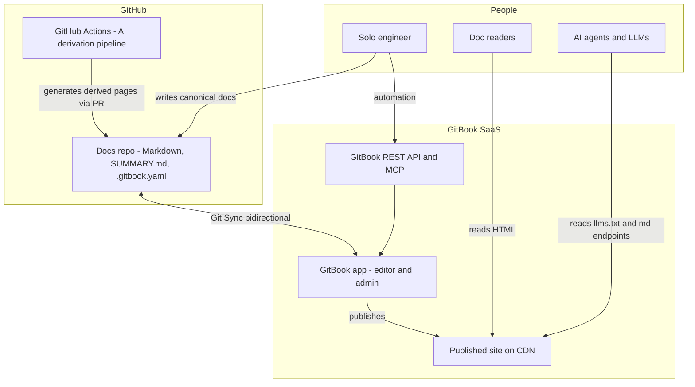
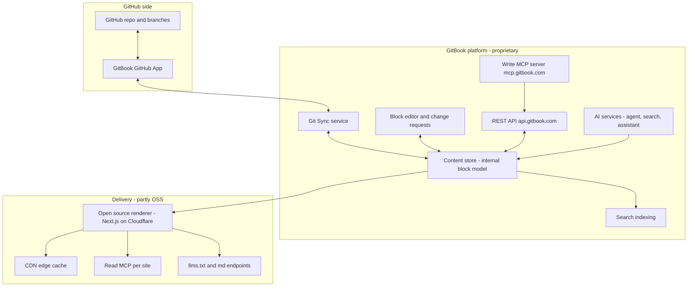
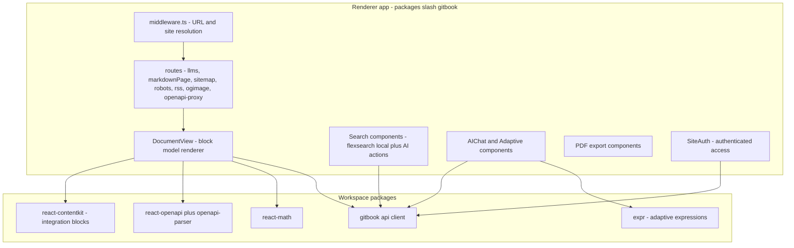
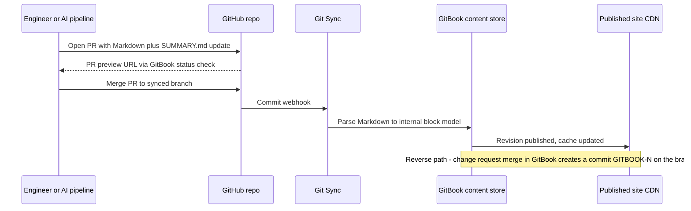
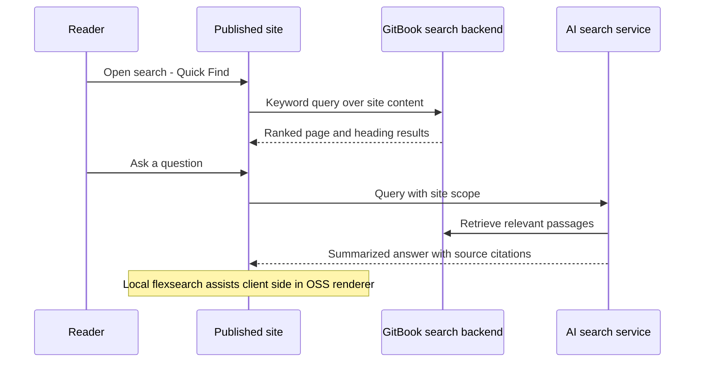

# Solution Architecture Document — GitBook (current SaaS platform)

Analyst: Principal Solution Architect (GitBook track) · Date: 2026-08-12
Platform: GitBook — https://www.gitbook.com/ · Docs: https://gitbook.com/docs
Scope guard: GitBook's current platform is **proprietary SaaS**. Everything below is derived from
current official documentation `[VERIFIED-OFFICIAL]`, inspection of the genuinely current open-source
renderer repository `github.com/GitbookIO/gitbook` `[VERIFIED-REPO]`, and observed public interfaces
`[OBSERVED]`. The legacy `gitbook`/`gitbook-cli` Node.js toolchain is `[HISTORICAL]` (deprecated; the
README of the current repo itself carries a "Legacy GitBook (deprecated)" section `[VERIFIED-REPO]`)
and is **never** presented here as current architecture. Backend internals are a black box.

---

## Executive Summary

GitBook today is a closed-SaaS documentation platform with an unusually honest docs-as-code story:
its **Git Sync** feature bidirectionally mirrors a GitBook "section" with a GitHub or GitLab branch —
Markdown files plus `SUMMARY.md` plus `.gitbook.yaml` in the repo, block-based WYSIWYG editing in the
app, with each merged GitBook change request becoming a commit and each repo commit becoming a GitBook
history entry `[VERIFIED-OFFICIAL]`. The critical architectural nuance for the target ecosystem: the
**canonical content model is GitBook's internal block document, not your Markdown**. Markdown is a
serialization format that GitBook parses on import and regenerates on export; the official
troubleshooting page concedes that GitBook "may create new markdown files instead of using the
existing ones," that README files created in the UI duplicate, and that pull requests in GitHub do
**not** create GitBook change requests `[VERIFIED-OFFICIAL]`. Git can be *a* source of truth only if
humans and pipelines write exclusively through Git and treat the GitBook editor as read-mostly.

The platform's strongest card in 2026 is AI-native publishing: every published page has a `.md`
endpoint, sites emit `llms.txt`/`llms-full.txt`, expose a read MCP server at `/~gitbook/mcp`, and a
separate authenticated write-capable MCP server (`mcp.gitbook.com/mcp`) plus a REST API and CLI exist
for automation `[VERIFIED-OFFICIAL]`. Mermaid is natively supported and round-trips as fenced
```` ```mermaid ```` code blocks `[VERIFIED-OFFICIAL]`. Localization is handled via language variants
with translation tooling as a paid AI add-on. There is **no self-hosting of the platform**; the only
current open-source piece is the GPLv3 published-site **renderer** (Next.js, actively developed, 177
commits in the last 90 days `[VERIFIED-REPO]`), which itself renders content fetched from
`api.gitbook.com` — it is not an independent static site generator.

Verdict preview: excellent turnkey publishing and best-in-class LLM-readability; structurally
compromised as the foundation of a strictly GitHub-canonical, statically-owned ecosystem. Weighted
score: **72.2/100**.

## HU: Vezetői összefoglaló

A GitBook ma egy zárt, SaaS-alapú dokumentációs platform, amelynek legfontosabb docs-as-code
képessége a **Git Sync**: egy GitBook szekció kétirányúan szinkronizálható egy GitHub- vagy
GitLab-ággal — a tartalom Markdown fájlokként, `SUMMARY.md` tartalomjegyzékkel és `.gitbook.yaml`
konfigurációval él a repóban, miközben a webes blokk-szerkesztő is használható. A célrendszer
szempontjából kulcsfontosságú architekturális tény: a **kanonikus tartalommodell a GitBook belső
dokumentummodellje, nem a Markdown**. A Markdown csak szerializáció: importáláskor a platform
feldolgozza, exportáláskor újragenerálja, ami normalizálási eltéréseket, duplikált README fájlokat
és zajos diffeket okozhat; a GitHub-oldali pull requestek nem hoznak létre GitBook change requestet.
A platform erőssége az AI-natív publikálás: minden oldal elérhető `.md` végponton, a site-ok
`llms.txt` és `llms-full.txt` fájlokat szolgálnak ki, olvasó MCP-szervert publikálnak, és REST API,
CLI, valamint írásképes MCP-szerver támogatja az automatizálást. A Mermaid natívan támogatott és
kódblokként szinkronizálódik. A lokalizációt nyelvi variánsok biztosítják, AI-fordítással mint
fizetős kiegészítővel. **Önüzemeltetés nincs**: egyedül a megjelenítő réteg nyílt forráskódú
(GPLv3), de az is a GitBook API-ból olvas. Összegzés: kiváló kulcsrakész publikálás és kiemelkedő
LLM-olvashatóság, de egy szigorúan GitHub-kanonikus ökoszisztéma alapjaként strukturálisan
kompromittált. Súlyozott pontszám: **72,2/100**.

## Business & Functional Fit

The target ecosystem needs a presentation/publishing foundation where GitHub is the single canonical
store, AI-derived views are generated externally and land as Markdown via PRs, and no AI is needed to
serve published docs. GitBook fits the *publishing* half well: a repo full of Markdown + Mermaid
syncs into a polished, hosted, SEO-ready, LLM-readable site with zero infrastructure to run
`[VERIFIED-OFFICIAL]`. Generated files are first-class as long as they are listed in `SUMMARY.md`
("New repository files only sync if listed in `SUMMARY.md`" `[VERIFIED-OFFICIAL]`), so an external AI
pipeline that writes pages *and* updates `SUMMARY.md` in the same PR integrates cleanly.

The fit breaks on canonicality and ownership. Because GitBook re-serializes content, a
"GitHub-canonical" posture requires discipline (or policy) that no one edits in the GitBook UI, at
which point you are paying for — and forfeiting — the platform's main differentiator, its editor.
Custom frontmatter beyond documented fields (`hidden`, `tags`, description) is not documented to
survive round-trips `[UNKNOWN]`, which threatens the ecosystem's frontmatter-metadata design. There is
no custom component model for authors (no MDX; ContentKit custom blocks require building an
integration against the GitBook platform `[VERIFIED-OFFICIAL]`), so a reusable "InterviewPrep"
component would have to be emulated with native blocks (tabs, expandables, cards) generated by the
external pipeline. And the platform cannot be self-hosted, so provider independence is limited to the
exit path: the Git repo remains complete and portable, which is a genuinely strong mitigation.

## Functional Requirements

Assessment of the ecosystem's functional needs against verified capability:

- **Markdown-in-Git authoring**: Supported via Git Sync (GitHub/GitLab), up to 5,000 Markdown pages
  per section `[VERIFIED-OFFICIAL]`. Structure controlled by `SUMMARY.md`; config by `.gitbook.yaml`
  (`root`, `structure.readme`, `structure.summary`, `redirects`) `[VERIFIED-OFFICIAL]`.
- **Mermaid-as-code**: Native Mermaid blocks; fenced ```` ```mermaid ```` code blocks render as
  native diagrams when synced `[VERIFIED-OFFICIAL]`.
- **Frontmatter metadata**: Documented fields include `hidden: true`, `tags` (with primary tag
  objects), page description `[VERIFIED-OFFICIAL]`. Arbitrary custom fields: undocumented
  round-trip behavior `[UNKNOWN]` — treat as at-risk.
- **Derived/generated content ingestion**: Via Git PRs (merged to synced branch) or REST
  API/MCP-created change requests `[VERIFIED-OFFICIAL]`. PR preview URLs are generated per PR on the
  synced branch `[VERIFIED-OFFICIAL]`.
- **Review workflow**: GitHub PR review works for Git-side changes (PRs do not appear as GitBook
  change requests `[VERIFIED-OFFICIAL]`); GitBook change requests + merge rules exist app-side.
- **Static-first serving without AI**: Published sites are server-rendered HTML on a CDN; AI features
  are additive, not required for reading `[VERIFIED-OFFICIAL]`.
- **Bilingual EN/HU**: Language variants per section with a language picker; localized site/section
  titles; AI auto-translation as paid add-on `[VERIFIED-OFFICIAL]`. Hungarian availability in the
  auto-translation language list: `[UNKNOWN]`; manual HU variant maintained via Git Sync works
  regardless `[INFERRED]` (a variant is a separate synced content tree).
- **OpenAPI**: Swagger 2.0 / OpenAPI 3.0 / 3.1 specs by file or URL, interactive test panel powered
  by Scalar, CI/CD support for API blocks `[VERIFIED-OFFICIAL]`.
- **Search**: Built-in keyword Quick Find + AI Search with cited answers `[VERIFIED-OFFICIAL]`.

## Non-functional Requirements

- **Operability by one engineer**: Excellent — zero hosting, zero build pipeline to own; the operable
  surface is the Git repo, `.gitbook.yaml`, and sync health `[VERIFIED-OFFICIAL]` `[INFERRED]`.
- **Availability/performance**: Global CDN, pre-rendered HTML `[VERIFIED-OFFICIAL]`; no public SLA
  found on the docs consulted `[UNKNOWN]` (Enterprise likely negotiates; not verified).
- **Security/compliance**: SOC 2 Type II and ISO/IEC 27001 certified (announced 2023-09-29, described
  as ongoing) `[VERIFIED-OFFICIAL]`; trust center at security.gitbook.com `[VERIFIED-OFFICIAL]`.
- **Data portability**: Full content as Markdown in your Git repo when Git Sync is on — the strongest
  NFR in GitBook's favor `[VERIFIED-OFFICIAL]`.
- **Vendor risk**: Proprietary platform, US/EU SaaS; renderer OSS does not mitigate platform
  dependence because it consumes `api.gitbook.com` `[VERIFIED-REPO]`.
- **Cost predictability**: Per-site + per-user pricing, published (see Cost Drivers)
  `[VERIFIED-OFFICIAL]`.

## C4 L1 — System Context (Mermaid)



## C4 L2 — Containers (Mermaid)

Containers are modeled from public interfaces and the OSS renderer repo; internal SaaS containers
beyond these are `[UNKNOWN]`.



Evidence: renderer fetches from `api.gitbook.com` via `@gitbook/api`
(`packages/gitbook/src/lib/data/api.ts` `[VERIFIED-REPO]`); deploys to Cloudflare Workers/AWS via
OpenNext (`@opennextjs/cloudflare`, `@opennextjs/aws` in `packages/gitbook/package.json`
`[VERIFIED-REPO]`); llms.txt/markdown/MCP routes exist in `packages/gitbook/src/routes/`
(`llms.ts`, `llms-full.ts`, `markdownPage.ts`, `markdownAsk.ts`, `sitemap.ts`, `robots.ts`)
`[VERIFIED-REPO]`.

## C4 L3 — Components (Mermaid)

Component view of the **open-source renderer** (the only layer where code-level evidence exists).



Evidence: directory listing of `packages/gitbook/src/components` (DocumentView, Search, AIChat,
Adaptive, SiteAuth, PDF), `packages/` (react-contentkit, react-openapi, openapi-parser, react-math,
expr), `flexsearch` dependency and `useLocalSearchResults.tsx`, `mermaid@^11.14.0` dependency
`[VERIFIED-REPO]`.

## Author → Build → Publish sequence (Mermaid)



`[VERIFIED-OFFICIAL]` for PR previews, commit format `GITBOOK-{n}`, and bidirectional flow.

## Search/indexing sequence (Mermaid)



`[VERIFIED-OFFICIAL]` for Quick Find + AI answer with references; `[VERIFIED-REPO]` for flexsearch
client-side component; backend indexing internals `[UNKNOWN]`.

## Deployment & Infrastructure

- Platform: fully managed SaaS. **No self-hosting option for the platform exists in the official
  docs** `[VERIFIED-OFFICIAL]` (nothing in docs/pricing offers on-prem; absence-of-evidence check
  done 2026-08-12).
- Published sites: pre-rendered HTML on a global CDN, default `.gitbook.io` URLs, custom domains on
  paid plans, custom subdirectory on Ultimate `[VERIFIED-OFFICIAL]`.
- The OSS renderer targets Cloudflare Workers (OpenNext) and has AWS OpenNext adapters
  `[VERIFIED-REPO]` — strong evidence the production delivery tier runs on edge infrastructure, but
  the exact production topology is `[INFERRED]`, not confirmed.
- Git Sync egress IPs are published for enterprise allowlisting (34.136.22.210, 34.29.189.57,
  35.223.181.150, 34.72.115.112, 136.116.236.109) `[VERIFIED-OFFICIAL]` — these are GCP-range IPs,
  suggesting sync infrastructure on Google Cloud `[INFERRED]`.
- Self-hosting the OSS renderer is possible under GPLv3 but it renders content **from the GitBook
  API**; it is not an offline generator `[VERIFIED-REPO]`.

## Security Architecture

- Certifications: SOC 2 Type II and ISO/IEC 27001 `[VERIFIED-OFFICIAL]`.
- AuthN/AuthZ: role ladder Guest → Reader → Commenter → Editor → Reviewer → Creator → Admin, with
  per-content overrides and inheritance; Commenter/Reviewer are paid-plan roles
  `[VERIFIED-OFFICIAL]`. SAML SSO on Enterprise `[VERIFIED-OFFICIAL]`.
- Published-site access: public, private share links, or authenticated access (OAuth/OIDC with
  Auth0, Azure AD, Okta adapters) on Ultimate+ `[VERIFIED-OFFICIAL]`.
- API security: personal access tokens (bearer); OAuth for MCP `[VERIFIED-OFFICIAL]`. Token scoping
  granularity: `[UNKNOWN]` (docs describe user-level tokens — a leaked token has the user's reach
  `[INFERRED]`).
- Supply chain: GitHub App permissions selectable per-repo; PR previews from forks disabled by
  default explicitly to prevent malicious preview content under your domain `[VERIFIED-OFFICIAL]`.
- AI data handling: agent docs state no model training on customer data; OpenAI used for service
  delivery `[VERIFIED-OFFICIAL]`.

## Threat Model

Ecosystem-relevant threats (STRIDE-flavored, honest about SaaS boundaries):

1. **Content tampering via GitBook UI bypassing PR review** — an editor with app access merges a
   change request; it lands on the Git branch as a `GITBOOK-n` commit without GitHub PR review.
   Mitigation: restrict app roles to Reader for all but the operator; branch protection with the
   documented `gitbook-com` bypass carefully scoped `[VERIFIED-OFFICIAL]`.
2. **Round-trip corruption/normalization of generated Markdown** — GitBook re-serializes files,
   may create new files, duplicates READMEs `[VERIFIED-OFFICIAL]`. Mitigation: Git→GitBook as
   initial direction, forbid app-side edits, CI diff-noise monitor.
3. **Loss of custom frontmatter metadata** `[UNKNOWN]` behavior — pipeline metadata could be
   silently dropped on a round-trip. Mitigation: keep machine metadata in sidecar files GitBook
   never touches (outside `root`), test before adoption.
4. **Vendor lock-in / discontinuation of Git Sync or plan changes** — platform history includes a
   full product pivot (legacy OSS toolchain deprecated) `[HISTORICAL]` fact used only as risk prior.
   Mitigation: repo remains complete; renderer-independent fallback (e.g., another SSG) rehearsed.
5. **Compromised GitHub App integration** — the GitBook App holds write access to the docs repo.
   Mitigation: repo-scoped installation only `[VERIFIED-OFFICIAL]`, dedicated docs repo.
6. **Preview-domain abuse from forked PRs** — mitigated by default (fork previews off)
   `[VERIFIED-OFFICIAL]`.
7. **AI answer poisoning via hidden pages** — hidden pages are included in `llms-full.txt` and MCP
   `[VERIFIED-OFFICIAL]`; drafts meant to be private leak to AI surfaces. Mitigation: keep
   truly private content out of the published site entirely.
8. **Account takeover of the single operator** — one-engineer model concentrates admin. Mitigation:
   SSO/2FA, break-glass second admin.

## Operational Model

Day-to-day operations for one engineer: merge PRs; GitBook syncs automatically. Failure handling is
documented and low-tech: failed export → merge a trivial change request to re-trigger; failed import
→ push a trivial commit; broken installation → remove and reinstall integration
`[VERIFIED-OFFICIAL]`. There are no servers, builds, or upgrades to operate; platform upgrades are
continuous SaaS releases (changelog.gitbook.com `[VERIFIED-REPO]` link in README). Monitoring is
thin: no documented webhook/alert for sync failures was found `[UNKNOWN]` — a periodic CI job
comparing repo HEAD against the API's revision is the practical watchdog `[INFERRED]`. Backup: the
Git repo *is* the content backup when Git Sync is healthy; app-side settings (site structure,
customization, redirects app-side, roles, domains) are **not** in Git and need API-based export for
disaster recovery `[VERIFIED-OFFICIAL]` (API exposes org/site/settings endpoints).

## Extensibility / Plugin Architecture

There is no author-facing plugin/MDX system. Extensibility paths:

- **Integrations platform**: build integrations with the CLI (`gitbook integration new/dev/publish`);
  integrations can contribute ContentKit blocks rendered in docs (evidence: `@gitbook/react-contentkit`
  is a real renderer dependency `[VERIFIED-REPO]`; developer docs at developer.gitbook.com
  `[VERIFIED-OFFICIAL]`). This is a hosted-app model, not a build-time plugin model.
- **Native block palette**: tabs, expandables, steppers, cards, hints, embeds, OpenAPI blocks,
  Mermaid, math `[VERIFIED-OFFICIAL]` `[VERIFIED-REPO]`.
- **Renderer forking**: GPLv3 code can be modified and self-deployed against the GitBook API —
  deep customization with real maintenance cost and copyleft obligations `[VERIFIED-REPO]`.
- A reusable "InterviewPrep component" would be emulated by the external generator emitting a
  consistent pattern of native blocks (e.g., tabs + expandables), or by building a ContentKit
  integration block `[INFERRED]` from verified primitives.

## Developer Experience

Strong for a SaaS: real Git workflow (branch, PR, preview URL, merge), `.gitbook.yaml` kept in repo,
monorepo support with per-section project directories `[VERIFIED-OFFICIAL]`. CLI (`@gitbook/cli`,
Node ≥18) wraps the API for org/space/page inspection and natural-language queries with `--json`
output aimed explicitly at "agentic coding" `[VERIFIED-OFFICIAL]`. A `skill.md` mechanism gives AI
coding assistants GitBook context `[VERIFIED-OFFICIAL]`. Irritants: no local offline preview of the
final site (CLI has no build/preview of content; preview happens via PR checks or the app)
`[VERIFIED-OFFICIAL]`; round-trip normalization makes diffs occasionally non-deterministic
`[OBSERVED]`-class caveat documented by GitBook itself; new files must be registered in `SUMMARY.md`.

## Writer / Content UX

Best-in-class WYSIWYG block editor with slash commands, live collaboration, comments, change
requests with merge rules, version history with visual diffs and rollback, revision preview URLs
`[VERIFIED-OFFICIAL]`. For the target ecosystem this is largely *unused* surface (writers work in
Git), but it is a genuine advantage if non-technical contributors (e.g., recruiters reviewing
recruiter-facing pages) ever need to suggest edits — at the cost of the canonicality discipline
described above.

## Localization

Variants per section carry language metadata; setting languages moves a language picker to the
upper-right of the site `[VERIFIED-OFFICIAL]`. Localized titles for sites/sections show per browsing
language with fallback `[VERIFIED-OFFICIAL]`. Auto-updating AI translations are an add-on: included
in Ultimate, priced on Premium at $25 for the first 50,000 words then $0.20 per 1,000 words
`[VERIFIED-OFFICIAL]`. For EN/HU: maintain `en` and `hu` variants, each syncable from its own
directory of the same repo (monorepo project directories) `[VERIFIED-OFFICIAL]` — but note assets are
not shared across section project directories `[VERIFIED-OFFICIAL]`. Whether Hungarian is in the AI
translation language list is `[UNKNOWN]`; a Git-managed HU tree avoids the question. hreflang
emission is undocumented `[UNKNOWN]`.

## SEO

Server-side pre-rendered HTML ("crawlers don't need JavaScript"), automatic XML sitemaps
(`/sitemap-pages.xml`), canonical URLs, Open Graph tags, automatic 301s on page moves and variant
slug changes, global CDN `[VERIFIED-OFFICIAL]`. Custom domain requires Premium+
`[VERIFIED-OFFICIAL]`. Gaps: no documented structured-data/JSON-LD control, no hreflang statement,
limited robots/meta control `[UNKNOWN]`.

## Search

Built-in and non-configurable: Quick Find keyword search plus AI Search that answers questions with
citations across all site sections `[VERIFIED-OFFICIAL]`; AI search is a Premium+ feature per the
pricing page `[VERIFIED-OFFICIAL]`. The OSS renderer additionally ships a client-side flexsearch
path `[VERIFIED-REPO]`. No bring-your-own index (Algolia etc.) is documented `[UNKNOWN]`→ treat as
unsupported. Critically for the ecosystem: baseline keyword search works without any AI dependency
`[VERIFIED-OFFICIAL]`, satisfying the static-first constraint.

## GitHub Integration

The heart of the evaluation. Verified semantics:

- Bidirectional: app edits → commits (`GITBOOK-{change_request_number}: {subject}`, customizable
  template); repo commits → GitBook history entries `[VERIFIED-OFFICIAL]`.
- Initial sync direction is an explicit choice: "GitBook is the source of truth" vs "the selected
  GitHub branch is the source of truth" — **this choice applies to the initial import/export**, after
  which both sides write `[VERIFIED-OFFICIAL]`.
- Enabling sync locks live edits; all app-side changes flow through change requests
  `[VERIFIED-OFFICIAL]`.
- One branch per section; PR previews with unique URLs per PR (viewer needs a GitBook account; not
  available with authenticated-access sites; fork PRs off by default) `[VERIFIED-OFFICIAL]`.
- Conflict model: no merge-conflict UI exists; ordering is "Git to GitBook import occurs first,
  establishing the table of contents; GitBook to Git export follows, potentially creating new files"
  — i.e., GitBook resolves collisions by *creating new markdown files* rather than merging
  `[VERIFIED-OFFICIAL]`. GitHub PRs do not become change requests `[VERIFIED-OFFICIAL]`.
- Scale/limits: 5,000 Markdown pages per section; 100MB per file; protected branches need a
  `gitbook-com` bypass `[VERIFIED-OFFICIAL]`.
- **Canonicality verdict**: Git holds a complete, portable serialization, but the operational source
  of truth is GitBook's internal model; Markdown fidelity is normalized-on-export, not byte-preserved
  `[VERIFIED-OFFICIAL]` `[INFERRED]`.

## Mermaid Support

Native Mermaid blocks inserted via slash command; render automatically; Git Sync represents them as
fenced code blocks with the `mermaid` language identifier, and inbound ```` ```mermaid ```` blocks
render natively `[VERIFIED-OFFICIAL]`. The renderer bundles `mermaid@^11.14.0` plus
`@mermaid-js/mermaid-zenuml` and panzoom `[VERIFIED-REPO]` — current Mermaid major version, zoomable
diagrams. No documented site-level Mermaid theme configuration `[UNKNOWN]`. This is a clean,
code-first fit for the ecosystem's Mermaid-as-code rule.

## AI Integration Suitability

Two directions matter:

- **Platform's own AI (inbound/authoring)**: GitBook Agent writes docs, reviews change requests,
  lints against style guides, translates; invoked via prompts or `@gitbook` mentions; uses OpenAI
  for delivery, no training on customer data; 10 messages/week free, unlimited on Ultimate
  `[VERIFIED-OFFICIAL]`. **No bring-your-own-model / provider abstraction** `[VERIFIED-OFFICIAL]`
  (no such option documented) — conflicts with the ecosystem's provider-independence rule, but the
  ecosystem's own AI layer runs outside the platform anyway, so this is avoidable surface.
- **LLM-readability (outbound)**: `.md` on every page URL, `?ask=` answer endpoint, `llms.txt`,
  `llms-full.txt`, per-site read MCP at `/~gitbook/mcp` `[VERIFIED-OFFICIAL]` `[VERIFIED-REPO]`
  (route code inspected). Caveat: hidden pages are exposed through `llms-full.txt` and MCP
  `[VERIFIED-OFFICIAL]`.
- **Agent write path**: authenticated MCP server `mcp.gitbook.com/mcp` can open change requests,
  draft, restructure — human review preserved `[VERIFIED-OFFICIAL]`.

Net: the *reading* side is best-in-class; the *generation* side of the target ecosystem should stay
in GitHub Actions and treat GitBook purely as a publish target.

## Automated Content Generation Suitability

An external AI pipeline can deliver derived pages by PR: add Markdown files + `SUMMARY.md` entries +
frontmatter (`hidden`, `tags`, description) and merge; GitBook imports on commit
`[VERIFIED-OFFICIAL]`. Incremental regeneration maps naturally to per-file commits; GitBook imports
the changed revision (import granularity/latency undocumented `[UNKNOWN]`, observed to be
commit-driven `[OBSERVED]` via webhook flow). Constraints: generated pages must not fight the
normalizer (generate GitBook-flavored Markdown: hint syntax ``, tabs syntax, fenced
mermaid); READMEs managed only in Git; per-import UI cap of 20 pages irrelevant since Git Sync path
supports 5,000 `[VERIFIED-OFFICIAL]`. Derived-vs-canonical separation is representable as separate
`SUMMARY.md` groups or separate site sections (monorepo directories) `[VERIFIED-OFFICIAL]`.

## API / Automation Surface

- **REST API** `api.gitbook.com`: orgs, spaces, collections, content import/export, change requests
  (create/list/review/merge), comments, custom hostnames, search settings, analytics/insights, and an
  Ask endpoint (`/v1/orgs/{org}/sites/{site}/ask`) `[VERIFIED-OFFICIAL]`. Rate limits undocumented on
  the consulted pages `[UNKNOWN]`.
- **CLI** `@gitbook/cli`: API wrapper with JSON/YAML output, org/space/page listing, ask-stream
  queries, integration scaffolding/publishing `[VERIFIED-OFFICIAL]`. Not a static site builder.
- **MCP**: write server (OAuth or PAT) + per-site read servers `[VERIFIED-OFFICIAL]`.
- **Git**: the de facto bulk content API and the one the target ecosystem should prefer.

## Community / Maintenance

Current OSS renderer `GitbookIO/gitbook`: 28.9k stars (note: star count inherited from the repo's
earlier life as the legacy toolchain — treat popularity signal with caution `[INFERRED]`), GPL-3.0,
not archived, 46 open issues, latest visible package release Oct 2025 (`@gitbook/react-contentkit@0.7.7`)
`[VERIFIED-OFFICIAL]` (github.com page, 2026-08-12). Activity measured from clone: last commit
2026-08-11; **177 commits in the trailing 90 days across 10+ distinct authors**, mostly GitBook
employees `[VERIFIED-REPO]`. The company actively maintains docs and a changelog. Legacy
`gitbook-cli`/legacy toolchain: deprecated `[HISTORICAL]` — explicitly labeled in the current README.

## Licensing

- Platform: proprietary SaaS, commercial ToS `[VERIFIED-OFFICIAL]`.
- Renderer repo: **GPL-3.0**; README instructs cloning into a public repo to comply, or acquiring a
  commercial license for private distribution `[VERIFIED-REPO]`.
- Your content: lives in your Git repo under your license — clean separation `[VERIFIED-OFFICIAL]`.

## Cost Drivers

Official pricing (www.gitbook.com/pricing, 2026-08-12, annual billing) `[VERIFIED-OFFICIAL]`:

- **Free**: $0, 1 user, block editor, GitHub/GitLab sync, API playground, LLM optimizations, Agent
  10 msgs/week. No custom domain.
- **Premium**: $65/site/month + $12/user/month — custom domain, AI search, analytics, redirects,
  advanced roles, teams; translations add-on $25 first 50k words + $0.20/1k words.
- **Ultimate**: $249/site/month + $12/user/month — AI assistant, unlimited Agent, adaptive content,
  authenticated access, site sections consolidation, custom subdirectory, translations included.
- **Enterprise**: custom — SAML SSO, Git Sync IP allowlisting, migration service.

Solo-engineer ecosystem realistic cost: Free (on `.gitbook.io`, no AI search) or **Premium at
~$65–77/month** for a custom domain; bilingual via variants costs nothing extra if HU is maintained
in Git. Ultimate is only needed for authenticated access/adaptive content. Main cost cliff: per-site
pricing punishes splitting content into multiple sites.

## Top 8 Risks + Mitigations

| # | Risk | Likelihood | Impact | Mitigation |
|---|------|-----------|--------|-----------|
| 1 | Markdown round-trip normalization creates noisy or destructive diffs against generated content | High | Medium | Git→GitBook one-way discipline; no app-side editing; CI check comparing pre/post-sync file hashes |
| 2 | Custom frontmatter metadata dropped by sync (undocumented) | Medium | High | Pre-adoption spike test; keep pipeline metadata in sidecar files outside `root` |
| 3 | App-side edits bypass GitHub PR review, landing as direct `GITBOOK-n` commits | Medium | High | Keep all humans at Reader role in app; branch protection alerting on non-PR commits |
| 4 | Vendor lock-in: no self-hosting; prior platform pivot deprecated an entire toolchain | Medium | High | Repo stays canonical + rehearsed fallback build with an OSS SSG; quarterly export drill |
| 5 | Hidden/draft pages leak via llms-full.txt and MCP | Medium | Medium | Never publish sensitive drafts; use separate unpublished space |
| 6 | Sync failures are silent; no documented failure webhook | Medium | Medium | Scheduled CI watchdog diffing repo HEAD vs API revision; documented manual re-trigger |
| 7 | Pricing/plan changes (per-site fees) alter cost basis | Medium | Low | Annual billing lock; Free-tier fallback acceptable for public docs |
| 8 | No custom components; derived-view UX limited to native blocks | High | Low | Standardize generator templates on tabs/expandables/hints; optional ContentKit integration later |

## Migration Plan

**In (adoption)**: 1) Restructure repo to GitBook layout: per-language directories, each with
`.gitbook.yaml`, `README.md`, `SUMMARY.md`; convert any unsupported MDX/components to GitBook
Markdown syntax. 2) Create site + sections (EN, HU variants), enable GitHub Sync per section with
**GitHub → GitBook** initial direction `[VERIFIED-OFFICIAL]`. 3) Verify round-trip: make one app-side
test edit, inspect the resulting commit for normalization drift, then lock app editing by role
policy. 4) Point pipeline PRs at the synced branch; adopt PR preview checks. 5) Premium plan +
custom domain; submit sitemap to Search Console.

**Out (exit)**: content is already Markdown + `SUMMARY.md` in Git — convert `SUMMARY.md` to the next
tool's nav config, translate ``/tabs syntax (mechanical), re-host redirects. App-side
settings (domains, customization, roles, redirects configured in-app) must be re-exported via API.
Exit cost is days, not months `[INFERRED]` — the best exit story of any closed SaaS in this class.

## Prioritized Recommendations

1. Adopt only with a written "Git-only writes" policy: all humans Reader-role in the app; the GitBook
   editor is a viewer, not an authoring tool.
2. Run a 1-day frontmatter fidelity spike before committing: round-trip files carrying custom
   frontmatter and measure loss; if metadata is dropped, move pipeline metadata to sidecar JSON
   outside the synced `root`.
3. Use monorepo project directories: `docs/en` and `docs/hu` as separate synced sections/variants;
   duplicate shared assets per directory (verified limitation).
4. Make the AI pipeline emit GitBook-flavored Markdown (hints, tabs, fenced mermaid) and always
   update `SUMMARY.md` in the same PR — unlisted files do not sync.
5. Build a CI watchdog: after each merge, poll the API for the new revision; alert if the synced
   revision lags HEAD by more than N minutes.
6. Keep derived AI content in clearly separated `SUMMARY.md` groups (or a dedicated section) with
   `tags` frontmatter marking provenance.
7. Start on Free to validate, move to Premium only when the custom domain is needed; avoid Ultimate
   unless authenticated access becomes a requirement.
8. Rehearse the exit quarterly: script a conversion of `SUMMARY.md` + syntax to a fallback SSG and
   keep it green in CI.
9. Do not adopt GitBook Agent for canonical content generation — it is provider-locked (OpenAI) and
   bypasses your provider abstraction; keep generation in your own pipeline.
10. Treat `llms-full.txt`/MCP exposure of hidden pages as a publishing rule: nothing
    semi-confidential ever enters a published site.

## Architectural Verdict

GitBook is the strongest managed *publishing endpoint* evaluated for LLM-era documentation: real
bidirectional Git Sync, native Mermaid round-tripping, first-class llms.txt/.md/MCP surfaces, solid
SEO defaults, SOC 2/ISO 27001, and a genuine Markdown exit path. It is simultaneously a weak
*foundation* for a strictly GitHub-canonical ecosystem: the internal block model is the operational
source of truth, Markdown is normalized on export, custom frontmatter fidelity is unverified,
components are closed, and the platform cannot be self-hosted. Recommended posture: **acceptable as
a replaceable presentation tier operated in one-way Git→GitBook mode; unacceptable as the system of
record or as the ecosystem's AI layer.** Weighted score 72.2/100.

## Target-System Fit Assessment

**Git/GitHub as canonical source**: Partially satisfied. All content can live in GitHub as Markdown
+ `SUMMARY.md` + `.gitbook.yaml`, and an initial "GitHub is the source of truth" direction exists
`[VERIFIED-OFFICIAL]`. But steady-state operation is bidirectional, GitBook's block model is
authoritative, and export is normalized — Git is a *faithful mirror*, not the engine. The ecosystem
can enforce canonical-Git by policy (no app edits), which works but wastes the product's editor and
leaves risk #1–#3 open.

**AI layer with provider abstraction generating derived views**: Compatible, externally. The
pipeline writes PRs; GitBook ingests them like any commit. GitBook's own AI (Agent/Assistant) is
OpenAI-backed with no BYO-model option `[VERIFIED-OFFICIAL]`, so it must be treated as out-of-scope
convenience, not part of the architecture.

**Derived content separated, validated, PR-reviewed, incrementally regenerated**: Well supported.
PR previews per change, per-file commits drive incremental sync, `SUMMARY.md` groups/sections and
`tags` frontmatter express the canonical/derived split `[VERIFIED-OFFICIAL]`.

**AI not required to serve docs**: Satisfied. Published sites are pre-rendered HTML with keyword
search independent of AI features `[VERIFIED-OFFICIAL]`.

**Operable by one engineer / anti-overengineering**: Strongly satisfied on ops (zero infrastructure)
but the discipline layer (watchdog CI, fidelity checks, role policy) is real added complexity that a
pure static pipeline would not need `[INFERRED]`.

**Mermaid-as-code, frontmatter metadata, bilingual EN/HU, custom components**: Mermaid — clean fit.
Frontmatter — limited documented set, custom fields at risk. EN/HU — workable via variants and
monorepo directories with asset duplication. Custom components — no MDX; emulate with native blocks
or a ContentKit integration. **Self-hosting/provider independence**: not available; mitigated only
by the strong Markdown exit path.
