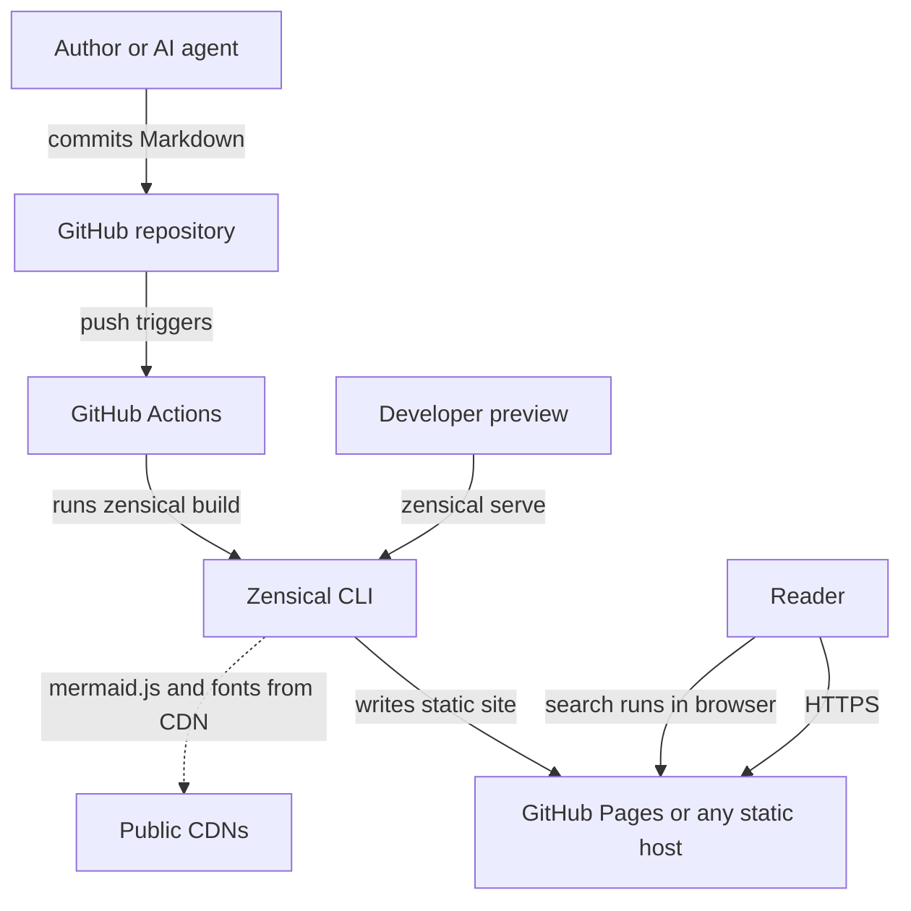
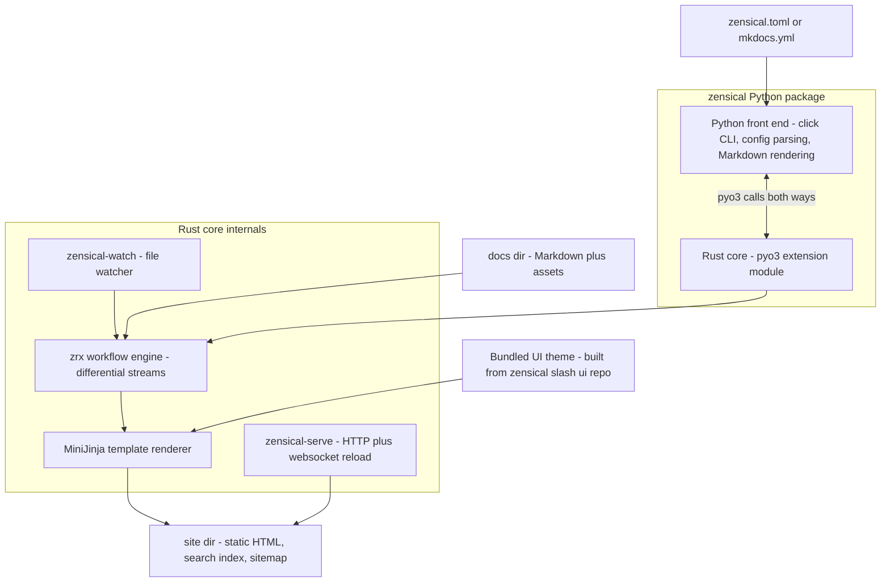
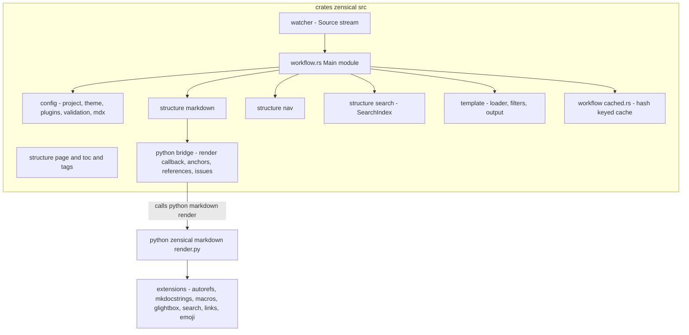
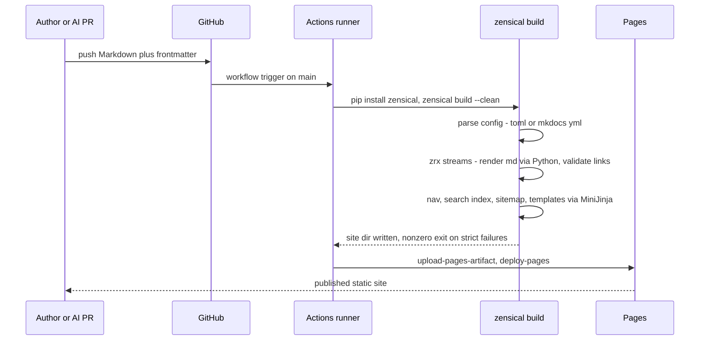
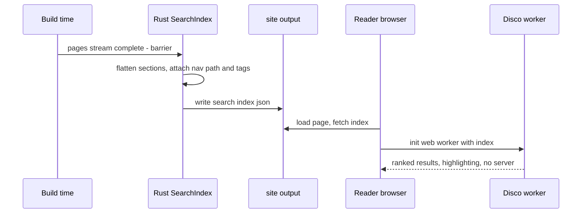

# Solution Architecture Document — Zensical

Platform: **Zensical** (https://zensical.org/) — repo: https://github.com/zensical/zensical
Analysis date: 2026-08-12. Version analyzed: **v0.0.53** (tagged 2026-08-04) [VERIFIED-REPO: git tag, commit 21824d2].
Evidence tags per shared brief: [VERIFIED-OFFICIAL], [VERIFIED-REPO], [OBSERVED], [INFERRED], [UNKNOWN], [HISTORICAL].

---

## Executive Summary

Zensical is the successor project to Material for MkDocs, built by the same team (Martin Donath / squidfunk, joined by Timothée Mazzucotelli, author of mkdocstrings) and announced on 2025-11-05 [VERIFIED-OFFICIAL: squidfunk.github.io/mkdocs-material/blog/2025/11/05/zensical/]. It was created because "MkDocs must be considered a supply chain risk, since it's unmaintained since August 2024" [VERIFIED-OFFICIAL], and rather than fork MkDocs the team rebuilt static site generation "from first principles" on a Rust runtime. The repository confirms a hybrid architecture: a Rust workspace (61.4% Rust, 38.2% Python [OBSERVED: GitHub language bar, 2026-08-12]) with three crates (`crates/zensical`, `crates/zensical-serve`, `crates/zensical-watch`) exposed to Python via pyo3/maturin, orchestrated by an in-house differential dataflow engine, `zrx` (crates.io v0.0.26) [VERIFIED-REPO: Cargo.toml, crates/zensical/src/workflow.rs]. Markdown rendering, however, is **still Python** (python-markdown + pymdown-extensions, called back from Rust), with an explicit in-code note: "We're working on moving the entire rendering chain to Rust" [VERIFIED-REPO: python/zensical/markdown/render.py].

Zensical is MIT-licensed [VERIFIED-REPO: LICENSE.md], reads `mkdocs.yml` natively alongside its own `zensical.toml` [VERIFIED-REPO: python/zensical/main.py], ships the Material theme experience (identical HTML structure, template overrides supported with MiniJinja adjustments) [VERIFIED-OFFICIAL: zensical.org/compatibility/], and has first-class Mermaid support identical to Material's superfences approach [VERIFIED-REPO: python/zensical/bootstrap/zensical.toml; ui repo components/content/mermaid].

The honest maturity picture as of 2026-08: **pre-1.0 alpha** (PyPI classifier "Development Status :: 3 - Alpha" [VERIFIED-REPO: pyproject.toml]). There is **no third-party plugin system yet** — the promised "module system" is the team's top priority but not publicly released [VERIFIED-OFFICIAL: FAQ]. Blog, tags, social cards, i18n plugin, redirects and minify are explicitly **not yet supported** [VERIFIED-OFFICIAL: zensical.org/compatibility/plugins/]. The new "Disco" search engine ships as a **minified, not-yet-open-source blob** inside the UI repo [VERIFIED-REPO: zensical/ui src/assets/javascripts/components/search/client/README.md]. Bus factor is low: the last 50 commits are essentially two people [VERIFIED-REPO: git shortlog]. Weighted score: **76.4/100** — an excellent GitHub-native static foundation with real differential-build advantages, discounted for youth, missing extension surface, and bilingual i18n gaps.

## HU: Vezetői összefoglaló

A Zensical a Material for MkDocs készítőinek új, MIT licencű statikuswebhely-generátora, amelyet 2025. november 5-én jelentettek be, mert a karbantartás nélkül maradt MkDocs-t ellátásilánc-kockázatnak ítélték. Az architektúra hibrid: Rust futtatókörnyezet (differenciális, adatfolyam-alapú build a saját `zrx` motorral, MiniJinja sablonozás, Rust keresőindex-építés), miközben a Markdown-feldolgozás egyelőre Pythonban történik (python-markdown + pymdown-extensions). A Zensical natívan olvassa a meglévő `mkdocs.yml` fájlokat, a Material-téma HTML-szerkezete változatlan, a Mermaid-diagramok pedig ugyanúgy, első osztályú módon működnek. A GitHub-natív működés kiváló: statikus kimenet, beépített GitHub Pages workflow, edit-linkek, sitemap. Ugyanakkor a platform 2026 augusztusában még alfa állapotú (v0.0.53): nincs nyilvános bővítményrendszer (a "module system" fejlesztés alatt áll), a blog, a címkék, a social cards, az i18n bővítmény és az átirányítások hivatalosan még nem támogatottak, az új Disco keresőmotor pedig egyelőre zárt, minifikált formában érkezik. A kétnyelvű (EN/HU) működés csak kettős builddel oldható meg, bár a felület magyar fordítása kész. A célrendszerhez erős, egyszerű, GitHub-natív alap, de a korai érettség és a kevés közreműködő miatt verziórögzítés és kilépési terv (Material for MkDocs tartalék) szükséges.

---

## Business & Functional Fit

Zensical targets exactly the docs-as-code segment the target ecosystem lives in: Markdown in Git, static output, CI-driven publishing. Its pedigree matters — the team maintained the most widely used MkDocs theme for a decade, and Zensical's stated purpose is to preserve that ecosystem's content investment while replacing the unmaintained MkDocs core [VERIFIED-OFFICIAL: announcement blog]. Functional fit today is "Material for MkDocs minus plugins, plus speed": identical Markdown dialect, identical HTML output, identical template structure [VERIFIED-OFFICIAL: roadmap "Compatibility" items checked], but a materially smaller extension surface. For a single-engineer operation the value proposition is strong — one `pip install zensical`, one config file, no plugin dependency sprawl — provided the missing features (tags, blog, redirects, i18n plugin) are not hard requirements at adoption time. Zensical Spark is the commercial support offering; the software itself has no paid features: "Zensical Spark is an optional offering for organizations to get direct support and training" [VERIFIED-OFFICIAL: FAQ]. Spark tier pricing: [UNKNOWN] (page did not render in this session; do not assume figures).

## Functional Requirements (as satisfied by Zensical today)

- Markdown authoring with the Python-Markdown/pymdownx dialect, incl. admonitions, tabs, footnotes, task lists, snippets, arithmatex [VERIFIED-REPO: python/zensical/bootstrap/zensical.toml default extension set].
- YAML frontmatter on every page, parsed with full YAML (SafeLoader) — lists/nested maps work, unlike stock python-markdown meta [VERIFIED-REPO: python/zensical/markdown/render.py FRONT_MATTER_RE + yaml.load].
- Navigation from config (`nav` in TOML/YAML) with Material navigation features (sections, tabs, instant navigation, prune, indexes) [VERIFIED-REPO: bootstrap zensical.toml features list].
- Built-in client-side search with index generated at build time in Rust [VERIFIED-REPO: crates/zensical/src/structure/search.rs].
- Link/anchor validation with configurable checks (unresolved references, invalid links, invalid anchors, footnote hygiene) and `--strict` CI mode [VERIFIED-REPO: crates/zensical/src/config/validation.rs; main.py `-s/--strict`; commit 6227f4e "support strict configuration option"].
- Live-preview dev server with websocket reload [VERIFIED-REPO: crates/zensical-serve/src/middleware/websocket.rs; crates/zensical-watch].
- Project scaffolding (`zensical new`) that includes a ready GitHub Pages deployment workflow [VERIFIED-REPO: python/zensical/bootstrap/.github/workflows/docs.yml].
- Versioned docs via the team's mike fork (env-var shim `MIKE_DOCS_VERSION`) [VERIFIED-REPO: config.py `_convert_plugins` mike block; OBSERVED: github.com/squidfunk/mike described as "Fork of mike that works with Zensical"].
- API docs via mkdocstrings, plus macros, glightbox, autorefs, markdown-exec compatibility shims [VERIFIED-REPO: python/zensical/config.py `_shim_*` functions; python/zensical/extensions/].
- NOT provided today: blog, tags, social cards, redirects, minify, i18n plugin, awesome-nav [VERIFIED-OFFICIAL: zensical.org/compatibility/plugins/ — "commit to support ... added all of them to our backlog"].

## Non-functional Requirements

- **Performance:** differential builds — "repeated builds – especially when serving the site – are already 4 to 5x faster" [VERIFIED-OFFICIAL: announcement]. The FAQ is candid that cold builds "may show limited gains"; "Zensical builds only what needs to be re-built" [VERIFIED-OFFICIAL: FAQ]. Mechanism verified in repo: zrx stream/barrier dataflow (`workflow.rs`) plus a hash-keyed on-disk cache described in-code as "only a preliminary implementation" [VERIFIED-REPO: crates/zensical/src/workflow/cached.rs]. Roadmap still lists "Intelligent build caching" as unchecked [VERIFIED-OFFICIAL: roadmap]. Label: differential rebuild in serve mode is [VERIFIED-OFFICIAL]+[VERIFIED-REPO]; generalized incremental CI builds are **not yet done**.
- **Reliability:** static output; no runtime services. Pre-1.0 release cadence (six releases v0.0.48→v0.0.53 between 2026-07-07 and 2026-08-04 [VERIFIED-REPO: git log]) implies frequent behavior changes; pin versions.
- **Portability:** wheels for Linux/macOS/Windows incl. musl targets, built with maturin, with GitHub artifact attestations [VERIFIED-REPO: .github/workflows/build.yml]; official Docker image (python:3.14-alpine base) [VERIFIED-REPO: Dockerfile].
- **Compatibility:** Python >= 3.10, abi3 wheels [VERIFIED-REPO: pyproject.toml, Cargo pyo3 abi3-py310].

## C4 L1 — System Context

Notes: no server-side runtime exists; readers need only static hosting [VERIFIED-REPO: bootstrap docs.yml deploys `site/` to Pages]. The theme lazily loads mermaid@11 from unpkg at view time [VERIFIED-REPO: zensical/ui src/assets/javascripts/components/content/mermaid/index.ts `watchScript("https://unpkg.com/mermaid@11/...")`] — a CDN dependency to note for air-gapped/GDPR setups (offline plugin exists for file:// viewing [VERIFIED-REPO: config.py offline plugin defaults]).

## C4 L2 — Containers

Evidence: crate layout [VERIFIED-REPO: Cargo.toml workspace members crates/*]; Python-to-Rust entry `build()`/`serve()` [VERIFIED-REPO: python/zensical/main.py "Build project in Rust runtime, calling back into Python when necessary"]; theme bundled from separate repo, gitignored in main repo [VERIFIED-REPO: python/zensical/.gitignore "templates"; .mono.toml ui scope; pyproject include python/zensical/templates/**].

## C4 L3 — Components (Rust core)

Evidence: module names and pipeline steps `process_markdown`, `generate_page`, `generate_nav`, `generate_search_index`, `generate_object_inventory`, `render_templates`, `render_pages`, `collect_references`/`collect_anchors`/`validate` [VERIFIED-REPO: crates/zensical/src/workflow.rs]; extension shims [VERIFIED-REPO: python/zensical/extensions/].

## Author → Build → Publish sequence

Grounded in the bundled workflow [VERIFIED-REPO: python/zensical/bootstrap/.github/workflows/docs.yml] and CLI [VERIFIED-REPO: main.py].

## Search / indexing sequence

Evidence: index assembly in Rust [VERIFIED-REPO: crates/zensical/src/structure/search.rs — items carry location, nav path, tags; language + separator config]; client worker [VERIFIED-REPO: zensical/ui src/assets/javascripts/workers/search.ts importing minified Disco client]; CJK tokenization added v0.0.52 [VERIFIED-REPO: commit f2d9ef8].

## Deployment & Infrastructure

Pure static artifact deployment. Verified options: GitHub Pages via the scaffolded workflow [VERIFIED-REPO: bootstrap docs.yml — `pip install zensical; zensical build --clean; upload-pages-artifact`]; any static host or object storage [INFERRED from static output — trivially true]; Docker image for building, explicitly "not for hosting" [VERIFIED-OFFICIAL: get-started docs; VERIFIED-REPO: Dockerfile]. Install channels: pip (recommended), uv, conda-forge, Docker [VERIFIED-OFFICIAL: zensical.org/docs/get-started/]. Self-hosting requires only a web server; the offline plugin produces a file://-viewable build [VERIFIED-REPO: config.py offline handling disables directory URLs, injects iframe-worker shim]. Caveat: default theme pulls mermaid and (configurably) Google Fonts from CDNs; the roadmap's GDPR asset-download feature ("downloading of external assets") is part of the not-yet-complete parity work [VERIFIED-OFFICIAL: roadmap].

## Security Architecture

- Static output eliminates server-side attack surface; security reduces to build-time supply chain and hosting [INFERRED, standard SSG property].
- Supply chain: MIT-licensed monorepo with lockfiles for both ecosystems (Cargo.lock, uv.lock) [VERIFIED-REPO], CI builds wheels with **GitHub artifact attestations** [VERIFIED-REPO: build.yml "Create artifact attestation"], DCO-certified contributions [VERIFIED-REPO: license headers], and a published security policy with a 3-business-day acknowledgement commitment to hello@zensical.org [VERIFIED-REPO: SECURITY.md]. Only the latest version receives security fixes [VERIFIED-REPO: SECURITY.md "Supported versions"].
- Demonstrated responsiveness: dependency vulnerability patched promptly ("fix: update pymdownx to 11.0 to fix vulnerability", 2026-08-03) [VERIFIED-REPO: commit 71c5ed5].
- Concerns: the Disco search client is a minified, unreleased-source component executed in every reader's browser [VERIFIED-REPO: ui client/README.md — auditable only as minified JS]; pre-1.0 velocity means behavior drift; macros extension executes Jinja2 (and markdown-exec executes code blocks) at build time — treat docs builds of untrusted PRs as code execution [VERIFIED-REPO: python/zensical/extensions/macros.py imports jinja2, subprocess].

## Threat Model

- Malicious PR executing code via macros/markdown-exec/snippets at build time → run CI for fork PRs without secrets; require review before build of derived AI content [VERIFIED-REPO grounded, above].
- Supply-chain compromise of the young `zrx`/`zensical` crates or PyPI package → pin exact versions + hashes; attestations help verification [VERIFIED-REPO: build.yml].
- CDN tampering/outage for mermaid@11 (unpkg) → self-host mermaid via `extra_javascript` override [VERIFIED-REPO: ui mermaid/index.ts; config supports extra_javascript].
- Abandonment/direction risk: two-person core, pre-1.0, sponsorware-adjacent economics (Spark) → keep mkdocs.yml as canonical config to preserve fallback to Material for MkDocs (supported ≥12 months from 2025-11-05 [VERIFIED-OFFICIAL: FAQ] — note that window is already near its floor as of 2026-08; continued Material maintenance beyond it is [UNKNOWN]).
- Search blob integrity (minified Disco) → subresource served from own origin, not CDN, mitigating third-party injection [VERIFIED-REPO: bundled into site assets].
- Stale/broken cross-references in AI-generated pages → enable full validation + `--strict` in CI so builds fail on invalid links/anchors [VERIFIED-REPO: validation.rs; main.py].

## Operational Model

One engineer can run this: no database, no services, no scheduled jobs. Routine ops = dependency pinning, monthly upgrade review (releases are frequent), and CI green-keeping. The cache (`--clean` clears it) is disposable [VERIFIED-REPO: main.py `-c/--clean` "Clean cache"; cached.rs]. Failure recovery is `git revert` + rebuild. Monitoring is CI status plus link-validation warnings; there is no telemetry in the generator [not found in repo — [INFERRED] absence, high confidence]. Upgrades pre-1.0 must be treated as minor-breaking: read the changelog every bump (changelog at zensical.org/docs/changelog/ [VERIFIED-REPO: pyproject urls]).

## Extensibility / Plugin Architecture

**This is Zensical's biggest current gap.** There is no public plugin API. The Rust config struct supports exactly two "plugins" (search, offline) and states: "Right now, this is only a small subset, and only provided for compatibility with our templates. We'll replace this with the module system in the near future" [VERIFIED-REPO: crates/zensical/src/config/plugins.rs]. A fixed set of popular MkDocs plugins is emulated via hardcoded shims: autorefs, mkdocstrings, macros, glightbox, markdown-exec, mike [VERIFIED-REPO: python/zensical/config.py `_shim_*`; compat/mkdocstrings.py]. Markdown extensions remain fully pluggable because rendering is python-markdown ("Python Markdown and all extensions work without changes" [VERIFIED-OFFICIAL: compatibility]) — custom Python Markdown extensions are therefore a real, supported extension point today [VERIFIED-REPO: config.py loads arbitrary `markdown_extensions`]. Theming: template overrides via `theme.custom_dir` incl. recursive theme inheritance (`mkdocs_theme.yml` `extends`) and MkDocs theme entry-points [VERIFIED-REPO: config.py get_themes/_load_theme_config], "minor adjustments for MiniJinja compatibility" required [VERIFIED-OFFICIAL: compatibility]. The module system ("unlimited extensibility", Python API, native modules) is roadmapped, with module interdependencies already built internally but no public release, standard library, or docs [VERIFIED-OFFICIAL: roadmap; VERIFIED-REPO: workflow.rs comment "With the advent of the module system at the beginning of April 2026... ship the module system as fast as possible"]. A reusable "InterviewPrep component" today = Jinja include/macro in `custom_dir` overrides + attr_list-decorated Markdown, or a custom python-markdown extension — both workable, neither a first-class component model; the roadmap's "Component System" is planning-stage [VERIFIED-OFFICIAL: roadmap].

## Developer Experience

Excellent for its age: single tool, `zensical new` scaffolds project + CI [VERIFIED-REPO: main.py new_project + bootstrap/], `zensical serve` gives fast differential rebuilds with websocket reload and optional browser open [VERIFIED-REPO: serve options], and error reporting uses the ariadne diagnostics crate [VERIFIED-REPO: Cargo.toml]. Config error messages in `config.py` are explicit and human-readable [VERIFIED-REPO]. Rough edges: TOML-vs-YAML duality, docs still thinner than Material's decade-old corpus, and pre-1.0 churn (e.g., "update zensical.toml to TOML 1.1 syntax" landed 2026-08-04 [VERIFIED-REPO: commit 94ceb07]). Tests exist for the Python layer (unit + integration) [VERIFIED-REPO: python/tests/]; Rust-side test coverage in the main crate appears thin [OBSERVED in tree; exact coverage [UNKNOWN]].

## Writer / Content UX

Identical authoring model to Material for MkDocs: plain Markdown files in `docs/`, frontmatter metadata, the full pymdownx toolbox (admonitions, content tabs, annotations, task lists, snippets/includes for reuse) [VERIFIED-REPO: bootstrap zensical.toml]. Snippets (`--8<--`) are watched for changes [VERIFIED-REPO: workflow.rs SNIPPET_RE; config.py _list_snippet_files]. `edit_uri` deep-links every page to GitHub editing [VERIFIED-REPO: config.py repo/edit_uri defaults for github.com]. WYSIWYG or web editor: none — Git-only authoring [OBSERVED/INFERRED; consistent with static-first goal].

## Localization

Two distinct layers. (1) **Theme UI translations: strong.** 69 language files including Hungarian (`hu.html`, e.g. "Oldal szerkesztése") [VERIFIED-REPO: zensical/ui src/partials/languages/ — 69 files]; `theme.language` and RTL `direction` configurable [VERIFIED-REPO: config.py]. Search tokenization is language-aware incl. CJK [VERIFIED-REPO: search.rs SearchConfig.lang; commit f2d9ef8]. (2) **Multi-language content: weak today.** The mkdocs-static-i18n plugin is explicitly unsupported (Tier-2 backlog) [VERIFIED-OFFICIAL: compatibility/plugins/], and native i18n ("flexible content organization", "AI-powered translation workflows", "localizing all parts") is a **planned** roadmap section with nothing checked [VERIFIED-OFFICIAL: roadmap]. A bilingual EN/HU site therefore requires the classic workaround: two builds (two config files, `site_url` subpaths `/en/`, `/hu/`) wired together with `extra.alternate` language switcher config, which the theme supports (alternate icon in config defaults) [VERIFIED-REPO: config.py icon.alternate; INFERRED workflow — the pattern is inherited from Material and the theme partials include an alternate/language switcher [VERIFIED-REPO: ui integrations/alternate]].

## SEO

Generated: `sitemap.xml` and `404.html` are mandatory static templates [VERIFIED-REPO: config.py static_templates]; canonical URLs from `site_url`; meta description/author from config [VERIFIED-REPO: config.py]. URL stability is a design goal: "URLs and anchors remain identical, preserving bookmarks, external links, and SEO" [VERIFIED-OFFICIAL: compatibility]. Gaps: social cards (OpenGraph images) not yet supported [VERIFIED-OFFICIAL: plugins page], redirects plugin not yet supported — moved pages need host-level redirects [VERIFIED-OFFICIAL: plugins page].

## Search

Build-time index in Rust; client-side execution in a web worker using **Disco**, the team's new engine ("inverted index, hierarchical filtering" done; vector search and federated search planned) [VERIFIED-OFFICIAL: roadmap; VERIFIED-REPO: search.rs, ui workers/search.ts]. Disco's source is not yet open: "the files are minified... We're working on making Disco ready for Open Source release, and expect to release it in early 2026" [VERIFIED-REPO: ui client/README.md — note that as of 2026-08 no public Disco repo was reachable; release status [UNKNOWN]]. Search quality improvements (excerpts) landed v0.0.46 [OBSERVED: GitHub releases page]. No server, no SaaS: search works on any static host and offline [VERIFIED-REPO: offline plugin]. For the ecosystem: index is a build artifact regenerated on every content change — no external indexing pipeline to operate.

## GitHub Integration

Best-in-class for the target ecosystem: repo/edit/view links auto-derived from `repo_url` with GitHub-specific defaults [VERIFIED-REPO: config.py repo_names/edit_uris maps], scaffolded GitHub Pages Actions workflow with OIDC permissions in every new project [VERIFIED-REPO: bootstrap docs.yml], magiclink extension auto-links GitHub issues/users [VERIFIED-REPO: bootstrap zensical.toml pymdownx.magiclink], and the project's own CI shows a mature Actions setup (build matrix across platforms, attestation, docker, release) [VERIFIED-REPO: .github/workflows/*.yml]. Nothing in the build requires anything but a checkout — generated/derived files committed to the repo are just ordinary sources [VERIFIED-REPO: build reads `docs_dir` from disk].

## Mermaid Support

First-class and verified end-to-end: default config registers `mermaid` as a superfences custom fence [VERIFIED-REPO: python/zensical/config.py default custom_fences; bootstrap zensical.toml], and the theme detects `.mermaid` code blocks, lazily loads mermaid@11 from unpkg, and themes diagrams with `--md-mermaid-*` CSS variables for light/dark palettes [VERIFIED-REPO: zensical/ui components/content/mermaid/index.ts + index.css]. Rendering is client-side (browser) — no build-time SVG generation, so diagrams don't appear in search index text and require JS [OBSERVED/INFERRED from implementation; same trade-off as Material]. Mermaid-as-code in Git works with zero configuration in a `zensical new` project [VERIFIED-REPO: bootstrap config ships the fence].

## AI Integration Suitability

Zensical has **no AI features and no build-time API surface for AI** — which is exactly what the brief's static-first rule wants at serve time, but limits build-time hooks. The AI layer must operate at the repo level: generate/update Markdown + frontmatter + Mermaid, open PRs, and let Zensical build deterministically. That works cleanly: full-YAML frontmatter carries provenance metadata [VERIFIED-REPO: render.py]; the macros extension gives Jinja templating over `extra` variables and external YAML/JSON includes for structured derived data [VERIFIED-REPO: extensions/macros.py]; `--strict` + link validation gates malformed AI output in PR CI [VERIFIED-REPO: validation.rs]. What is missing: programmatic build API (Python API is a roadmap item under the module system [VERIFIED-OFFICIAL: roadmap]), collection/data-file abstractions, and hooks to inject virtual pages (MkDocs' gen-files/hooks equivalents don't exist yet). AI-powered translation workflows are on the roadmap, not shipped [VERIFIED-OFFICIAL: roadmap]. Net: suitable as a dumb, reliable renderer behind an external AI pipeline; unsuitable if you need in-build generation hooks today.

## Automated Content Generation Suitability

Strong for file-based generation: any tool that writes `docs/**/*.md` participates fully; nav can be declared in config or derived from directory structure when `nav` is omitted [VERIFIED-REPO: config.py nav handling; structure/nav]. mkdocstrings works (co-maintained by a core Zensical dev) for API-reference generation [VERIFIED-REPO: compat/mkdocstrings.py; shortlog Timothée Mazzucotelli]. markdown-exec allows executing code blocks at build time for computed content [VERIFIED-REPO: _shim_markdown_exec]. Watch lists include snippet/macro sources so `serve` rebuilds when generated inputs change [VERIFIED-REPO: config.py watched_files]. Missing: no programmatic page API, no "virtual files" plugin (awesome-nav/gen-files unsupported), so generated files must physically exist in the repo — which the target ecosystem prefers anyway (derived content reviewed via PR).

## API / Automation Surface

CLI only: `zensical build [-f config] [--clean] [--strict]`, `zensical serve [-a addr] [-o] `, `zensical new [dir]` [VERIFIED-REPO: main.py]. Exit codes + strict mode are the CI contract. No stable Python API (planned) [VERIFIED-OFFICIAL: roadmap "Python API" unchecked]; importing `zensical` internals is possible but unstable [INFERRED — internals are documented as transitional throughout]. No REST/webhook surface (none needed for static output).

## Community / Maintenance

Collected 2026-08-12. Stars ~4.6k, forks 103, watchers 24, open issues 9, "Used by 948" [OBSERVED: github.com/zensical/zensical]. Latest tag v0.0.53 (2026-08-04); six releases in the last month of history [VERIFIED-REPO: git log]. Contributor concentration is high: of the last 50 commits, Martin Donath (incl. squidfunk alias) ~39 and Timothée Mazzucotelli 24 of 65 authored commits, others single commits [VERIFIED-REPO: git shortlog on shallow clone — full-history contributor count [UNKNOWN]]. Discord community exists [VERIFIED-REPO: README badge]. Ecosystem context: Material for MkDocs (~75k stars historically) users are the funnel; GitHub Sponsors/Insiders discontinued in favor of Zensical Spark [VERIFIED-OFFICIAL: announcement]. Maintenance assessment: very active, well-run, but **young and two-person-critical**.

## Licensing

MIT for the generator and the UI/theme [VERIFIED-REPO: LICENSE.md; zensical/ui LICENSE + package.json "license": "MIT"]. Contributions under DCO [VERIFIED-REPO: file headers]. Caveats: the Disco search client ships minified without published source (MIT headers surround it, but source availability is pending [VERIFIED-REPO: ui client/README.md]); `zrx` is published on crates.io with a public repo (github.com/zensical/zrx reachable) [OBSERVED: git ls-remote]. No open-core feature gating today: "Zensical is Free and Open Source – no paid features" [VERIFIED-OFFICIAL: FAQ]; Spark is support/services.

## Cost Drivers

Software: $0 (MIT). Hosting: static (GitHub Pages free tier suffices). CI: minutes for builds — Rust wheel install via pip is prebuilt, so CI cost is seconds-to-minutes per build [OBSERVED: bootstrap workflow uses plain pip install]. Optional: Zensical Spark subscription for support (pricing [UNKNOWN]). Hidden costs: engineer time tracking pre-1.0 changes; dual-build complexity for bilingual sites until native i18n ships.

## Top 8 Risks + Mitigations

| # | Risk | Likelihood | Impact | Mitigation |
|---|------|-----------|--------|------------|
| 1 | Pre-1.0 breaking changes (config, CLI, output) | High | Medium | Pin exact version; upgrade deliberately with changelog review; keep `--strict` CI to surface regressions |
| 2 | Needed feature missing (redirects, tags, blog, social cards) | High | Medium | Verify feature checklist before adoption; host-level redirects; defer tag-driven IA until supported |
| 3 | Bus factor ~2 core maintainers | Medium | High | Keep mkdocs.yml canonical for Material fallback; MIT license permits community fork |
| 4 | Module system slips; no plugin API for custom needs | Medium | Medium | Constrain customization to Markdown extensions + template overrides, both supported today |
| 5 | Bilingual EN/HU native support delayed | Medium | Medium | Dual-build pattern with alternate switcher now; migrate to native i18n when shipped |
| 6 | Disco search closed-source blob | Low | Medium | Served from own origin; monitor promised OSS release; search plugin can be disabled if policy requires |
| 7 | Build-time code execution via macros/markdown-exec on untrusted PRs | Medium | High | No-secrets CI for fork PRs; require human review before building AI-derived branches |
| 8 | CDN dependency for mermaid rendering | Low | Low | Self-host mermaid via extra_javascript; offline plugin for portable builds |

## Migration Plan

From Material for MkDocs (the realistic origin): (1) `pip install zensical`, run `zensical serve` against the **unchanged** `mkdocs.yml` — natively read [VERIFIED-REPO: main.py config discovery order]; (2) audit plugin usage against the supported list (search/offline/mike/mkdocstrings/autorefs/macros/glightbox/markdown-exec pass; blog/tags/social/i18n/redirects/minify block) [VERIFIED-OFFICIAL: plugins page]; (3) adjust template overrides for MiniJinja strictness [VERIFIED-OFFICIAL: compatibility]; (4) swap CI build step (`mkdocs build` → `zensical build --clean --strict`); (5) optionally adopt `zensical.toml` later — the team promises conversion tooling when config diverges [VERIFIED-OFFICIAL: FAQ]. Exit path: because content, config, and URL structure stay MkDocs-compatible through the current phase, reverting to Material for MkDocs is a CI one-liner while that project remains maintained — the cheapest exit story of any young platform, but time-bounded by Material's maintenance window [VERIFIED-OFFICIAL: FAQ 12-month commitment from 2025-11-05].

## Prioritized Recommendations

1. Keep `mkdocs.yml` as the canonical config (not `zensical.toml`) until Zensical 1.0, preserving the two-way door with Material for MkDocs.
2. Pin `zensical==0.0.x` exactly in CI; upgrade monthly with changelog review; never float pre-1.0.
3. Turn on full validation + `--strict` in the PR pipeline as the acceptance gate for AI-generated pages (links, anchors, footnotes).
4. Implement the AI layer entirely outside the build: generate Markdown/Mermaid/frontmatter into `docs/derived/**`, PR-reviewed; treat Zensical as a deterministic renderer.
5. Build the InterviewPrep-style component as a MiniJinja partial in `theme.custom_dir` plus an attr_list/markdown-in-html authoring convention — do not wait for the component system.
6. For EN/HU: two builds from two configs into `/en/` and `/hu/` with `extra.alternate` switcher; revisit when native i18n ships (roadmap).
7. Self-host mermaid@11 via `extra_javascript` to remove the unpkg dependency and pin the diagram renderer version.
8. Run fork-PR CI without secrets and disable markdown-exec/macros on untrusted branches (build-time code execution).
9. Use host-level redirects (Pages 404 or CDN rules) until the redirects plugin lands.
10. Watch two roadmap items as adoption triggers for deeper investment: public module system (custom modules) and native i18n (drop dual-build).

## Architectural Verdict

Zensical is the most credible successor bet in the MkDocs ecosystem: same team, same authoring dialect, dramatically better build architecture (verified differential dataflow in Rust), MIT-licensed, and genuinely static-first. As of 2026-08 it is an **alpha** with a deliberately narrow surface: no plugin API, no blog/tags/social/i18n/redirects, search engine source pending. For a GitHub-native, single-engineer, AI-augmented docs ecosystem it is already a safe *foundation* — because the fallback to Material for MkDocs is nearly free — but it should be adopted with version pinning, strict CI validation, and zero dependence on unshipped roadmap items. Score 76.4/100; recommendation: adopt for the presentation layer with the documented hedges, or shortlist behind Material for MkDocs if bilingual i18n or tags are day-one hard requirements.

## Target-System Fit Assessment

**Git/GitHub as canonical source:** Perfect fit. Zensical consumes a checkout and nothing else; the scaffolded Pages workflow, auto edit-links, and magiclink integration make GitHub the native habitat [VERIFIED-REPO: bootstrap docs.yml, config.py]. Generated files committed by the AI layer are indistinguishable from human content — no registration, no manifest.

**Markdown + Mermaid + frontmatter fidelity:** Strong fit. The pymdownx dialect is the richest Markdown toolbox in the static-site world; frontmatter is full YAML; Mermaid is zero-config with theme-integrated light/dark rendering [VERIFIED-REPO: render.py, bootstrap config, ui mermaid component]. One caveat: client-side Mermaid means diagrams need JS and are absent from search text.

**AI-derived views with validation + PR review:** Good fit by omission. Zensical offers no AI hooks, which forces the (desired) architecture: derive → commit → validate → build. Its link/anchor validation with `--strict` is a genuinely useful automated reviewer for machine-generated content [VERIFIED-REPO: validation.rs]. Incremental regeneration on the AI side maps well to Zensical's differential rebuilds during preview; CI builds remain full builds for now (intelligent caching unshipped) — acceptable at personal-site scale.

**Static-first, AI-free serving:** Perfect fit. Nothing dynamic exists to accidentally depend on; search runs in-browser.

**One-engineer operability / anti-overengineering:** Excellent fit. One pip package, one config, no plugin dependency tree — materially simpler than an equivalent Material stack with 6–10 plugins. The risks are calendar risks (youth, roadmap), not operational complexity.

**Custom components (InterviewPrep) and bilingual EN/HU:** The two genuine compromises. Components are achievable via template overrides + Markdown conventions but not first-class; bilingual requires the dual-build workaround because the i18n plugin is unsupported and native i18n is roadmap-only [VERIFIED-OFFICIAL: plugins page, roadmap]. Both have documented, low-tech workarounds compatible with the anti-overengineering rule; neither blocks adoption, both warrant tracking.
