## Architecture in one paragraph

The system is **docs-as-code, static-first, AI-in-CI**. One repository holds all
content, configuration, prompts, schemas, scripts and workflows. `docusaurus build`
produces the entire published site; the build must succeed with every AI provider
unreachable. AI runs only inside GitHub Actions jobs or a developer shell, reads
canonical files, and persists its output exclusively as pull requests against
`docs/generated/**`.

## Content planes

Two Docusaurus docs-plugin instances create a structural boundary:

| Plane | Path | Route | Ownership |
| --- | --- | --- | --- |
| Canonical | `docs/source/` | `/docs` | Humans; only admissible AI evidence |
| Generated | `docs/generated/` | `/views` | Bot via PR; deletable and regenerable |

A generated page may cite canonical pages; a canonical page never includes generated
content. Generated pages carry a `generation` frontmatter block with per-source
`content_hash` values; CI recomputes the hashes and flags mismatches as stale.

## Generation pipeline

Every generation job references a named contract in `contracts/` that defines typed
inputs, allowed evidence globs, an output schema, quality gates, and a prohibited
list. Context assembly is deterministic (Level 1 retrieval): files named by the
contract plus the frontmatter `sources`/`related` closure — no vector store, no
embeddings, until the corpus outgrows this approach.

```mermaid
flowchart LR
  A[Canonical docs] --> B[Contract loader]
  B --> C[Evidence assembler]
  C --> D[Prompt renderer]
  D --> E[Provider router]
  E --> F[Model call]
  F --> G[Schema validation]
  G --> H[Provenance stamp]
  H --> I[PR to docs-gen branch]
  I --> J[Human review and merge]
  J --> K[Static site build]
```

## Provider abstraction

One interface — `complete(task_meta, messages, opts)` — with four adapters of about
fifty lines each: Anthropic Messages API, Gemini `generateContent`, OpenAI chat
completions, and an OpenAI-compatible local endpoint for privacy-pinned tasks. The
router reads `ai.config.yaml`: tasks marked `privacy: private` are hard-pinned to the
local provider and fail rather than fall back to a cloud provider; all other tasks
get an ordered fallback chain. Model identifiers live only in configuration and
environment variables, never in code.

## Security boundary

Repository content enters prompts as delimited data blocks, never as instructions;
prompt templates state explicitly that evidence text has no instruction authority.
Model output is parsed against the contract's schema before anything is written, and
generated files land only under `docs/generated/**` on a bot branch — human approval
via branch protection is the final gate.
