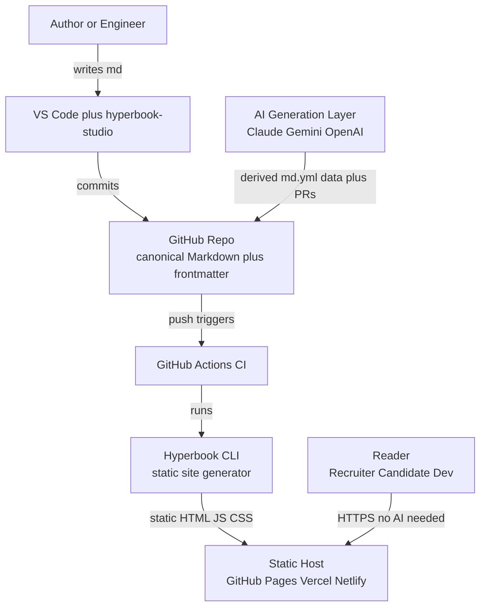
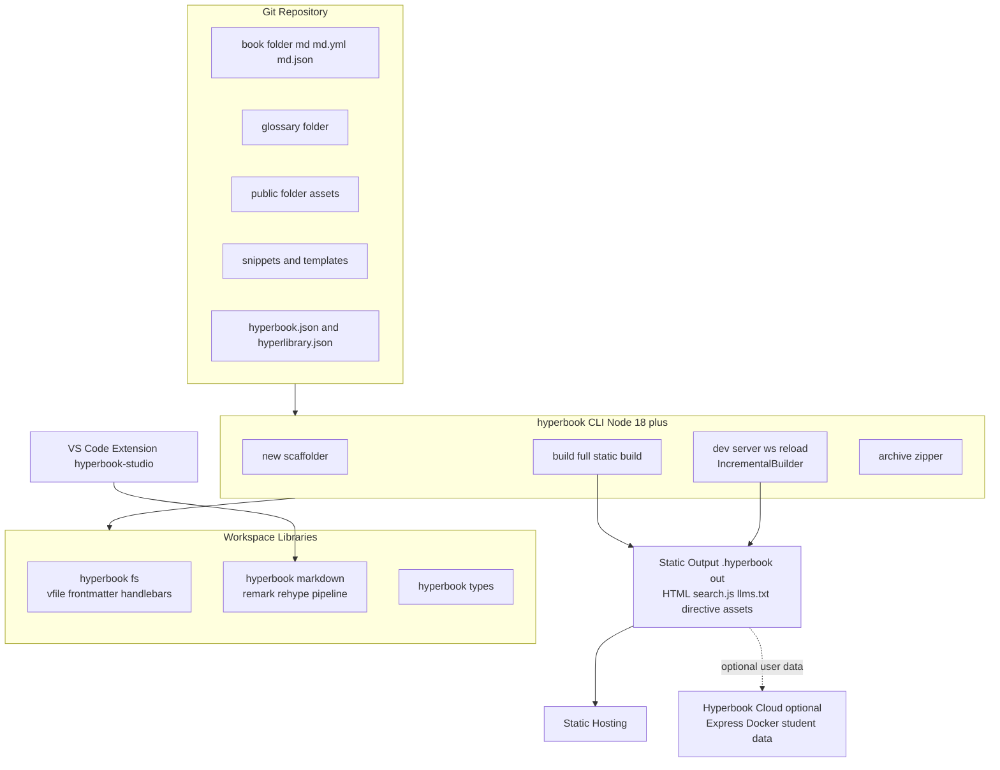
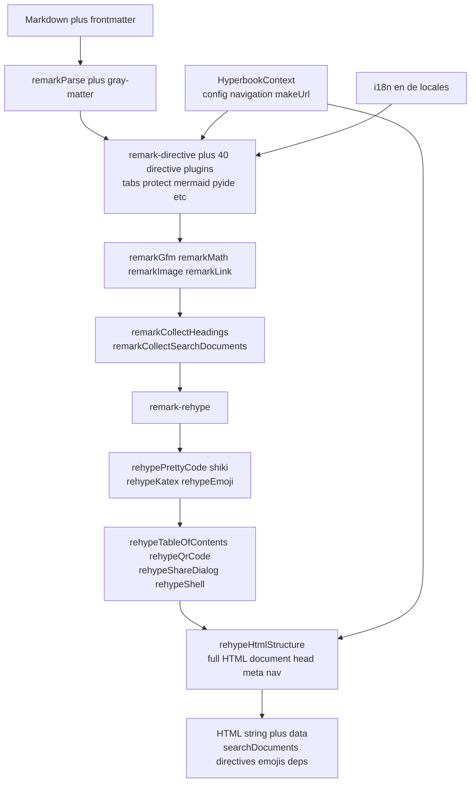
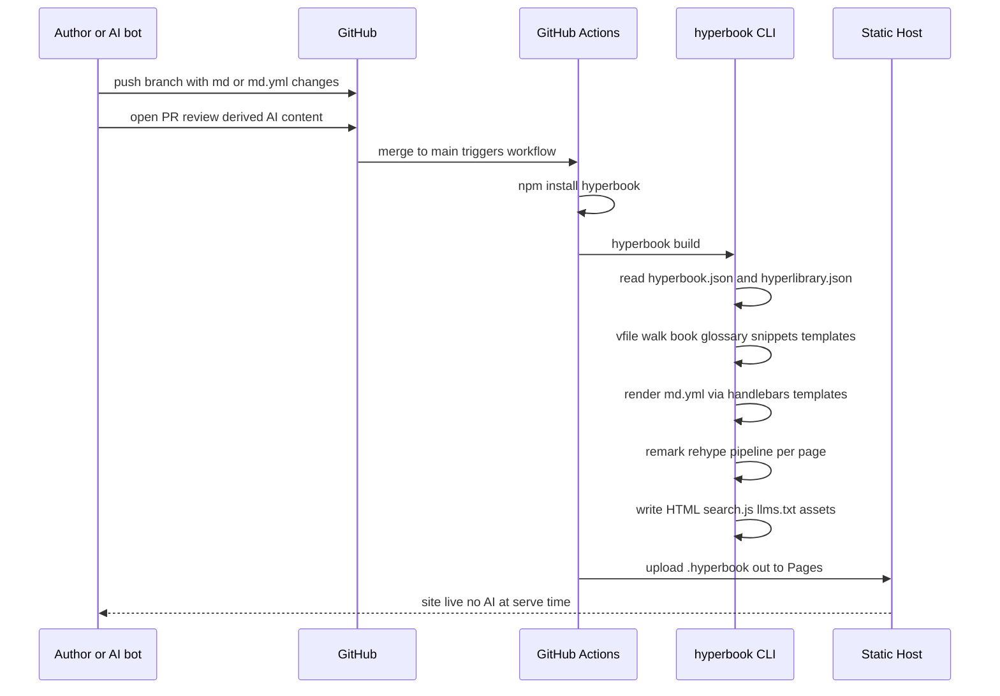
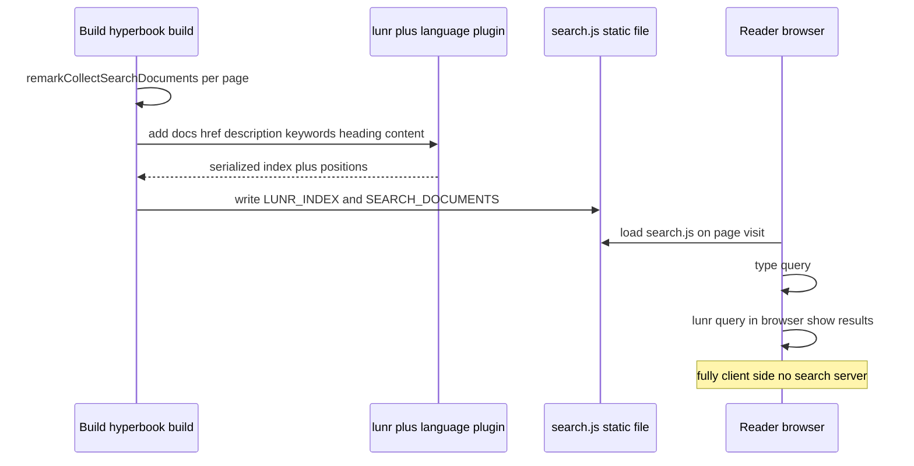

# Solution Architecture Document — Hyperbook

Platform: **Hyperbook** (https://hyperbook.openpatch.org/ • https://github.com/openpatch/hyperbook)
Analyst role: Principal Solution Architect • Date: 2026-08-12
Repo evidence base: shallow+history clone of `openpatch/hyperbook` at `/tmp/hyperbook` (HEAD 2026-08-11)

---

## Executive Summary

Hyperbook is an MIT-licensed, TypeScript/Node.js static-site generator for **interactive workbooks and OER (open educational resources)**, built and maintained essentially by one person (Mike Barkmin) under the small OpenPatch organization `[VERIFIED-REPO: /tmp/hyperbook/README.md, git shortlog]`. Architecturally it is exactly the shape the target ecosystem wants: plain Markdown files with YAML frontmatter in Git, a single CLI (`hyperbook build`) that emits fully static HTML with no server runtime, native Mermaid support (both fenced code blocks and `:::mermaid` directives), client-side lunr search, built-in `llms.txt` generation, and a genuinely unusual strength — a **data-driven templating layer** (`.md.yml`/`.md.json` data files rendered through Handlebars `.md.hbs` templates) that is close to purpose-built for programmatic/AI-generated derived content `[VERIFIED-REPO: packages/fs/src/vfile.ts:840-900]`.

The honest counterweights are equally clear. First, **audience mismatch**: its 45+ interactive elements are dominated by classroom tools (GeoGebra, H5P, Scratch blocks, Python/SQL IDEs, learning maps) rather than API-doc affordances; there is no versioned-docs concept, no OpenAPI support, and SEO output has real defects (no sitemap, a malformed `og:title` attribute, keywords joined without separators) `[VERIFIED-REPO: packages/markdown/src/rehypeHtmlStructure.ts:200-280]`. Second, **bus factor ≈ 1**: 910+ of ~1,010 human commits are the maintainer's; external human contributors total 2 commits ever. Release cadence is very fast (0.104.0 published 2026-08-11) but the project is permanently pre-1.0 and there is no plugin API — custom elements mean custom scripts/CSS, snippets, or a fork. Third, **Hungarian is not a supported UI locale**: the config type allows only `de|en|fr|es|it|pt|nl`, and only English and German UI string bundles exist `[VERIFIED-REPO: packages/types/src/index.ts:44, packages/markdown/src/i18n.ts]`. Hungarian *content* works fine, and the `hyperlibrary.json` multi-book pattern (used by Hyperbook's own EN/DE docs) is a clean bilingual model, but HU readers would see EN chrome.

Weighted score: **76.0/100**. Verdict: a surprisingly strong architectural fit with material product-maturity and sustainability risk; viable if the team accepts a single-maintainer dependency and does its own SEO hardening.

## HU: Vezetői összefoglaló

A Hyperbook egy MIT licencű, TypeScript/Node.js alapú statikus oldalgenerátor, amelyet elsősorban interaktív oktatási munkafüzetekhez (OER) fejlesztenek az OpenPatch szervezetnél — a gyakorlatban egyetlen fő karbantartóval. Architektúrája meglepően jól illeszkedik a cél-ökoszisztémához: Markdown fájlok YAML frontmatterrel Gitben, egyetlen CLI parancs (`hyperbook build`), teljesen statikus HTML kimenet szerver nélkül, natív Mermaid-támogatás, kliensoldali lunr kereső, beépített `llms.txt` generálás. Kiemelkedő erőssége a sablonrendszer: `.md.yml` és `.md.json` adatfájlok Handlebars sablonokkal (`.md.hbs`) renderelhetők, ami szinte készen kínálja a programozottan vagy AI-val generált származtatott tartalmak (pl. interjú-felkészítő oldalak) kezelését. A gyengeségek is egyértelműek: a beépített elemek túlnyomórészt tantermi eszközök; nincs plugin API, az egyéni komponensekhez szkriptek, snippetek vagy fork szükséges; a SEO-kimenet hibás (nincs sitemap, hibás og:title); a busz-faktor gyakorlatilag 1. A magyar nyelv nem támogatott felületi lokalizáció — csak angol és német UI-szövegek léteznek, a magyar tartalom viszont működik, és a `hyperlibrary.json` többkönyves modell tiszta kétnyelvű struktúrát ad. Súlyozott pontszám: 76,0/100. Ítélet: architekturálisan erős, fenntarthatósági és termékérettségi kockázatokkal terhelt jelölt.

## Business & Functional Fit

Hyperbook's declared mission is "interactive workbooks" for education `[VERIFIED-REPO: README.md]`; OpenPatch is "an organization for educational assessments and training." The target ecosystem is a developer/recruiter documentation platform. This is a real mismatch of *audience*, but a smaller mismatch of *mechanism* than one would guess: the ecosystem's core demands — Git-canonical Markdown, frontmatter metadata, Mermaid-as-code, static-first delivery, programmatic generation of derived pages, one-engineer operability — are all mechanisms Hyperbook implements natively. What Hyperbook does *not* bring is the developer-docs surface: no API reference tooling, no doc versioning, no "edit this page" workflow beyond a repo link, no breadcrumb-rich SEO discipline, and a visual identity that reads "school workbook" (emoji icons, QR codes, bookmarks, protect-with-password games) more than "engineering documentation." Some education features are accidentally useful for the recruiter/interview use case: `protect` (client-side gated content), `tabs`, `collapsible`, `multievent`/quiz-style interaction, `pagelist` (auto page listings), and the glossary system could plausibly serve interview-prep presentation. Fit assessment: mechanically strong, thematically off-center; adopting it means accepting an education-toned UI or investing in custom CSS.

## Functional Requirements

Assessment of the ecosystem's functional requirements against verified capability:

- **Markdown authoring with frontmatter** — Yes. `gray-matter` parses YAML frontmatter; a rich typed schema exists (`name`, `title`, `permaid`, `lang`, `description`, `keywords`, `index`, `hide`, `toc`, `next`/`prev`, `layout`, `hide`, per-page `scripts`/`styles`) `[VERIFIED-REPO: packages/types/src/index.ts:60-90, packages/fs/package.json]`. `name` is mandatory per page.
- **Content structure** — `book/` (pages+sections via folders with `index.md`), `glossary/` (terms auto-linked via `:t[Term]` directive), `public/` (static assets), `snippets/` (reusable content fragments), `templates/` (Handlebars), `archives/` (auto-zipped downloadables) `[VERIFIED-REPO: website/en/ layout; packages/fs/src/vfile.ts:161]`.
- **Multi-book / bilingual model** — `hyperlibrary.json` composes multiple books under one site with per-book `basePath` and localized library names; Hyperbook's own docs use it for EN/DE `[VERIFIED-REPO: website/hyperlibrary.json]`.
- **Interactive elements** — 45 directive implementations verified in code: alert, tabs, tiles, collapsible, slideshow, protect, textinput, multievent, bookmarks, pagelist, term, qr, download, archive, embed, video, audio, youtube, mermaid, plantuml, excalidraw, geogebra, jsxgraph, h5p, learningmap, scratchblock, struktog, struktolab, blockflow (player+editor), onlineide, webide, pyide, sqlide, kirimoto, openscad, typst, abc-music, p5, unpack, etc. `[VERIFIED-REPO: packages/markdown/src/remarkDirective*.ts — 40 files; packages/markdown/assets/directive-*]`. Note: there is no directive literally named "multiple-choice"; quiz-like behavior comes from `multievent`/`textinput`.
- **Programmatic page generation** — `.md.yml` and `.md.json` data files must reference a `template` rendered from `templates/<name>.md.hbs`; `.md.hbs` pages render standalone; ~20 Handlebars helpers (times, concat, case transforms, truncate, dateformat, rbase64, rfile…) `[VERIFIED-REPO: packages/fs/src/vfile.ts:840-900, packages/fs/src/handlebars.ts]`.
- **Search** — build-time lunr index with language stemming plugins, shipped as a static `search.js`; enabled by `"search": true` `[VERIFIED-REPO: packages/hyperbook/build.ts:36-97]`.
- **LLM-friendliness** — `"llms": true` generates a consolidated `llms.txt` from all Markdown at build time `[VERIFIED-REPO: packages/hyperbook/build.ts:283-412, 969-971]`.
- **PDF export** — none. A `typst` directive embeds Typst documents, but there is no book→PDF pipeline `[VERIFIED-REPO: grep of packages/hyperbook — no pdf export code]`.
- **VS Code extension** — `hyperbook-studio` (`platforms/vscode`): live preview using the real renderer, snippets, JSON-schema validation of `hyperbook.json`, published to Marketplace and OpenVSX from CI `[VERIFIED-REPO: platforms/vscode/package.json, .github/workflows/changeset-version.yml]`.
- **Hyperbook Cloud** — optional self-hosted Node/Express+Docker student-management backend (accounts, groups, per-user data persistence). Irrelevant to the target system but proves the static frontend can talk to an optional backend via `cloud` config `[VERIFIED-REPO: platforms/cloud/README.md, docker-compose.yml]`.
- **Scaffolding** — `create-hyperbook` and `hyperbook new` `[VERIFIED-REPO: packages/create, packages/hyperbook/new.ts]`.

## Non-functional Requirements

- **Performance**: output is prebuilt static HTML + per-directive JS/CSS assets copied only when used (the builder tracks which directives each page uses and ships only those assets) `[VERIFIED-REPO: packages/hyperbook/build.ts SinglePageResult.directives]`. Client-side Mermaid/lunr rendering costs some first-paint JS but nothing server-side.
- **Scalability**: fine for hundreds of pages; the lunr index and `SEARCH_DOCUMENTS` blob are a single JS file loaded in-browser — it grows linearly with corpus size `[VERIFIED-REPO: build.ts:90-97]`. `[INFERRED]` acceptable at the target scale (personal/team docs), a concern beyond ~1–2k pages.
- **Reliability**: no runtime dependencies to fail; failure modes are build-time only. Dev server does incremental rebuilds with a dependency-tracking `IncrementalBuilder` (content/glossary/public/config/structural/dependency change classes) `[VERIFIED-REPO: packages/hyperbook/incremental.ts]`; production `hyperbook build` is a full rebuild — incrementality is a dev-server feature, not a CI feature `[VERIFIED-REPO: packages/hyperbook/index.ts:47-64]`.
- **Maintainability**: pnpm monorepo, TypeScript throughout, 42 `*.test.ts` files (vitest), Renovate bot, changesets-driven automated releases `[VERIFIED-REPO: renovate.json, .changeset/, .github/workflows/changeset-version.yml]`. Consumer surface is a single npm CLI (`hyperbook`), Node >= 18.
- **Compatibility/churn**: version 0.104.0 — pre-1.0 semantics; frequent releases (11 in ~3 weeks of July–Aug 2026 per npm) mean directive/config churn risk `[OBSERVED: registry.npmjs.org/hyperbook time entries]`.

## C4 L1 — System Context



## C4 L2 — Containers



Evidence: `packages/hyperbook/{index,dev,build,incremental,archive}.ts`, `packages/fs/src/{vfile,hyperbook,hyperlibrary,hyperproject,handlebars}.ts`, `packages/markdown/src/process.ts`, `platforms/vscode`, `platforms/cloud`.

## C4 L3 — Components (markdown processing engine)



Evidence: `packages/markdown/src/process.ts` (plugin registration order), `rehypeHtmlStructure.ts` (document assembly), `remarkCollectSearchDocuments.ts`, `i18n.ts`.

## Author → Build → Publish sequence



## Search/indexing sequence



Evidence: `packages/hyperbook/build.ts:36-97` (`writeSearchIndex`), `packages/markdown/src/remarkCollectSearchDocuments.ts`.

## Deployment & Infrastructure

Output is a self-contained static directory (`.hyperbook/out` for libraries; book output analogous) `[VERIFIED-REPO: build.ts:439]`. Official hosting guides cover GitHub Pages, GitLab Pages, Vercel, and generic custom hosting `[VERIFIED-REPO: website/en/book/hosting/{ghpages,glpages,vercel,custom}.md]`; a starter repo `hyperbook-anywhere` provides preconfigured deployments `[VERIFIED-OFFICIAL: github.com/openpatch/hyperbook-anywhere]`. `basePath` config supports subpath hosting (project Pages). No Docker image is needed for the site itself; the only Dockerized component is the optional Cloud backend. CI for the target system is a ~15-line GitHub Actions workflow: checkout → setup-node → `npx hyperbook build` → deploy-pages. Node >= 18 is the sole build dependency `[VERIFIED-REPO: packages/hyperbook/package.json engines]`.

## Security Architecture

Static-first delivery gives an inherently small attack surface: no server code, no database, no auth in the published site. Points of note, honestly assessed:

- The `protect` element is **presentation-level gating only**: the password is embedded in the page as base64 (`data-toast` attribute) and content ships in a hidden div — anyone reading source sees everything `[VERIFIED-REPO: packages/markdown/src/remarkDirectiveProtect.ts:37]`. It must never be treated as access control for sensitive recruiter content.
- `allowDangerousHtml` (default false) opts into raw HTML passthrough; with it off, injection surface from Markdown is limited `[VERIFIED-REPO: packages/markdown/src/process.ts:139]`.
- Several directives load or embed third-party runtimes (GeoGebra, H5P, YouTube, embeds); each unused directive's assets are excluded from output, limiting exposure to what pages actually use `[VERIFIED-REPO: build.ts directive tracking]`.
- No CSP/SRI generation, no SECURITY.md in the repo `[VERIFIED-REPO: repo root listing]`. Supply-chain posture is decent: Renovate-automated dependency updates, pnpm lockfile, changesets releases from CI with npm provenance-capable setup (`id-token: write`) `[VERIFIED-REPO: renovate.json, .github/workflows/changeset-version.yml]`.

## Threat Model

- **Supply chain (moderate)**: fast-moving 0.x npm package built with bundled deps (`ncc`); pin the CLI version in CI and update deliberately. Single maintainer means a compromised maintainer account is a single point of publication failure `[INFERRED]`.
- **Content injection (low-moderate)**: AI-generated Markdown merged via PR could carry raw HTML or `embed` directives; keep `allowDangerousHtml: false` and lint derived content for directive whitelist in PR validation `[INFERRED]`.
- **Secrets leakage via "protect" misuse (moderate, human error)**: authors may believe `protect` hides content; it does not. Policy: nothing non-public in the repo, ever.
- **Availability (low)**: static host outage only; Git is the backup of record.
- **SEO/impersonation (low)**: no canonical URL emission means scrapers/mirrors can outrank the origin `[VERIFIED-REPO: rehypeHtmlStructure.ts — no canonical link element]`.

## Operational Model

One engineer can run this comfortably: no servers, no databases, one CLI, one CI workflow. Routine operations are: write/merge Markdown; CI rebuilds and deploys (full rebuild each time — acceptable, builds are `[INFERRED]` seconds-to-low-minutes at target scale); occasionally bump the pinned `hyperbook` version and re-verify rendering. The dev loop (`hyperbook dev`) has WebSocket live reload with incremental rebuilds `[VERIFIED-REPO: dev.ts:267-353, incremental.ts]`. There is no telemetry, no admin panel, nothing to monitor beyond CI status and host uptime. Upgrade risk concentrates in the 0.x directive/config churn: the project's own website doubles as a regression corpus, but adopters should keep a visual smoke-test page exercising every directive they use.

## Extensibility / Plugin Architecture

This is Hyperbook's weakest architectural axis relative to peers. **There is no plugin API**: all 40 directive plugins are compiled into `@hyperbook/markdown` and registered in a fixed pipeline `[VERIFIED-REPO: packages/markdown/src/process.ts:78-...]`. Extension paths that exist without forking:

1. **Custom scripts and styles** — global (`scripts`/`styles` in `hyperbook.json`, with head/body placement control) and per-page via frontmatter `[VERIFIED-REPO: packages/types/src/index.ts Script type]`; documented under `website/en/book/advanced/custom-{scripts,styles}.md`.
2. **Snippets** — reusable parameterized content fragments in `snippets/` inlined at read time `[VERIFIED-REPO: packages/fs/src/vfile.ts:90,593-730]`.
3. **Handlebars templates** — `.md.hbs` + data files; a custom "InterviewPrep block" is realistically a template + snippet + custom CSS composition rather than a first-class component.
4. **Raw HTML** with `allowDangerousHtml` plus a web component loaded via `scripts` — the project itself ships `@hyperbook/web-component-excalidraw` this way `[VERIFIED-REPO: packages/web-component-excalidraw]`.
5. **Fork/PR** — the directive framework (`remarkHelper.ts` `registerDirective`) is clean and a new directive is a ~100-line file plus assets, but it lives upstream or in a fork, not in userland.

## Developer Experience

Strong for its size: TypeScript everywhere, typed config (`HyperbookJson`), JSON schemas powering VS Code validation, `create-hyperbook` scaffolding, fast dev server with dependency-aware incremental rebuild (a genuinely sophisticated piece: reverse dependency index mapping inlined snippets/templates to dependent pages, navigation fingerprinting for structural changes) `[VERIFIED-REPO: incremental.ts:60-70]`. The CLI surface is minimal (`new`, `dev`, `build`) — nothing to learn beyond directives. Friction points: directive syntax (`:::tabs`) is Hyperbook-specific and degrades on GitHub's own Markdown renderer (canonical files preview imperfectly in PRs `[INFERRED]`); documentation exists but is thinner than mainstream SSGs; community help is a Matrix room and one maintainer.

## Writer / Content UX

Authors write plain Markdown with GFM, math (KaTeX), emoji shortcodes, sub/superscript, and directives. Frontmatter drives ordering (`index`), visibility (`hide`), TOC, prev/next overrides, and permalinks (`permaid`) `[VERIFIED-REPO: types/src/index.ts]`. The glossary with automatic term linking (`:t[Term]`) is a nice writer affordance. The VS Code extension gives WYSIWYG-adjacent preview with the actual production renderer — better fidelity than most SSG preview plugins. Non-technical writers (recruiters editing a page) can use GitHub's web editor since content is plain files, though directive syntax errors surface only at build/preview time.

## Localization

Split verdict. **Site-level bilingualism is well supported structurally**: the `hyperlibrary.json` model composes one book per language with per-language `basePath` and localized names, and the project's own docs run EN + DE this way, including a `diffFolders` script to detect untranslated drift between language trees `[VERIFIED-REPO: website/hyperlibrary.json, package.json website:diff, scripts/diffFolders.mjs]`. **UI-chrome localization is narrow**: the `Language` type is `"de" | "en" | "fr" | "es" | "it" | "pt" | "nl"` — **no Hungarian** — and only `en.json`/`de.json` locale bundles actually exist; any other language falls back to English strings `[VERIFIED-REPO: packages/types/src/index.ts:44, packages/markdown/src/i18n.ts:1-12]`. Lunr stemming likewise loads per-language plugins with English fallback `[VERIFIED-REPO: build.ts:48-65]`. For EN/HU: the EN book is native; the HU book would carry English (or German) UI labels unless the team contributes a `hu.json` locale upstream (small PR, but dependent on the single maintainer) or forks. HU content, search-as-substring, and navigation all work.

## SEO

The weakest verified area. Emitted head metadata: title, `og:title`, description, `og:description`, keywords, favicon `[VERIFIED-REPO: rehypeHtmlStructure.ts:200-280]`. Verified defects: `og:title` uses attribute `value` instead of `content` (invalid OpenGraph); keywords are joined with an empty string (`keywords.join("")`); the `<html lang>` fallback is bizarrely `"es"`; there is **no sitemap.xml, no robots.txt, no canonical link, no og:image** generation (OpenGraph images are an open issue, #350, since 2022) `[VERIFIED-REPO: rehypeHtmlStructure.ts:200,273; grep for sitemap/robots — absent]` `[OBSERVED: GitHub issue list]`. Static HTML is crawlable and fast, so baseline indexing works, but a recruiter-facing site would want a post-build step to inject canonical/og fixes and generate a sitemap — trivially scriptable over static output, but it is a workaround.

## Search

Build-time lunr index over description, keywords, headings, and content with position metadata for highlighting; language-specific stemming via lunr-languages when the configured language has a plugin; entirely client-side (`search.js` with serialized index + document store) `[VERIFIED-REPO: build.ts:36-97, remarkCollectSearchDocuments.ts]`. Zero infrastructure, works offline, private. Costs: index payload grows with the corpus and is downloaded by every searching visitor; no cross-language unified index (each book in a library builds its own scope `[INFERRED from per-project build flow]`); no Hungarian stemmer shipped in the CLI's bundled lunr-languages set unless present (`lunr.hu` exists upstream in lunr-languages; whether it is bundled needs a check of `dist` — `[UNKNOWN]`, fallback is English tokenization which still substring-matches HU text tolerably).

## GitHub Integration

No GitHub-specific coupling, which here is a virtue: content is plain files, so the whole GitHub-native workflow (PRs for AI-derived content, CODEOWNERS on `book/` vs generated dirs, branch protection, Actions build) composes naturally. The `repo` config option renders a repository link in the site chrome `[VERIFIED-REPO: types/src/index.ts repo field]`. GitHub Pages deployment is a documented first-class path `[VERIFIED-REPO: website/en/book/hosting/ghpages.md]`. There is no built-in "edit this page on GitHub" per-page deep link (only the site-level repo link) `[VERIFIED-REPO: types — repo is site-level; page-level repo field exists on pages/sections, suggesting per-page repo links are partially modeled — treat as partial]`. GitHub emojis are supported in content `[VERIFIED-REPO: remarkGithubEmoji.ts]`.

## Mermaid Support

Native and dual-syntax: both fenced ` ```mermaid ` code blocks and `:::mermaid` directives are converted to a `<pre class="directive-mermaid">` with base64 payload, rendered client-side by a bundled `mermaid.min.js` `[VERIFIED-REPO: packages/markdown/src/remarkDirectiveMermaid.ts:15-50, packages/markdown/assets/directive-mermaid]`. Fenced-block support means canonical files stay renderable on GitHub itself — exactly the Mermaid-as-code requirement. PlantUML and Excalidraw are additional diagram options. The bundled Mermaid version rides Hyperbook releases (Renovate keeps it fresh `[INFERRED from renovate.json + release cadence]`). No build-time SVG pre-rendering — client JS is required for diagram display (consistent with static-first, but no-JS readers see raw diagram text).

## AI Integration Suitability

Hyperbook has no AI features to speak of, and that is compatible with the ecosystem's rule that AI must not be needed at serve time. What matters is how well it *receives* AI-generated content, and there it is strong: (1) derived pages can be `.md.yml` data files — the AI emits structured YAML validated against a schema, and a human-owned Handlebars template controls all presentation, giving a clean canonical/derived separation and making PR diffs of AI output semantically reviewable `[VERIFIED-REPO: vfile.ts:850-887]`; (2) `llms.txt` generation is built in, making the published site itself AI-consumable `[VERIFIED-REPO: build.ts:283-412]`; (3) frontmatter `hide` and section `virtual` flags let derived views exist without polluting primary navigation `[VERIFIED-REPO: types HyperbookSectionFrontmatter]`. Missing: any hook system for build-time AI validation (must live in CI, which is fine), and no MDX/component model for rich AI-rendered blocks beyond what templates+snippets compose.

## Automated Content Generation Suitability

Best-in-class among education-oriented SSGs for this criterion. The pipeline `data (.md.yml/.md.json) → template (.md.hbs) → page` was designed for exactly the "generate many similar pages from structured records" pattern (the docs even ship demos: `template-demo-yaml.md.yml`, `single-use-templates.md.hbs`) `[VERIFIED-REPO: website/en/book/advanced/]`. An InterviewPrep generator would: write one `interview-prep.md.hbs` template; have the AI layer emit `book/interview/<topic>.md.yml` records; CI validates YAML shape before merge. Incremental regeneration maps naturally to file-level diffs. Caveats: helpers are string-oriented (no partials-with-logic ecosystem); template errors surface as console warnings at build (`[VERIFIED-REPO: vfile.ts console.log on missing template]`) rather than hard failures — CI should grep build output or check page counts.

## API / Automation Surface

No HTTP API (none needed). Automation surface = CLI (`new`, `dev`, `build`) plus the published workspace libraries: `@hyperbook/fs` (project walking, frontmatter, templates) and `@hyperbook/markdown` (the full render pipeline as a function `process(markdown, ctx)`) are standalone npm packages, so custom tooling — linters for AI output, per-page render tests, link checkers — can consume the real engine programmatically `[VERIFIED-REPO: packages/fs/package.json publishConfig, packages/markdown exports]`. `buildSingleBookPage`/`writeSearchIndex` are exported from the CLI package for embedding `[VERIFIED-REPO: build.ts exports]`. This is a meaningfully scriptable surface for a one-engineer operation.

## Community / Maintenance

Collected 2026-08-12. Stars: **74**, forks 14, watchers 2, open issues 5, ~1,924 commits `[OBSERVED: github.com/openpatch/hyperbook]`. Contributor concentration is extreme: Mike Barkmin 910 + 55 (two identities) of ~1,010 human commits; bots (renovate, actions) account for ~950 more; external human contributors: 2 people, 1 commit each; recent Copilot-assisted commits (9) `[VERIFIED-REPO: git shortlog]`. Activity is *high*: 220 commits in the last six months, 158 by the maintainer; latest release hyperbook@0.104.0 published 2026-08-11 (the day before collection), 11 npm releases in July 15–Aug 11 window `[OBSERVED: npm registry timestamps]`. Issue volume is tiny (5 open; oldest from 2022), consistent with a small user base concentrated in German CS education `[INFERRED]`. Maintenance assessment: **actively and rapidly maintained, but bus factor 1 with no institutional redundancy**; OpenPatch is a small org, and the README's support channel is a personal-scale mailto. The project has run continuously since 2022-03 — a four-year track record softens but does not remove the risk.

## Licensing

MIT, copyright Mike Barkmin `[VERIFIED-REPO: LICENSE.md]`. All core packages MIT and published to npm with public access. No CLA, no trademark constraints observed. Forking is legally and practically unencumbered (the monorepo is self-contained with pnpm + changesets). The VS Code extension is `private: true` in manifest but published to both Marketplace and OpenVSX `[VERIFIED-REPO: platforms/vscode/package.json, CI workflow]`.

## Cost Drivers

Software: free. Hosting: static (GitHub Pages free tier suffices). Build: GitHub Actions minutes (full rebuild per merge; small). Real cost drivers are labor: (1) custom CSS to neutralize the workbook aesthetic; (2) post-build SEO patching (sitemap/canonical/og); (3) upstream contribution or fork maintenance for a `hu` UI locale; (4) tracking 0.x releases (or the opposite: pinning and batching upgrades); (5) if the maintainer disappears, either freezing on a pinned version (viable for years for a static generator) or absorbing fork maintenance `[INFERRED]`.

## Top 8 Risks + Mitigations

| # | Risk | Likelihood | Impact | Mitigation |
|---|------|-----------|--------|------------|
| 1 | Bus factor 1 — maintainer abandonment or account compromise | Medium | High | Pin exact CLI version; vendor the npm tarball; fork-readiness runbook; static output keeps old versions serviceable indefinitely |
| 2 | 0.x churn breaks directives/config on upgrade | High | Medium | Pin version in CI; upgrade quarterly against a smoke-test book exercising all used directives |
| 3 | SEO defects (no sitemap, invalid og:title, no canonical) hurt recruiter discoverability | High | Medium | Post-build script: generate sitemap.xml, patch meta tags over static output; contribute fixes upstream |
| 4 | No HU UI locale — Hungarian readers get EN chrome | High | Low-Med | Contribute `hu.json` upstream (small, i18n.ts is trivial) or patch strings post-build; accept EN chrome initially |
| 5 | `protect` element misused as access control for sensitive content | Medium | High | Policy: repo is public-equivalent; never commit non-public data; PR checklist item |
| 6 | No plugin API — InterviewPrep block needs template+CSS composition or fork | High | Medium | Standardize on `.md.hbs` template + snippet + custom stylesheet; isolate in one directory for portability |
| 7 | Client-side lunr index grows with corpus; search payload bloat | Low (at target scale) | Low | Monitor search.js size in CI; swap to Pagefind post-build if it exceeds budget |
| 8 | Education-toned UI undermines professional recruiter impression | Medium | Medium | Custom fonts/colors/styles via first-class config; hide QR/bookmarks/importExport features; design pass before launch |

## Migration Plan

**Inbound (adopting Hyperbook)**: existing Markdown ports with low friction — GFM, frontmatter, and fenced Mermaid carry over unchanged; only callouts/tabs/custom components must be re-expressed as directives (`:::alert`, `:::tabs`). Structure maps to `book/` folders with `index.md` sections; navigation order becomes frontmatter `index` values. A 2-book EN/HU `hyperlibrary.json` mirrors the repo's own EN/DE setup. Estimated one engineer-week for a mid-size corpus including CI `[INFERRED]`.

**Outbound (exit strategy)**: canonical content remains plain Markdown + frontmatter, so exit to Astro/Docusaurus/MkDocs is mostly a directive-translation problem (`:::` blocks → target syntax) — scriptable with the very `@hyperbook/fs` parser. Data-file pages (`.md.yml`) are even more portable since presentation lives in one template. Lock-in is low; the strongest coupling is directive syntax density in authored pages, so a style rule "prefer plain Markdown, use directives sparingly in canonical content, freely in templates" preserves exit cheapness.

## Prioritized Recommendations

1. **Pin the `hyperbook` version exactly in CI** and vendor the tarball; upgrade deliberately on a quarterly cadence with a directive smoke-test book. (Mitigates R1/R2.)
2. **Build the InterviewPrep block as data + template**: `templates/interview-prep.md.hbs` + AI-emitted `.md.yml` records + JSON-schema validation in PR CI. This is the platform's sweet spot — use it.
3. **Add a post-build hardening script** (sitemap.xml, canonical links, corrected og tags, robots.txt) over `.hyperbook/out` before deploy; ~50 lines of Node. Offer the meta-tag fixes upstream as PRs.
4. **Contribute a `hu.json` locale upstream** (i18n.ts pattern makes this a small PR) and add `hu` to the `Language` union; keep a post-build string-patch fallback if the PR stalls.
5. **Adopt the EN/HU hyperlibrary layout from day one** (mirroring `website/hyperlibrary.json`) and wire the repo's `diffFolders.mjs` pattern into CI to flag translation drift.
6. **Keep `allowDangerousHtml: false`** and enforce a directive whitelist linter on AI-generated PRs using `@hyperbook/fs` + mdast-util-directive.
7. **Do a design pass early**: custom fonts/colors/styles config plus a stylesheet that suppresses workbook chrome (bookmarks, QR, import/export) to reach a professional register.
8. **Write the fork-readiness runbook now**: repo mirror, build-from-source verification (`pnpm build` of the monorepo), and a decision trigger (e.g., 6 months without releases).
9. **Add CI guards for silent build degradation**: fail the pipeline if built page count drops or build output contains template-missing warnings.
10. **Budget search**: track `search.js` size; predefine a Pagefind swap as the escape hatch (runs over static HTML, no Hyperbook coupling).

## Architectural Verdict

Hyperbook is the wildcard candidate: architecturally it satisfies the ecosystem's hard requirements — Git-canonical Markdown, static-first with zero serve-time AI, native Mermaid, frontmatter metadata, one-command builds, genuine one-engineer operability — and its data-file→template pipeline is arguably the *best* native mechanism in this comparison set for AI-generated derived pages with human-owned presentation. But it is a 74-star, single-maintainer, pre-1.0 education tool with no plugin API, verified SEO defects, no Hungarian UI locale, and a visual identity aimed at classrooms. Recommended posture: **credible second choice, not the default**. Choose it only if the data-driven template capability is valued highly enough to accept the sustainability risk with the pinning/fork mitigations above; otherwise prefer a mainstream SSG and rebuild the template pattern there.

## Target-System Fit Assessment

**Git/GitHub as canonical source**: Fully aligned. Content is plain files; no proprietary storage, no sync layer, no SaaS. PR-based review of AI-derived content works with zero adaptation. Score-relevant caveat: directive-heavy pages preview imperfectly in GitHub's renderer, slightly weakening "GitHub is the readable source of truth" — mitigated by keeping canonical content directive-light.

**AI layer producing derived views**: Strong structural fit via `.md.yml`/`.md.hbs`. The AI emits data, humans own templates; derived directories (`book/interview/`, `book/recruiter/`) separate cleanly from canonical ones and can be CODEOWNERS-gated. `hide`/`virtual` frontmatter keeps derived views out of primary navigation. No build-time AI hooks exist, and none are needed — validation belongs in CI.

**Static-first, AI not required to serve**: Perfect compliance. Output is static HTML; search is client-side lunr; `llms.txt` even makes the published site LLM-readable without any runtime.

**One-engineer operability / anti-overengineering**: The platform itself is admirably simple (one CLI, no servers). The overengineering risk is inverted: the *ecosystem* must compensate for platform gaps (SEO post-processing, locale patching, upgrade discipline), adding small but permanent bespoke glue. Net: still comfortably within one engineer's capacity.

**Bilingual EN/HU**: Structurally solved by hyperlibrary; substantively incomplete because HU is not a supported UI language and no HU stemmer/UI strings ship. This is the clearest concrete gap versus requirements and needs the upstream-PR-or-patch mitigation.

**Custom InterviewPrep component**: Achievable without forking as template + snippet + CSS, but it will not be a first-class "component" — no MDX-style composition, no plugin registration. Teams wanting rich interactive bespoke blocks will eventually feel the ceiling.

**Governance/validation**: Everything rides on GitHub (branch protection, required checks, CODEOWNERS); Hyperbook neither helps nor hinders. The one platform-level governance hazard is the misleading `protect` element — address by policy.

**Provider independence**: Total. No AI vendor, no hosting vendor, no SaaS coupling anywhere in the platform.
