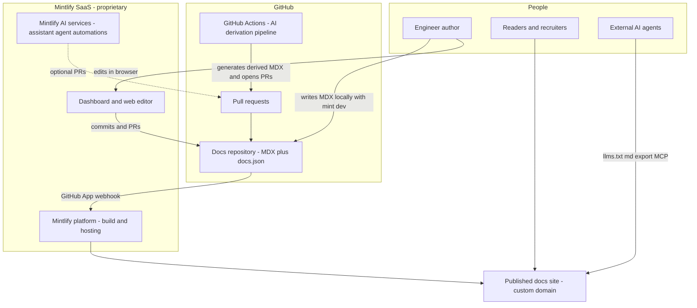
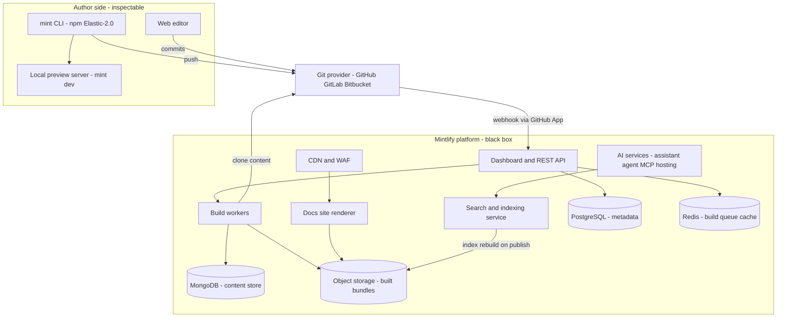
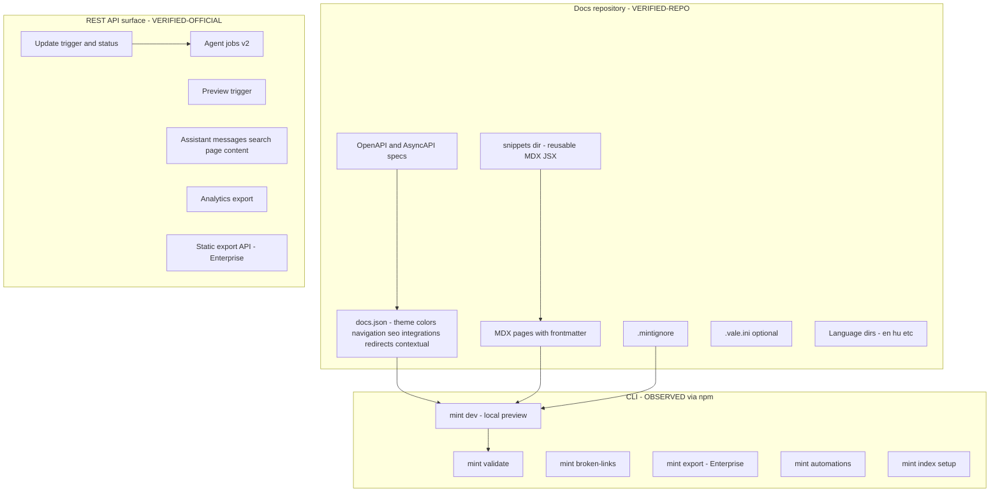
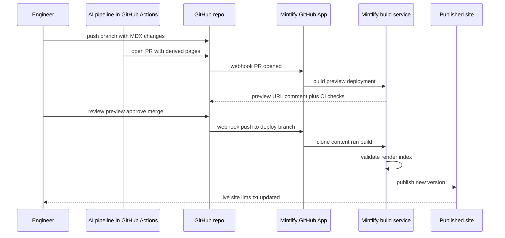
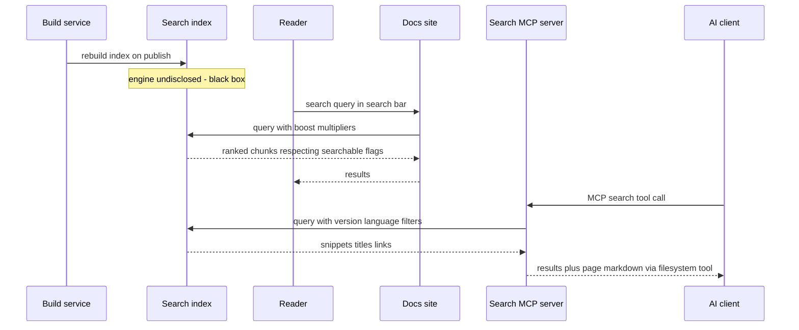

# Solution Architecture Document — Mintlify

**Platform:** Mintlify (https://www.mintlify.com, docs: https://mintlify.com/docs)
**Analysis date:** 2026-08-12
**Analyst scope note:** Mintlify is a commercial SaaS. Its backend (build pipeline, rendering service, search engine, AI services) is **proprietary and not inspectable**. This analysis is grounded in (a) the official documentation, whose source repository `mintlify/docs` is public on GitHub and was cloned and inspected file-by-file `[VERIFIED-OFFICIAL]` / `[VERIFIED-REPO]`; (b) the open-source repos `mintlify/components` (MIT) and `mintlify/starter` (MIT) `[VERIFIED-REPO]`; (c) npm registry metadata for the `mint` CLI `[OBSERVED]`; (d) the official pricing page `[VERIFIED-OFFICIAL]`. The CLI's source repository (`mintlify/mint`, referenced from the npm package) returns 404 and is **not publicly browsable** `[OBSERVED]`; the CLI ships under the Elastic License 2.0 via npm. Everything about internal services is marked `[INFERRED]` or `[UNKNOWN]`.

---

## Executive Summary

Mintlify is a hosted docs-as-code platform: MDX content plus a single `docs.json` configuration file live in a Git repository (GitHub, GitLab, or Bitbucket); a Mintlify-operated pipeline builds and serves the site on every push `[VERIFIED-OFFICIAL]`. Among the platforms in this comparison it is the most aggressively "AI-native": it auto-generates `llms.txt`/`llms-full.txt`, serves every page as Markdown via a `.md` URL suffix or `Accept: text/markdown` header, hosts a per-site search MCP server at `/mcp`, generates `skill.md` agent capability files, and offers an embedded assistant, an autonomous docs agent, and scheduled/triggered "automations" that open reviewed pull requests `[VERIFIED-OFFICIAL]`.

For the target ecosystem — GitHub as canonical source, external AI generating derived views that flow through PR review, static-first serving — Mintlify's fit is strong on the content plane: true Git single-source, GitHub App sync, PR preview deployments, CI checks (broken links, Vale), monorepo and multi-repo layouts, `.mintignore` exclusion, frontmatter metadata, first-class Mermaid (including ELK layout and zoom/pan controls), reusable MDX snippets and custom React components for things like a reusable InterviewPrep component, and `hu` among ~30 supported language codes `[VERIFIED-OFFICIAL]`.

The weaknesses are structural, not functional: the build/serve plane is a vendor-operated black box; self-hosting exists only as an Enterprise "scoped engagement" with a heavy footprint (MongoDB, PostgreSQL, Redis, object storage, roughly 45–60 vCPU) `[VERIFIED-OFFICIAL]`; offline/static export is Enterprise-gated; preview deployments, the REST API, and all AI features require the Pro plan (third-party reporting puts Pro at ~$450/month, the official page renders the number client-side) `[OBSERVED]`; and reader authentication beyond a shared password is Enterprise-only. Weighted score: **85.0/100** — best-in-class authoring and AI surface, with vendor dependence and cost as the principal counterweights.

## HU: Vezetői összefoglaló

A Mintlify egy kereskedelmi, felhőben üzemeltetett docs-as-code platform: a tartalom MDX fájlokként és egyetlen `docs.json` konfigurációként egy Git tárolóban él, a Mintlify pedig minden push után automatikusan felépíti és kiszolgálja az oldalt. A vizsgált platformok közül a leginkább „AI-natív": automatikusan generál `llms.txt` és `llms-full.txt` fájlokat, minden oldalt Markdownként is kiszolgál, oldalankénti MCP szervert üzemeltet, és beépített AI asszisztenst, dokumentációs ügynököt és ütemezett automatizmusokat kínál, amelyek pull requesteket nyitnak.

A célrendszer szempontjából — GitHub mint kanonikus forrás, külső AI által generált származtatott nézetek PR-alapú ellenőrzéssel — a tartalmi oldal kiváló: valódi Git-alapú működés, GitHub App szinkronizáció, PR előnézeti telepítések, CI ellenőrzések, első osztályú Mermaid támogatás, újrafelhasználható komponensek, és a magyar nyelv hivatalosan támogatott a kb. 30 nyelvi kód között.

A gyengeségek szerkezetiek: a build- és kiszolgálóréteg zárt, a self-hosting csak Enterprise szinten, egyedi projektként érhető el, az offline export szintén Enterprise-funkció, az előnézeti telepítések és a REST API pedig a Pro csomagot igénylik, amelynek ára jelentős. Súlyozott pontszám: **85,0/100** — kiemelkedő szerzői és AI-felület, az árazás és a szállítófüggőség ellensúlyával.

## Business & Functional Fit

Mintlify's commercial positioning is "documentation for developers and AI" `[VERIFIED-OFFICIAL]` (`what-is-mintlify.mdx`). The product model has exactly three parts: your Git repository (source of truth), the Mintlify dashboard (deployment/settings/team management + web editor), and the hosted site at `<name>.mintlify.site` or a custom domain `[VERIFIED-OFFICIAL]`.

For the target ecosystem this maps well:

- **Canonical content in GitHub** — supported natively; Mintlify explicitly encourages owning your repo, and even offers a "clone to your own repository" migration path out of Mintlify-hosted repos `[VERIFIED-OFFICIAL]` (`deploy/github.mdx`).
- **Derived AI content through PR review** — Mintlify's whole automation model is PR-centric: its own agent and automations open PRs; external pipelines can do the same, and preview deployments give reviewers a rendered view per PR `[VERIFIED-OFFICIAL]`.
- **Static-first, AI-not-required-to-serve** — the published site is served without any AI in the read path; AI features (assistant, agent) are additive `[VERIFIED-OFFICIAL]`. Caveat: "static-first" is true of the serving model but the *build* is a hosted service, not a static artifact you own, except via Enterprise-only `mint export` `[VERIFIED-OFFICIAL]`.
- **One-engineer operability** — very high: the vendor operates the entire platform; the engineer maintains a repo and a JSON file.

Notable dogfooding signal: of the last 300 commits to Mintlify's own docs repo, 235 were authored by `mintlify[bot]` (their agent/automations, including the `es/`, `fr/`, `zh/` translation trees) with human review in the loop `[VERIFIED-REPO]` (git log of `mintlify/docs`).

## Functional Requirements

Assessment of the target ecosystem's functional requirements against verified capabilities:

| Requirement | Support | Evidence |
|---|---|---|
| Markdown/MDX authoring in Git | Native. MDX pages + YAML frontmatter (`title`, `description`, `keywords`, `boost`, `hidden`, `searchable`, `noindex`, `seo.indexing`) | `[VERIFIED-OFFICIAL]` `organize/pages.mdx`, `optimize/search.mdx` |
| Mermaid diagrams as code | Native ```` ```mermaid ```` blocks, ELK layout option, zoom/pan controls | `[VERIFIED-OFFICIAL]` `components/mermaid-diagrams.mdx` |
| Structured navigation | `docs.json` `navigation` with pages/groups/tabs/anchors/dropdowns/menus/versions/products/languages; `$ref` splitting of config | `[VERIFIED-OFFICIAL]` `organize/navigation.mdx`, `organize/settings.mdx` |
| Reusable components | Built-in component library (30+ components); reusable snippets (`.mdx`/`.md`/`.jsx` imports with props); inline/exported React components with hooks; custom CSS/JS | `[VERIFIED-OFFICIAL]` `create/reusable-snippets.mdx`, `customize/react-components.mdx` |
| Generated-file handling | `.mintignore` (gitignore syntax) excludes files from build/search; `hidden: true` frontmatter for unlisted pages; navigation-only publishing (pages not in nav are hidden) | `[VERIFIED-OFFICIAL]` `organize/mintignore.mdx`, `organize/hidden-pages.mdx` |
| PR preview builds | Automatic per-PR preview URLs (Pro+), manual branch previews, API-triggered previews | `[VERIFIED-OFFICIAL]` `deploy/preview-deployments.mdx` |
| CI quality gates | Broken-link check, Vale prose linting (custom `.vale.ini` supported), warning/blocking levels | `[VERIFIED-OFFICIAL]` `deploy/ci.mdx` |
| Bilingual EN/HU | `hu` is a supported language code; `navigation.languages` with per-language directories and language switcher | `[VERIFIED-OFFICIAL]` `guides/internationalization.mdx` |
| API reference docs | OpenAPI 3.x/AsyncAPI/GraphQL-driven page generation + interactive playground | `[VERIFIED-OFFICIAL]` `api-playground/overview.mdx` |
| Programmatic control | REST API: trigger update, update status, trigger preview, trigger automation, agent jobs, assistant messages, search, page content, analytics export (Pro+) | `[VERIFIED-OFFICIAL]` `api/introduction.mdx` + shipped OpenAPI specs (`admin-openapi.json` etc.) |
| AI-readable output | Auto `llms.txt`/`llms-full.txt` (also at `/.well-known/`), `.md` URL suffix, `Accept: text/markdown`, `skill.md`, search MCP at `/mcp`, `<Visibility for="agents">` audience gating | `[VERIFIED-OFFICIAL]` `ai/*.mdx` |
| Versioning | `versions` in navigation; version-filtered search | `[VERIFIED-OFFICIAL]` `organize/navigation.mdx`, `ai/model-context-protocol.mdx` |
| Redirects | `redirects` in `docs.json` | `[VERIFIED-REPO]` `docs.json` of mintlify/docs |

Gaps: no build-plugin system (you cannot hook the build pipeline); no arbitrary remark/rehype plugins; theming limited to 8 named themes plus CSS overrides `[VERIFIED-OFFICIAL]` (`customize/themes.mdx`).

## Non-functional Requirements

- **Availability/performance:** vendor-operated CDN-fronted hosting; a performance SLA is an Enterprise line item on the pricing page `[VERIFIED-OFFICIAL]`. No public uptime numbers verified `[UNKNOWN]`.
- **Scalability:** black box; the self-host architecture doc reveals the shape (build workers, object storage for built bundles, CDN) `[VERIFIED-OFFICIAL]` `deploy/self-host.mdx`, which supports an inference that hosted serving is pre-built static bundles behind a CDN `[INFERRED]`.
- **Data residency:** EU hosting and BYOK listed under Enterprise on the pricing page `[VERIFIED-OFFICIAL]`.
- **Operability by one engineer:** excellent on the hosted plan (vendor runs everything); self-hosting explicitly violates the anti-overengineering rule (45–60 vCPU, 160–220 GB RAM, MongoDB+PostgreSQL+Redis+object storage) `[VERIFIED-OFFICIAL]`.
- **Exportability/reversibility:** content is portable MDX in your repo (excellent); the rendered site is only exportable via Enterprise `mint export` zip bundles served by a bundled Node server `[VERIFIED-OFFICIAL]` `deploy/export.mdx`.

## C4 L1 — System Context



## C4 L2 — Containers

Container boundaries inside Mintlify are drawn from the officially documented self-host architecture, which is the only place the vendor discloses internal topology `[VERIFIED-OFFICIAL]` (`deploy/self-host.mdx`); the hosted service is assumed to be materially similar `[INFERRED]`.



## C4 L3 — Components

L3 decomposes the two layers that ARE inspectable — the content/configuration layer in the repo and the CLI/components packages — plus the documented API surface. Internal service decomposition beyond this is `[UNKNOWN]`.



## Author → Build → Publish sequence



`[VERIFIED-OFFICIAL]` for every hop: `deploy/github.mdx`, `deploy/preview-deployments.mdx`, `deploy/ci.mdx`, `deploy/deployments.mdx`. Build internals (validate/render/index steps) are `[INFERRED]` from observable outputs.

## Search/indexing sequence



`[VERIFIED-OFFICIAL]`: index rebuild on publish (`deploy/self-host.mdx`), boost/searchable frontmatter (`optimize/search.mdx`), MCP tools and filters (`ai/model-context-protocol.mdx`). The search engine technology itself is **not documented anywhere** — `[UNKNOWN]`.

## Deployment & Infrastructure

- **Default:** fully vendor-hosted. Site at `<subdomain>.mintlify.site`, custom domains on all plans (custom domain listed under Starter on pricing page) `[VERIFIED-OFFICIAL]`. Subpath hosting (`example.com/docs`) via customer-operated reverse proxy, Cloudflare, Vercel, or Route53/CloudFront is documented `[VERIFIED-OFFICIAL]` (`deploy/docs-subpath.mdx`, `deploy/reverse-proxy.mdx`).
- **Git providers:** GitHub (App), GitHub Enterprise Server, GitLab incl. self-managed, Bitbucket Cloud `[VERIFIED-OFFICIAL]` (`deploy/ghes.mdx`, `deploy/gitlab-self-hosted.mdx`, `deploy/bitbucket.mdx`).
- **Monorepo:** docs path within a repo configurable; **multi-repo:** multiple repos composed into one site under path prefixes (Enterprise) `[VERIFIED-OFFICIAL]`.
- **Self-hosting:** exists, Enterprise-only, delivered as an account-team "scoped engagement" — AWS CDK app or Helm chart (AKS/GKE/OKE/OpenShift/any K8s). Requires MongoDB, PostgreSQL, Redis, S3-compatible storage, ingress, IdP; sized at ~45–60 vCPU / 160–220 GB RAM / ~1 TB SSD for production `[VERIFIED-OFFICIAL]` (`deploy/self-host.mdx`). This is not self-serve and not a one-engineer footprint.
- **Air-gapped/static:** `mint export` produces a zip of pre-rendered HTML + assets + a zero-dependency Node `serve.js`; Enterprise-only; also a Static Export REST API `[VERIFIED-OFFICIAL]` (`deploy/export.mdx`, `api/static-export/*`).

## Security Architecture

- **Reader-facing auth:** password auth (Pro+), Mintlify-org "private" auth (all plans), OAuth 2.0 and JWT with group-based access control (Enterprise) `[VERIFIED-OFFICIAL]` (`deploy/authentication-setup.mdx`). Not supported on subpath-hosted sites.
- **Dashboard/team:** SSO (OIDC/SAML), SCIM, RBAC, audit logs, session security, dashboard network access policies, security contact — all Enterprise `[VERIFIED-OFFICIAL]` (`dashboard/*.mdx`).
- **Repo access:** the GitHub App is installed per-repository with admin approval; the agent can only read repos you connect `[VERIFIED-OFFICIAL]`.
- **CSP:** configurable (`deploy/csp-configuration.mdx`) `[VERIFIED-OFFICIAL]`.
- **Build sandboxing:** Vale config forbids absolute paths and `..` "for security reasons" — indicating a shared, sandboxed build environment `[VERIFIED-OFFICIAL]` `[INFERRED]`.
- **Certifications/compliance:** not verified in this analysis; not claimed here `[UNKNOWN]`.
- **Fork PRs:** previews are deliberately NOT built for fork PRs (the App can't read forks) — a sensible supply-chain posture `[VERIFIED-OFFICIAL]`.

## Threat Model

Threats specific to adopting Mintlify for the target ecosystem:

1. **Vendor compromise or outage (build/serve plane).** Content is safe in Git, but publishing and serving depend wholly on Mintlify. Mitigation: keep a degraded-mode static fallback (any SSG rendering the same MDX subset) and DNS runbook; content portability makes this credible.
2. **Custom JS injection surface.** `docs.json` allows custom scripts and third-party analytics tags sitewide; a malicious or compromised snippet is an XSS vector. Mitigation: PR review over `docs.json` and any `.js` files; CSP configuration `[VERIFIED-OFFICIAL]`.
3. **AI agent write access.** The admin MCP and agent can edit content and settings; the docs themselves warn to treat it as write-capable and review every PR `[VERIFIED-OFFICIAL]` (`ai/mintlify-mcp.mdx`). Mitigation: branch protection (agent falls back to PR when direct push is blocked — documented behavior), scoped connections.
4. **Prompt-injection into AI features.** Assistant/agent read published pages and connected repos; hostile content in a connected repo could steer automations. Mitigation: connect only trusted repos; review automation PRs.
5. **Hidden-page leakage.** Hidden pages are public-by-URL; derived-but-unreviewed content must never rely on `hidden: true` for confidentiality `[VERIFIED-OFFICIAL]` (`organize/hidden-pages.mdx` warning).
6. **GitHub App blast radius.** App has write access (agent PRs, web editor commits). Mitigation: install on the docs repo only, use branch protection on the deploy branch.
7. **Exported bundle leakage.** `mint export --groups` bakes restricted pages into an unauthenticated zip `[VERIFIED-OFFICIAL]`. Mitigation: distribution controls.
8. **API key handling.** Admin keys (`mint_` prefix) are org-wide and server-side only; up to 10 keys/hour, expiries configurable `[VERIFIED-OFFICIAL]`. Mitigation: rotate, expire, store in CI secrets.

## Operational Model

Day-to-day on the hosted plan is close to zero-ops: push → build → publish. The dashboard shows deployment history and supports manual re-deploys when webhook delivery fails `[VERIFIED-OFFICIAL]` (`deploy/deployments.mdx`). Failure modes documented by the vendor: GitHub App not installed/authorized, failed builds surfaced in dashboard, OpenAPI URL fetch failures (`help-center/openapi-url-fetch-fails-during-build.mdx`). Monitoring signals available to the operator: deployment status (dashboard + `api/update/status`), CI check results on PRs, analytics APIs, assistant/feedback analytics. There is no user-visible build log streaming API documented `[UNKNOWN]`. Upgrades are continuous and vendor-managed (no version pinning on the hosted plan) — a change-management risk you cannot schedule around, mitigated only by the self-host plan's versioned releases `[VERIFIED-OFFICIAL]`.

## Extensibility / Plugin Architecture

There is **no build-plugin system**. Extensibility is content-side:

- **Component library:** 30+ built-in MDX components (Accordions, Cards, Steps, Tabs, Code groups, Fields, Mermaid, Update/changelog, Tree, Panel, Tooltip, Visibility, etc.) `[VERIFIED-OFFICIAL]`; the underlying React implementations are open source in `mintlify/components` (MIT, Storybook, Tailwind) `[VERIFIED-REPO]`.
- **Custom components:** inline `export const X = () => ...` in MDX with React hooks; reusable `.jsx`/`.mdx` snippets imported by path; client-side only (no SSR data fetching documented) `[VERIFIED-OFFICIAL]` (`customize/react-components.mdx`). This directly supports a reusable `InterviewPrep` component as a snippet.
- **Custom CSS/JS:** sitewide files; Tailwind classes (v3 syntax, no arbitrary values) `[VERIFIED-OFFICIAL]`.
- **Themes:** 8 named themes (`mint`, `maple`, `palm`, `willow`, `linden`, `almond`, `aspen`, `sequoia`) selected in `docs.json`; deeper layout changes via custom CSS or Enterprise "custom frontend" guide `[VERIFIED-OFFICIAL]`.
- **What you cannot do:** add remark/rehype plugins, alter the rendering pipeline, add server-side logic, or swap the search engine. `[VERIFIED-OFFICIAL]` by omission — no such configuration exists in the settings reference.

## Developer Experience

Excellent and well-documented. `npm i -g mint`; `mint dev` local preview with hot reload; `mint validate` (with improved error explanations per the Aug 2026 changelog); `mint broken-links`; `mint openapi-check`; `mint automations` CRUD from the terminal; `mint index setup` for the Mintlify Index `[VERIFIED-OFFICIAL]` (`cli/commands.mdx`). The `docs.json` has a published JSON Schema (`$schema: https://mintlify.com/docs.json`) giving IDE autocomplete `[VERIFIED-REPO]` (starter repo). Config can be split with `$ref` for maintainability `[VERIFIED-OFFICIAL]`. Guides ship for Claude Code, Cursor, Codex, and Devin workflows, including a maintained `AGENTS.md` in the starter kit `[VERIFIED-REPO]`. Caveats: the CLI is Elastic-2.0 licensed and its source repo is private `[OBSERVED]`; local preview fidelity vs. hosted build is high but the hosted pipeline remains authoritative.

## Writer / Content UX

Two first-class workflows that interoperate through Git: the browser web editor (visual + Markdown modes, slash commands, branching, comments, suggestions/review mode, private draft pages, live preview panes, publish = commit) `[VERIFIED-OFFICIAL]` (`editor/*.mdx`), and the local CLI workflow. Non-developer contributors get a real WYSIWYG surface without leaving the Git model — an unusual strength among docs-as-code tools. Snippets are not editable in the web editor `[VERIFIED-OFFICIAL]` (noted limitation). Frontmatter is form-edited in the editor; keyboard shortcuts and duplicate-page exist.

## Localization

Directory-per-locale model: `hu/` mirror tree + a `languages` array in `navigation` with per-language full navigation (labels translated in nav config), language switcher rendered automatically, first language = default `[VERIFIED-OFFICIAL]` (`guides/internationalization.mdx`). **Hungarian (`hu`) is explicitly in the supported language-code list** `[VERIFIED-OFFICIAL]`. Search/MCP support `language` filters `[VERIFIED-OFFICIAL]`. Costs of the model: navigation must be duplicated per language (mitigated by `$ref` config splitting), and translation is your job — either the paid Translations automation (avg. ~913 credits/run `[VERIFIED-OFFICIAL]` `credits.mdx`) or an external pipeline. Mintlify itself maintains `es`/`fr`/`zh` trees via the General Translation (`gt.config.json`) toolchain with bot commits `[VERIFIED-REPO]` — evidence the external-pipeline pattern works, which matches the target ecosystem's provider-independent AI approach.

## SEO

Strong and automatic: meta tags, canonical URLs, `sitemap.xml`, `robots.txt`, JSON-LD structured data as a connected `@graph` (Organization, WebSite, WebPage, BreadcrumbList, TechArticle/APIReference), auto-generated OG images, `noindex`/`indexing` frontmatter control, `metatags` overrides in `docs.json` or frontmatter, and a GEO (generative engine optimization) guide `[VERIFIED-OFFICIAL]` (`optimize/seo.mdx`, `guides/geo.mdx`). Hidden pages default to non-indexed. This is best-in-class for a hosted platform.

## Search

Built-in search bar with configurable ranking: `boost` multiplier per page (frontmatter) or per navigation group with inheritance; `searchable: false` opt-out; max-results setting; product/version filters (filters Enterprise-gated) `[VERIFIED-OFFICIAL]` (`optimize/search.mdx`). Index rebuilds on publish `[VERIFIED-OFFICIAL]`. The underlying engine is **undisclosed** — no Algolia/Typesense/etc. reference exists anywhere in the official docs `[UNKNOWN]`; treat as black box. Additional layers: per-site search MCP server (`/mcp`, authed variant `/authed/mcp`) and "Mintlify Index" (`index.mintlify.com`), a cross-site retrieval API/MCP for coding agents with its own API key `[VERIFIED-OFFICIAL]` (`search-index/*.mdx`). No option to bring your own search engine.

## GitHub Integration

The deepest of any hosted docs platform examined here: GitHub App with per-repo install; webhook-driven deploys on push to the deploy branch; automatic PR preview URLs + preview widget showing changed pages; CI checks (broken links, Vale) with warning/blocking levels; monorepo docs-path; multi-repo composition; GHES support; agent PRs attributed via connected GitHub accounts; automerge configuration guide; fork-PR previews intentionally unsupported `[VERIFIED-OFFICIAL]` (`deploy/*.mdx`, `guides/configure-automerge.mdx`). The web editor writes commits/branches/PRs to the same repo, so even browser edits stay Git-canonical `[VERIFIED-OFFICIAL]`.

## Mermaid Support

Native and better than baseline: fenced ```` ```mermaid ```` blocks render automatically; ELK layout engine supported via init directive for large diagrams; built-in zoom/pan/reset controls with `placement` and `actions` props; all Mermaid diagram types per upstream docs `[VERIFIED-OFFICIAL]` (`components/mermaid-diagrams.mdx`). Mintlify's own docs use Mermaid in architecture pages `[VERIFIED-REPO]` (`deploy/self-host.mdx`, `what-is-mintlify.mdx`). Mermaid-as-code in Git works with zero configuration. Version of bundled Mermaid: undocumented `[UNKNOWN]`.

## AI Integration Suitability

Two distinct planes, and the distinction matters for the target ecosystem:

1. **AI-readability of the published site (free-to-consume, provider-neutral):** auto `llms.txt`/`llms-full.txt` (+ `.well-known` variants + discovery HTTP headers), `.md` suffix and `Accept: text/markdown` for every page, `skill.md` auto-generation (agentskills.io spec + A2A agent-card), search MCP server with search/filesystem/feedback tools, contextual menu with one-click "Open in ChatGPT/Claude/Perplexity/…", `<Visibility for="agents">` audience-split content, `markdown.instructions` for site-wide agent guidance `[VERIFIED-OFFICIAL]` (`ai/*.mdx`). This is the strongest AI-consumption surface of any platform in this comparison.
2. **Mintlify's own AI (proprietary, credit-metered):** assistant (embedded Q&A, Pro+, ~23 credits/response), agent (PR-writing docs bot; editor, Slack, API), automations (scheduled/push/integration-triggered agent runs, e.g. translations, changelog, broken links), admin MCP (`mcp.mintlify.com`) for external AI tools to edit content via OAuth `[VERIFIED-OFFICIAL]`. Model choice is not configurable on hosted plans (self-host can point at your own model endpoint/key `[VERIFIED-OFFICIAL]`), and everything is metered in credits.

For the ecosystem's rule that AI must not be required to serve docs: satisfied — all AI features are additive. For provider independence: the built-in AI is NOT provider-independent, but the ecosystem's own external pipeline (Claude/Gemini/OpenAI behind its own abstraction, running in GitHub Actions) coexists cleanly because Mintlify consumes whatever MDX lands in Git.

## Automated Content Generation Suitability

The critical question for derived views (recruiter pages, interview-prep, role-specific docs): can an external pipeline generate content safely and cheaply? Yes:

- Derived MDX under e.g. `derived/` directories is ordinary content; navigation placement is explicit in `docs.json`, so derived views can live in dedicated tabs/groups (or a separate language-style tree) `[VERIFIED-OFFICIAL]`.
- Incremental regeneration = ordinary Git diffs + PR; Mintlify rebuilds on merge; `api/update/trigger` and `api/preview/trigger` allow CI-driven control (Pro+) `[VERIFIED-OFFICIAL]`.
- Guardrails: `.mintignore` keeps working files out of the site; `hidden: true` for unlinked-but-published pages; `searchable: false` and `boost: 0.x` de-emphasize derived pages in search; `seo`/`noindex` frontmatter controls crawler exposure; broken-link CI and Vale gate quality `[VERIFIED-OFFICIAL]`.
- Frontmatter is plain YAML — a `generated: true`/provenance convention is trivially supportable (arbitrary keys are ignored by the renderer; only known keys are consumed `[INFERRED]`, low risk).
- Validation pre-merge: `mint validate` + `mint broken-links` run fine in GitHub Actions (CLI is npm-installable) `[OBSERVED]`.
- Alternative: Mintlify's own agent-jobs API could do generation, but that would couple generation to the vendor and its credits — contrary to the ecosystem's provider abstraction. Use it optionally, not structurally.

Main friction: `docs.json` navigation must be updated programmatically when derived pages are added/removed (JSON manipulation in the pipeline; schema-validated, `$ref`-splittable — manageable).

## API / Automation Surface

REST API (Pro+), with OpenAPI specs shipped in the docs repo (`admin-openapi.json`, `analytics.openapi.json`, `discovery-openapi.json`, `static-export-openapi.json`) `[VERIFIED-REPO]`:

- **Update:** trigger update, get status. **Preview:** trigger preview deployment for a branch. **Automations:** trigger on demand. **Agent:** create job, get job, send follow-up (v2). **Assistant:** create message (embed anywhere), search, get page content. **Analytics:** feedback, feedback-by-page, assistant conversations/caller stats, searches, views, visitors. **Admin:** "deslop" — detect AI-sounding prose. **Static export:** generate bundle, job status (Enterprise) `[VERIFIED-OFFICIAL]` (`api/introduction.mdx`).
- Three key types: Admin (`mint_`, org-wide, server-side), Assistant (deployment-scoped), Index (separate product) `[VERIFIED-OFFICIAL]`.
- CLI covers dev loop + automations; admin MCP covers conversational admin. Webhooks *from* Mintlify to you are not documented `[UNKNOWN]`.

## Community / Maintenance

The platform is a VC-backed commercial product under very active development — the changelog shows weekly-cadence releases (Aug 7, 2026 entry inspected) `[VERIFIED-OFFICIAL]`. Public repos: `mintlify/docs` (433 stars, 239 forks, 86 open issues, 277 commits in the last 30 days, MIT, external contributions accepted with a CONTRIBUTING.md) `[VERIFIED-REPO]`/`[OBSERVED]`; `mintlify/starter` (~1.9k stars, MIT); `mintlify/components` (114 stars, MIT, changelog v1.0.18 dated 2026-07-01) `[OBSERVED]`. The core platform has no community governance — you depend on the vendor's roadmap. There is no meaningful "community plugin" ecosystem because there is no plugin API.

## Licensing

- **Platform/backend:** proprietary SaaS `[VERIFIED-OFFICIAL]`.
- **CLI (`mint`, `mintlify`, `@mintlify/cli` npm packages):** Elastic License 2.0 `[OBSERVED]` (npm metadata) — source-available terms, but the referenced repo `mintlify/mint` is private (404) `[OBSERVED]`, so in practice the CLI is a binary-style dependency.
- **`mintlify/components`:** MIT `[VERIFIED-REPO]`. **`mintlify/starter`:** MIT `[VERIFIED-REPO]`. **`mintlify/docs` content:** MIT `[VERIFIED-REPO]`.
- **Your content:** stays yours, in your repo — no content lock-in; presentation-layer lock-in (docs.json, Mintlify-specific components) is real but bounded.

## Cost Drivers

Verified from the official pricing page on 2026-08-12 `[VERIFIED-OFFICIAL]` unless noted:

- **Starter — $0/mo:** 5 editor seats, full platform, custom domain, web editor, authentication (private auth), MCP server, API playground.
- **Pro — price rendered client-side on the official page; not verifiable via static fetch.** Third-party reporting (Ferndesk, Dec 2025) states $450/mo billed annually, $540 month-to-month `[OBSERVED — third-party, MEDIUM confidence]`. Adds: unlimited editors, agent, assistant, automations, preview deployments, admin APIs. Per official docs, each Pro plan contributes 10,000 AI credits/month to an org-shared, rolling balance `[VERIFIED-OFFICIAL]` (`credits.mdx`).
- **Enterprise — contact sales:** SSO/SCIM/RBAC, performance SLA, OAuth/JWT reader auth, audit logs, analytics streaming, PDF export, search filters, multi-repo, static export, self-hosting, EU hosting, BYOK.
- **AI credits:** add-ons at 15,000/$145, 40,000/$370, 90,000/$800 per month; average consumption e.g. assistant response ≈23, translation automation run ≈913 credits `[VERIFIED-OFFICIAL]` (`credits.mdx`).
- Cost cliff to watch: the target ecosystem's PR-preview review loop for AI-derived content requires **Pro**, so the realistic floor for the intended workflow is the Pro subscription even if all AI generation runs externally.

## Top 8 Risks + Mitigations

| # | Risk | Likelihood | Impact | Mitigation |
|---|---|---|---|---|
| 1 | Vendor lock-in of the presentation layer (docs.json, MDX components, hosted build) | High | Medium | Keep content plain-MDX-first; wrap Mintlify components in snippets; maintain a minimal fallback SSG proving the corpus renders elsewhere |
| 2 | Pro-plan cost outgrows a one-engineer project (previews + API gated) | High | Medium | Validate on Starter; adopt Pro only when preview-based review of derived content proves its value; watch credit overages |
| 3 | Hosted platform outage or company failure — no self-serve export below Enterprise | Low | High | Git holds canonical content; documented DNS cutover runbook to fallback renderer; periodic HTML mirror via crawling own site (`.md` endpoints are free to fetch) |
| 4 | Unscheduled platform changes (continuous vendor deploys) alter rendering/behavior | Medium | Medium | Subscribe to changelog RSS; visual smoke checks in CI against the live site; avoid undocumented behaviors |
| 5 | AI agent/admin-MCP write path abused or over-trusted | Medium | Medium | Branch protection on deploy branch (forces PRs); scoped MCP connections; human review mandatory for all bot PRs |
| 6 | Derived/hidden content leaks (hidden pages are public-by-URL; export zips unauthenticated) | Medium | Medium | Never publish pre-review derivations; keep drafts in `.mintignore` scope or unmerged branches; treat `hidden` as unlisted, not private |
| 7 | Search/AI answer quality is a black box you cannot tune beyond boost values | Medium | Low | Use `boost`, `searchable`, good frontmatter; monitor search analytics API; accept residual opacity |
| 8 | Bilingual maintenance drift between `en/` and `hu/` trees | High | Medium | CI check comparing file trees; external translation pipeline with per-file hash tracking; the vendor's own gt-based bot workflow is a proven pattern |

## Migration Plan

**Inbound (adopting Mintlify):**
1. Scaffold from `mintlify/starter`; port existing Markdown to MDX (mostly rename + frontmatter); Mermaid blocks work unchanged.
2. Model navigation in `docs.json`; split with `$ref` per section/language.
3. Connect GitHub repo + install GitHub App on that repo only; set deploy branch + branch protection.
4. Add `.mintignore` for pipeline working files; define `derived/` conventions and frontmatter provenance keys.
5. Wire GitHub Actions: `mint validate` + `mint broken-links` on PR; (Pro) trigger preview via API if needed beyond automatic PR previews.
6. Add `hu/` tree + `languages` navigation; stand up the external translation step.
7. Custom domain + DNS; SEO fields; contextual menu options.
Effort: days, not weeks, for a single engineer — migration friction is genuinely low `[INFERRED from verified feature set]`.

**Outbound (exit):** content and diagrams leave as MDX in Git; effort concentrates in (a) replacing Mintlify components with equivalents (the MIT `@mintlify/components` package can be reused in a custom React/Next site `[VERIFIED-REPO]`), (b) rebuilding navigation from `docs.json`, (c) re-implementing search/assistant. No data-egress barrier for content; analytics history export via API (Pro) before leaving.

## Prioritized Recommendations

1. **Adopt Git-owned-repo mode from day one** — never let content live in the `mintlify-community` hosted repo; own the repo, install the App on it alone.
2. **Start on Starter ($0), upgrade to Pro only for the preview-review loop** — the free tier covers custom domain, full rendering, Mermaid, llms.txt, and the MCP server; Pro's price is material.
3. **Keep AI generation external and provider-abstracted** (GitHub Actions + your own model keys); treat Mintlify's agent/automations as optional convenience, not architecture. This preserves the ecosystem's provider independence and avoids credit-metering as a structural cost.
4. **Enforce PR-only publishing with branch protection** — this also constrains Mintlify's own agent to PR mode (documented fallback behavior).
5. **Isolate derived content** in dedicated navigation tabs/groups and directories, with `generated:`-style frontmatter provenance, `boost` de-prioritization, and explicit `seo.indexing` decisions per class of derived page.
6. **Implement EN↔HU tree-parity CI** (file-list diff + staleness hashes) before enabling the `hu` navigation, so the switcher never exposes missing translations.
7. **Wrap all Mintlify-specific components in local snippets** (e.g. `snippets/InterviewPrep.jsx`) so an exit means rewriting snippet internals, not touching hundreds of pages.
8. **Maintain a fallback render path**: a trivial SSG config in the same repo that can serve the MDX corpus read-only if the vendor is unavailable; rehearse the DNS cutover once.
9. **Do not plan on self-hosting** — it is Enterprise-only, engagement-based, and its infrastructure footprint contradicts the one-engineer anti-overengineering rule.
10. **Fetch and archive your own `.md`/`llms-full.txt` outputs periodically** — a free, official, always-current plaintext mirror of the published site for backup and downstream AI use.

## Architectural Verdict

Mintlify is the strongest hosted candidate for the target ecosystem's *presentation layer*: genuinely Git-canonical, the best AI-consumption surface in the market (llms.txt, per-page Markdown, MCP, skill.md), first-class Mermaid, real PR previews and CI gates, official Hungarian support, and near-zero operations for one engineer. Its costs are equally clear: a proprietary, uninspectable build/serve plane; self-hosting and static export locked behind Enterprise; the practical workflow (previews + API) gated behind a Pro plan whose price is significant for a personal-scale project; and a paid, provider-locked built-in AI layer that the ecosystem should deliberately *not* depend on. Adopt it as a replaceable presentation tier over a Git corpus that never becomes Mintlify-shaped beyond `docs.json` and wrapped components — under that discipline it is an excellent fit; without that discipline it is a comfortable lock-in.

## Target-System Fit Assessment

**Git/GitHub as canonical source.** Fully satisfied. Content is MDX in your GitHub repo; the GitHub App syncs on push; the web editor and even Mintlify's own AI write back through commits/PRs, so there is exactly one source of truth `[VERIFIED-OFFICIAL]`. No shadow CMS exists (the "Mintlify-hosted repo" onboarding mode must be explicitly avoided, and the vendor documents the clone-out path).

**Markdown + Mermaid + frontmatter fidelity.** Satisfied. MDX is a superset of the canonical Markdown requirement (a constraint worth managing: derived generators should emit conservative MDX). Mermaid is native with ELK and interactive controls. Frontmatter drives title/description/SEO/search/visibility, and unknown provenance keys can ride along `[VERIFIED-OFFICIAL]`/`[INFERRED]`.

**AI layer transforms canonical docs into derived views.** Well supported *around* the platform: the external pipeline writes derived MDX, opens PRs, previews render per-PR (Pro), CI gates run via the npm CLI, and navigation placement isolates derived sections. Mintlify's own agent could do this but would violate provider independence; it remains an optional accelerator `[VERIFIED-OFFICIAL]`.

**Separation + validation + incremental regeneration of derived content.** Supported by convention, not by product feature: directories + navigation groups + frontmatter provenance + `.mintignore` + hidden pages give all needed primitives; incremental regeneration is plain Git diffing. Nothing in the platform fights this model.

**AI not required to serve docs.** Satisfied on the hosted plan (static-served site; AI features additive). The nuance: *serving* depends on Mintlify's cloud, so "static-first" independence is weaker than with a self-owned SSG — mitigated by the archival strategies above, fully solved only at Enterprise (static export/self-host).

**One capable engineer, anti-overengineering.** The hosted plan is arguably the lowest-ops option in the entire comparison set. Self-hosting is the opposite extreme and should be ruled out. The residual complexity budget goes to the external AI pipeline and the EN/HU parity tooling — which is where the ecosystem wants its complexity anyway.

**Bilingual EN/HU.** Officially supported (`hu` code, language switcher, per-language navigation, language-filtered search/MCP). The duplicated-tree model demands pipeline discipline but matches the ecosystem's plan of AI-assisted translation through PRs — the vendor demonstrably runs the same pattern on its own docs `[VERIFIED-REPO]`.

**Provider independence.** Content-plane: yes. Presentation-plane: no — this is the single deliberate trade-off of choosing Mintlify, to be priced against its authoring UX, AI surface, and zero-ops hosting.
