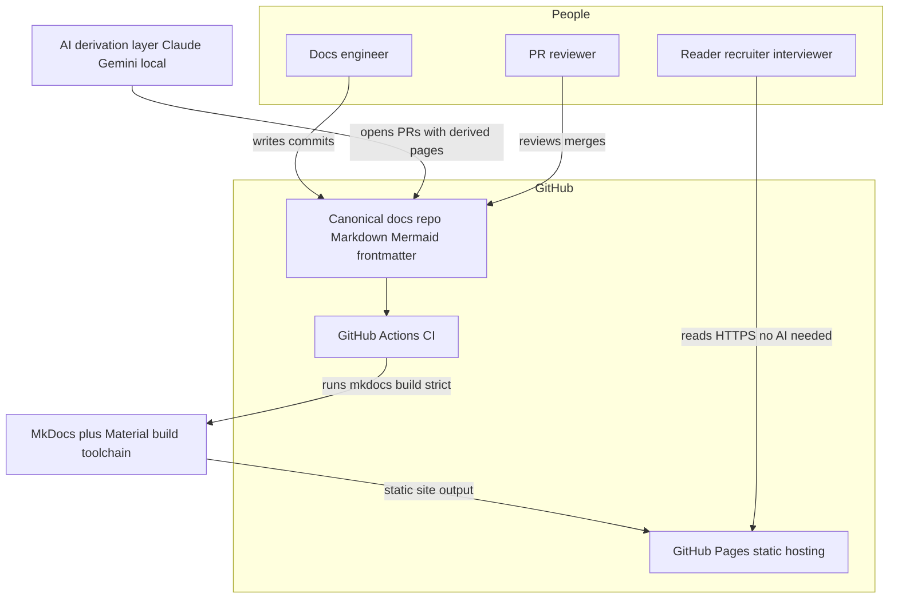
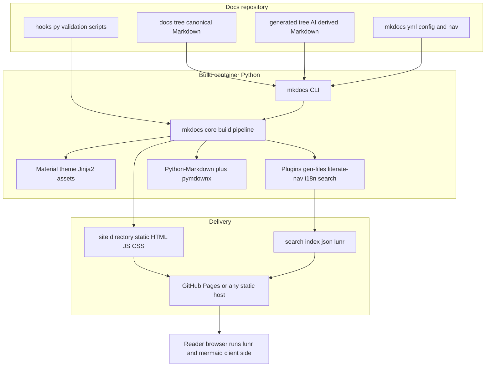
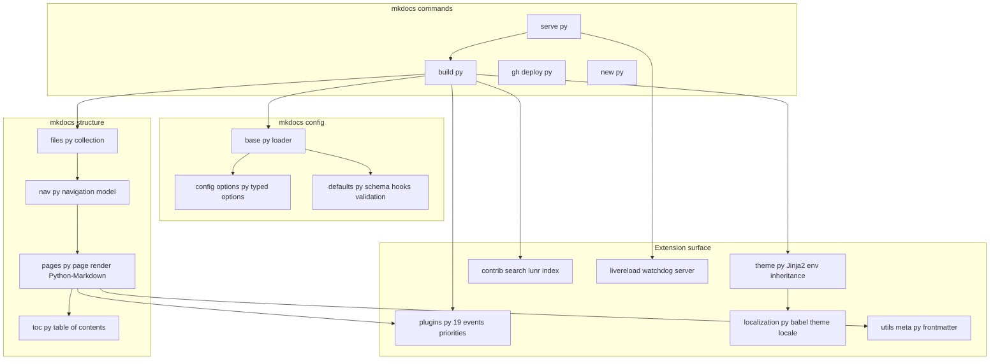
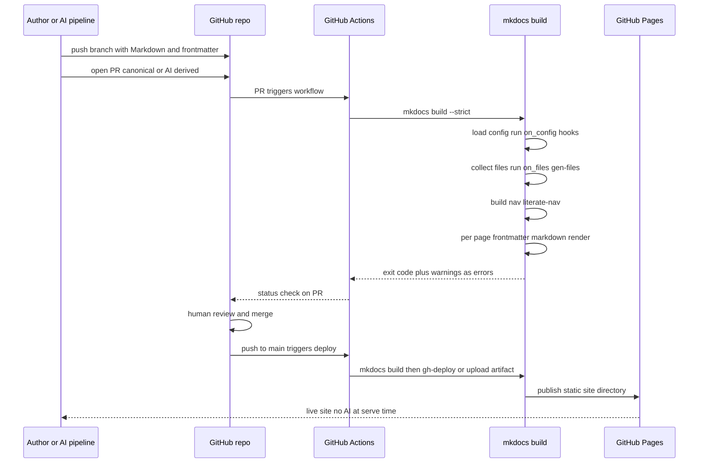
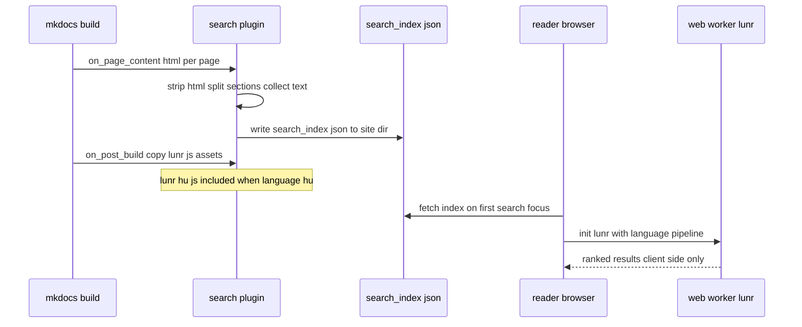

# Solution Architecture Document — MkDocs (+ Material for MkDocs ecosystem)

Analyst: Principal Solution Architect (platform: MkDocs). Date: 2026-08-12.
Repos inspected: `/tmp/mkdocs` (shallow clone of github.com/mkdocs/mkdocs) and `/tmp/mkdocs-material` (shallow clone of github.com/squidfunk/mkdocs-material). All repo citations reference paths inside those clones.

---

## Executive Summary

MkDocs is a small, Python-based static site generator purpose-built for project documentation: Markdown in, static HTML out, configured by a single `mkdocs.yml`. Its architecture is close to the theoretical minimum for a docs-as-code publishing layer: a CLI (`mkdocs/commands/`), a config loader with typed validation (`mkdocs/config/`), a file/nav/page model (`mkdocs/structure/`), a Python-Markdown rendering pipeline, Jinja2 themes, a 19-event plugin API (`mkdocs/plugins.py`), single-file Python hooks, and a bundled lunr.js client-side search (`mkdocs/contrib/search/`) `[VERIFIED-REPO]`. For the target GitHub-native, AI-augmented ecosystem, this is close to an ideal *technical* fit: canonical Markdown + YAML frontmatter is parsed natively (`mkdocs/utils/meta.py`), builds are deterministic and AI-free, output is pure static files, and the plugin/hook API lets one engineer inject programmatic page generation (mkdocs-gen-files), nav synthesis (mkdocs-literate-nav), validation, and metadata handling directly into the build in plain Python.

The decisive caveat is strategic, not technical. MkDocs core is dormant: last release 1.6.1 on 2024-08-30, and the last commits on master are documentation fixes from 2025-10-20 `[VERIFIED-REPO]`. The de-facto standard theme, Material for MkDocs (which supplies Mermaid-via-superfences, the modern search UX, blog/social/tags plugins, and 69 language packs including Hungarian `[VERIFIED-REPO]`), entered maintenance mode on 2025-11-05 when the squidfunk team pivoted to Zensical, and its `SECURITY.md` sets a public security-support end-of-life of **2026-11-05** — under three months from this analysis `[VERIFIED-REPO]` `[VERIFIED-OFFICIAL]`. The satellite ecosystem (gen-files, literate-nav, mike, static-i18n, macros) remained actively released through 2026 `[VERIFIED-OFFICIAL]`.

Verdict in one line: best-in-class docs-as-code mechanics and the simplest architecture in this comparison, but adopting it in August 2026 means adopting a stack whose flagship theme exits public security support in ~3 months and whose core has had no release in two years — acceptable only with pinned versions, a low-attack-surface posture, and a pre-planned exit path (Zensical migration or fork/pin).

## HU: Vezetői összefoglaló

Az MkDocs egy kisméretű, Python-alapú statikus oldalgenerátor, amelyet kifejezetten dokumentációra terveztek: Markdown a bemenet, statikus HTML a kimenet, a teljes konfiguráció egyetlen `mkdocs.yml` fájl. Architektúrája a docs-as-code publikálási réteg elméleti minimumához közelít: CLI, típusos konfigurációs validáció, fájl- és navigációs modell, Python-Markdown feldolgozó, Jinja2 sablonrendszer, 19 eseményből álló plugin API, egyfájlos Python hookok és beépített lunr.js keresés — a magyar nyelvű szótöveléshez `lunr.hu.js` is a csomag része. A cél-ökoszisztéma szempontjából a technikai illeszkedés kiváló: a kanonikus Markdown + YAML frontmatter natívan feldolgozott, a build determinisztikus és AI-mentes, a kimenet tisztán statikus, a plugin- és hook-felület pedig lehetővé teszi, hogy egyetlen mérnök programozott oldalgenerálást, validációt és metaadat-kezelést építsen a buildbe.

A döntő kockázat stratégiai: az MkDocs mag 2024 augusztusa óta nem adott ki új verziót, a de-facto szabvány Material téma pedig 2025. november 5-én karbantartási módba került, és nyilvános biztonsági támogatása **2026. november 5-én** megszűnik, mert a fejlesztőcsapat a Zensical utódprojektre váltott. A kiegészítő pluginok (gen-files, literate-nav, mike, static-i18n) 2026-ban is aktívak maradtak. Összegzés: technikailag a legegyszerűbb és legjobban illeszkedő platform, de csak rögzített verziókkal és előre megtervezett kivezetési útvonallal — Zensical migráció vagy fork — javasolt bevezetni.

---

## Business & Functional Fit

The target system needs a publishing foundation where GitHub is the single source of truth, Markdown + Mermaid + frontmatter are canonical, AI-derived views are generated ahead of publication (never at serve time), and one engineer runs everything. MkDocs matches this profile almost point-for-point:

- **GitHub-native**: the entire site is a repo — `mkdocs.yml` + `docs/` tree; `mkdocs gh-deploy` ships to GitHub Pages via ghp-import (`mkdocs/commands/gh_deploy.py`, dependency `ghp-import >=1.0` in `pyproject.toml`) `[VERIFIED-REPO]`.
- **Static-first**: `mkdocs build` emits a fully self-contained `site/` directory; no server-side runtime, no database, no AI at serve time `[VERIFIED-REPO]`.
- **Markdown fidelity**: rendering is Python-Markdown (`markdown.Markdown(extensions=config['markdown_extensions'], ...)` in `mkdocs/structure/pages.py:268`), extended in the real world with pymdown-extensions; not CommonMark-strict, which matters only if content must round-trip to CommonMark-only tools `[VERIFIED-REPO]`.
- **One-engineer operability**: the whole core is ~15 Python modules; there is no build farm, no JS toolchain requirement for the site itself (Material ships precompiled assets in `material/templates/assets/`) `[VERIFIED-REPO]`.

The functional gap is that "MkDocs" alone is not the product one adopts; the viable product is **MkDocs + Material + 4–6 ecosystem plugins**, and the business risk concentrates in that composite (see Community / Maintenance).

## Functional Requirements (as satisfied by the platform)

- FR1 Markdown pages with YAML frontmatter → native: frontmatter extracted by `mkdocs/utils/meta.py:get_data` using `yaml.load(..., SafeLoader)`; exposed as `page.meta` to plugins and templates `[VERIFIED-REPO]`.
- FR2 Mermaid diagrams as fenced code → via `pymdownx.superfences` custom fence + Material's Mermaid runtime (`/tmp/mkdocs-material/mkdocs.yml:163-167`, `docs/reference/diagrams.md`, `src/templates/assets/javascripts/components/content/mermaid/index.ts`) `[VERIFIED-REPO]`.
- FR3 Programmatic page generation → `mkdocs-gen-files` plugin (v0.6.1, released 2026-03-16 `[VERIFIED-OFFICIAL]`, PyPI) writes virtual files during `on_files`; `mkdocs-literate-nav` (v0.6.3, 2026-03-16) builds nav from Markdown lists.
- FR4 Nav/IA control → `nav:` in `mkdocs.yml` validated by `mkdocs/config/config_options.py`; omission/`not_in_nav`/`exclude_docs`/`draft_docs` controls in `mkdocs/config/defaults.py:51-57` `[VERIFIED-REPO]`.
- FR5 Client-side search incl. Hungarian stemming → `mkdocs/contrib/search/` bundles lunr.js + `lunr-language/lunr.hu.js` `[VERIFIED-REPO]`; Material replaces the UX with its own search plugin (`material/plugins/search/plugin.py`) `[VERIFIED-REPO]`.
- FR6 EN/HU bilingual site → not in core; `mkdocs-static-i18n` plugin (v1.3.1, 2026-02-20 `[VERIFIED-OFFICIAL]`) provides per-language builds with Material integration; Material ships `material/templates/partials/languages/hu.html` UI translations (69 languages total) `[VERIFIED-REPO]`.
- FR7 Derived-content separation and PR review → satisfied by repo layout convention (e.g. `docs/` vs `docs/_generated/` committed by CI), not by the platform; MkDocs is agnostic, which is the desired property `[INFERRED]`.
- FR8 Validation gates → `--strict` CLI flag, `validation:` sub-config with per-category warning levels (`mkdocs/config/defaults.py:169-199`), plus arbitrary Python checks via `hooks:` (`defaults.py:162`) `[VERIFIED-REPO]`.
- FR9 Versioned docs → `mike` (v2.2.0, 2026-04-14 `[VERIFIED-OFFICIAL]`) publishes versions as directories on the `gh-pages` branch.

## Non-functional Requirements

- **Performance**: single-process, full-site rebuild per change; `--dirty` rebuilds only modified pages but is explicitly a dev-only approximation (`mkdocs/commands/build.py:147-199` skips unmodified pages when dirty) `[VERIFIED-REPO]`. No differential build engine — this is the pain point Zensical was built to fix `[VERIFIED-OFFICIAL]`. For a personal-scale docs corpus (hundreds of pages) build times are seconds to low minutes `[INFERRED]`.
- **Reliability**: deterministic builds from pinned deps; no network required at build time except optional CDN assets (Material loads `mermaid@11` from unpkg unless self-hosted; `src/templates/assets/javascripts/components/content/mermaid/index.ts:72`) `[VERIFIED-REPO]`.
- **Scalability**: static hosting scales trivially; lunr client-side search degrades on very large corpora (index shipped to browser) `[INFERRED]`.
- **Maintainability**: minimal dependency tree (`click, Jinja2, Markdown, PyYAML, watchdog, ghp-import, pathspec, mergedeep, mkdocs-get-deps`, `pyproject.toml:35-50`) `[VERIFIED-REPO]` — but see maintenance risk.
- **Portability**: content is plain Markdown + frontmatter; the largest lock-ins are pymdown-extensions syntax (admonitions, tabs, superfences) and Material-specific features `[INFERRED]`.

## C4 L1 — System Context

## C4 L2 — Containers

## C4 L3 — Components (mkdocs core, from repo)

Evidence: directory listing of `/tmp/mkdocs/mkdocs/` (commands, config, structure, themes, contrib/search, livereload, plugins.py, theme.py, localization.py, utils/meta.py) `[VERIFIED-REPO]`.

## Author → Build → Publish sequence

## Search / indexing sequence

Evidence: `mkdocs/contrib/search/__init__.py` (language detection `get_lunr_supported_lang`, copies `lunr.{lang}.js`, `lunr.stemmer.support.js`, `lunr.multi.js`), `search_index.py`, `templates/search/worker.js`, optional Node `prebuild-index.js` for prebuilt indexes `[VERIFIED-REPO]`. Material substitutes its own client (`material/plugins/search/`) with the same static-index model `[VERIFIED-REPO]`.

## Deployment & Infrastructure

Build requires only Python ≥3.8-ish plus pip-installable packages (`pyproject.toml`); no Node needed unless prebuilding the lunr index (`contrib/search/prebuild-index.js`) or rebuilding Material's assets from `src/` (not needed — compiled assets ship in the wheel) `[VERIFIED-REPO]`. Output is a plain directory: deployable to GitHub Pages (built-in `gh-deploy` using ghp-import), Cloudflare Pages, Netlify, S3, or any web server — full self-hosting with zero runtime dependencies `[VERIFIED-REPO]`. Versioning via `mike` writes version subdirectories to the `gh-pages` branch, keeping deployment history itself in Git `[VERIFIED-OFFICIAL]`. Local preview: `mkdocs serve` (watchdog polling observer + WSGI livereload server, `mkdocs/livereload/__init__.py`) `[VERIFIED-REPO]`.

## Security Architecture

- Static output: no server-side code execution at serve time; attack surface is the hosting platform plus client-side JS (lunr, Mermaid, theme bundle) `[VERIFIED-REPO]` `[INFERRED]`.
- Frontmatter parsed with `yaml.SafeLoader` (`mkdocs/utils/meta.py:67`) — no arbitrary object construction from page metadata `[VERIFIED-REPO]`. Note: `mkdocs.yml` itself supports `!!python/name:` tags for superfences formatters, so the *config file* is code-equivalent and must be treated as trusted input `[VERIFIED-REPO]` (Material's own `mkdocs.yml:167`).
- Supply chain: small core dependency set, but the core receives no releases (last 2024-08-30) so CVE response latency is unbounded `[VERIFIED-REPO]` `[INFERRED]`; Material commits to security fixes only until 2026-11-05 (`SECURITY.md`) `[VERIFIED-REPO]`.
- External assets: Material loads Mermaid from unpkg CDN by default (`components/content/mermaid/index.ts:72`); the built-in `privacy` plugin (`material/plugins/privacy/`) self-hosts external assets for GDPR/air-gapped builds `[VERIFIED-REPO]`.
- No authentication/authorization layer — private docs require hosting-level access control (GitHub Pages visibility, Cloudflare Access, reverse proxy) `[INFERRED]`.

## Threat Model

- T1 Supply-chain compromise or unpatched CVE in dormant core/theme → pin exact versions + hashes (pip-compile), enable Dependabot/OSV scanning, budget for fork-and-patch after 2026-11 `[INFERRED]`.
- T2 Malicious `mkdocs.yml`/hook/plugin in a PR executes arbitrary Python at build time (hooks are code; `!!python/name:` in config) → CI builds of fork PRs run without secrets; restrict who can modify config/hooks via CODEOWNERS `[VERIFIED-REPO]` for the mechanism, `[INFERRED]` for mitigation.
- T3 AI-derived Markdown injects scripts (raw HTML passes through Python-Markdown by default) → sanitize/lint generated pages in validation hook; treat AI output as untrusted until PR review `[INFERRED]`.
- T4 CDN dependency (unpkg Mermaid) tampering/outage → self-host Mermaid via privacy plugin or local override `[VERIFIED-REPO]`.
- T5 Secrets leakage into the static site (build environment variables via `pyyaml_env_tag`) → scan `site/` artifact before deploy `[VERIFIED-REPO]` for the env-tag mechanism.
- T6 gh-pages branch force-push/defacement → branch protection, deploy from CI only `[INFERRED]`.

## Operational Model

One engineer, fully. Routine operations are `pip install -r requirements.txt` (pinned), `mkdocs serve` locally, CI runs `mkdocs build --strict` on PRs, and deploy on merge. There is no database, no service to monitor, no cache to invalidate. Monitoring reduces to CI status, link-check jobs, and host uptime. Upgrades are the exceptional event, not the routine — and given the maintenance freeze, the practical policy is "pin everything, change nothing without a reason". Full details in the runbook.

## Extensibility / Plugin Architecture

This is MkDocs' strongest card for the target system. `mkdocs/plugins.py` defines `BasePlugin` with 19 lifecycle events `[VERIFIED-REPO]`: `on_startup`, `on_shutdown`, `on_serve`, `on_config`, `on_pre_build`, `on_files`, `on_nav`, `on_env`, `on_post_build`, `on_build_error`, `on_pre_template`, `on_template_context`, `on_post_template`, `on_pre_page`, `on_page_read_source`, `on_page_markdown`, `on_page_content`, `on_page_context`, `on_post_page` — plus `@event_priority` ordering (line 426) and `CombinedEvent` (line 460). Plugins register via the `mkdocs.plugins` entry point (`pyproject.toml:86-87`). Critically, `hooks:` (`mkdocs/config/defaults.py:162`, `c.Hooks('plugins')`) lets a single un-packaged Python file act as a plugin — the anti-overengineering ideal: a 50-line `hooks/validate_frontmatter.py` can enforce the ecosystem's metadata schema with no packaging ceremony `[VERIFIED-REPO]`. Themes are Jinja2 with `extends` inheritance and per-project `custom_dir` overrides (`mkdocs/theme.py:39-58,146`), so a reusable "InterviewPrep" partial/macro is a template override plus a `page.meta` contract, or a `mkdocs-macros-plugin` Jinja macro rendered inside Markdown `[VERIFIED-REPO]` `[VERIFIED-OFFICIAL]`.

## Developer Experience

Excellent for Python-literate engineers: one config file, plain-text everything, `mkdocs serve` live reload (full rebuild per change — sluggish on big sites; `--dirty` mode exists with documented accuracy caveats, `mkdocs/commands/build.py:147-199`) `[VERIFIED-REPO]`. Debugging plugins is ordinary Python. The weakness is ecosystem archaeology: assembling theme + 5 plugins + pymdownx config is folk knowledge encoded in other people's `mkdocs.yml` files, and with Material frozen, that folk knowledge stops evolving `[INFERRED]`.

## Writer / Content UX

Writers edit Markdown files in any editor; frontmatter is plain YAML; no proprietary syntax is required for canonical content. Material adds high-polish affordances (admonitions, content tabs, code annotations, tooltips, `meta`/`tags`/`blog` plugins — `material/plugins/{meta,tags,blog}/`) `[VERIFIED-REPO]`. There is no WYSIWYG/web editor and no review UI beyond GitHub's PR review — acceptable by design for this ecosystem, a real limitation for non-technical contributors `[INFERRED]`.

## Localization

Core: theme-chrome localization only — `mkdocs/localization.py` installs babel translations for the two built-in themes' locales (`themes/mkdocs/locales`, `messages.pot`); there is **no multi-language site model in core** `[VERIFIED-REPO]`. Bilingual EN/HU is achieved by: (1) `mkdocs-static-i18n` plugin — suffix (`page.hu.md`) or folder structures, per-language builds, language switcher, active in 2026 (v1.3.1, 2026-02-20) `[VERIFIED-OFFICIAL]`; (2) Material UI translations for Hungarian (`material/templates/partials/languages/hu.html`, one of 69) `[VERIFIED-REPO]`; (3) Hungarian search stemming via bundled `lunr.hu.js` (`mkdocs/contrib/search/lunr-language/lunr.hu.js`) `[VERIFIED-REPO]`. Workable and proven, but assembled from three parts and configured per-language by hand — a 3/5, not a native capability.

## SEO

Static, crawlable HTML with `sitemap.xml` generated by core templates (`mkdocs/templates/sitemap.xml`) `[VERIFIED-REPO]`; Material adds canonical URLs, meta descriptions from frontmatter, social cards (`material/plugins/social/` generates share images at build time) and an `optimize` plugin `[VERIFIED-REPO]`. hreflang for bilingual pairs comes via mkdocs-static-i18n/Material integration `[VERIFIED-OFFICIAL]`. Adequate for a personal/professional docs property; no structured-data framework beyond what you template yourself `[INFERRED]`.

## Search

Core search: build-time `search_index.json` + lunr.js in a web worker, fully client-side, offline-capable, with Hungarian stemming available (`mkdocs/contrib/search/`) `[VERIFIED-REPO]`. Material's search plugin improves tokenization, highlighting and UX, configurable `lang`/`separator`/`pipeline` (`material/plugins/search/plugin.py:67-70,247`) `[VERIFIED-REPO]`. No server, no third-party service required — ideal for static-first and provider independence. Limits: index size grows with corpus; relevance is lunr-grade, not Algolia-grade `[INFERRED]`.

## GitHub Integration

Native and first-class: `gh-deploy` command commits the built site to `gh-pages` via ghp-import (`mkdocs/commands/gh_deploy.py`) `[VERIFIED-REPO]`; standard practice today is the GitHub Actions Pages workflow instead (build → upload artifact → deploy), which the ecosystem documents extensively `[VERIFIED-OFFICIAL]`. Material adds repo cards, edit-this-page links (`edit_uri` in core config), git revision dates via `mkdocs-git-revision-date-localized-plugin` (listed in Material's recommended extras, `pyproject.toml:62-63`) `[VERIFIED-REPO]`. Everything — content, config, hooks, theme overrides, deployed site history (mike) — lives in Git. Score-driving strength.

## Mermaid Support

Not in core. The de-facto standard is `pymdownx.superfences` with a `mermaid` custom fence emitting `<pre class="mermaid">`, plus Material's runtime that lazy-loads `mermaid@11` and renders client-side with theme-matched styling (`/tmp/mkdocs-material/mkdocs.yml:163-167`; `docs/reference/diagrams.md`; `src/templates/assets/javascripts/components/content/mermaid/index.ts`) `[VERIFIED-REPO]`. This preserves Mermaid-as-code in canonical Markdown (GitHub renders the same fences natively in the repo view — dual rendering with zero duplication) `[VERIFIED-OFFICIAL]`. Caveats: client-side rendering (no build-time SVG without extra plugins like mkdocs-mermaid2 or kroki), and default CDN loading (self-host via privacy plugin) `[VERIFIED-REPO]` `[INFERRED]`.

## AI Integration Suitability

The platform's shape is exactly what the brief's AI layer wants: AI lives **outside** the build (CI jobs calling providers, committing derived Markdown via PRs), and MkDocs neither knows nor cares — it just builds whatever Markdown is in the tree. Integration points that make this clean: frontmatter as machine-readable contract (`page.meta`), `on_files`/gen-files for assembling derived views, `hooks` for schema validation of AI output before build success, `--strict` to fail PRs on broken links/nav `[VERIFIED-REPO]`. Because search and rendering are static/client-side, published docs are fully readable with zero AI availability — hard requirement met. No native AI features exist (no llms.txt generation in core; community plugins exist but were not verified here `[UNKNOWN]`). The Markdown source doubles as LLM-friendly retrieval corpus directly from the repo `[INFERRED]`.

## Automated Content Generation Suitability

Two proven patterns, both compatible with the "derived content is separated and PR-reviewed" rule:

1. **Commit-generated Markdown** (recommended for AI output): CI writes `docs/derived/**` files, opens a PR; MkDocs treats them as ordinary pages; `exclude_docs`/`not_in_nav`/`draft_docs` (`mkdocs/config/defaults.py:51-57`) control exposure `[VERIFIED-REPO]`.
2. **Build-time virtual generation** via `mkdocs-gen-files` (files created during `on_files`, never on disk in the repo) + `mkdocs-literate-nav` for nav stitching — best for mechanical derivations (indexes, per-tag pages), because build-time generation bypasses PR review of the *rendered* content `[VERIFIED-OFFICIAL]` `[INFERRED]`.

Incremental regeneration is handled upstream (AI layer regenerates only changed sources); MkDocs itself always rebuilds the whole site in CI — acceptable at personal scale, and honest to note it does not help with incrementality `[VERIFIED-REPO]` (`--dirty` is dev-only).

## API / Automation Surface

CLI: `mkdocs build|serve|gh-deploy|new` (`mkdocs/commands/`, click-based `mkdocs/__main__.py`) `[VERIFIED-REPO]`. Python API: the build pipeline is importable (`mkdocs.commands.build.build(config)`), config loadable programmatically (`mkdocs/config/base.py`) — used by tools like mike and test harnesses `[VERIFIED-REPO]`. No HTTP API (nothing to serve). Automation is therefore Git + CI + CLI — precisely the provider-independent surface the target system wants `[INFERRED]`.

## Community / Maintenance (critical section)

- **mkdocs core**: 22.3k stars `[OBSERVED]` (GitHub topics page, 2026-08-12). Latest release **1.6.1, 2024-08-30**; last master commits 2025-10-20 (docs fixes) `[VERIFIED-REPO]` (git log). Historical maintainer churn: waylan stepped down 2021, oprypin stepped down April 2024; PRs sit unreviewed `[VERIFIED-OFFICIAL]` (fpgmaas.com analysis, corroborated by repo log). Assessment: **dormant** — works today, but no CVE-response or bug-fix capacity should be assumed. Talk of "MkDocs 2.0" exists with no public release activity `[VERIFIED-OFFICIAL]`.
- **mkdocs-material**: 27.2k stars `[OBSERVED]`; latest release 9.7.7 (2026-07-17, PyPI) `[VERIFIED-OFFICIAL]`; commits through 2026-08 are dependency/security bumps only `[VERIFIED-REPO]`. **Maintenance mode since 2025-11-05** (Zensical announcement, official blog + issue #8523); `SECURITY.md` (committed 2026-07-06) fixes public security-update **EOL at 2026-11-05**, with paid extended support offered `[VERIFIED-REPO]` `[VERIFIED-OFFICIAL]`. The squidfunk team's successor, Zensical, reads `mkdocs.yml` and targets Material compatibility (covered by a sibling analysis).
- **Ecosystem plugins remain alive in 2026**: mkdocs-gen-files 0.6.1 (2026-03-16), mkdocs-literate-nav 0.6.3 (2026-03-16), mike 2.2.0 (2026-04-14), mkdocs-static-i18n 1.3.1 (2026-02-20), mkdocs-macros-plugin 1.5.0 (2025-11-13) — all `[VERIFIED-OFFICIAL]` via PyPI JSON, collected 2026-08-12.
- Community fragmentation post-announcement (Zensical, plus forks like MaterialX/ProperDocs mentioned in commentary `[OBSERVED]`, unverified depth) increases uncertainty about where fixes will land.

Net: the *format and content model* are safe (plain Markdown, portable), but the *toolchain* has a dated security floor. This is the single largest scoring discount applied in this analysis.

## Licensing

- mkdocs: **BSD-2-Clause** (LICENSE, "Copyright © 2014-present, Tom Christie") `[VERIFIED-REPO]`.
- mkdocs-material: **MIT** (LICENSE, Martin Donath) `[VERIFIED-REPO]`; historical "Insiders" sponsorware tier existed for early-access features `[VERIFIED-OFFICIAL]`.
- Ecosystem plugins: MIT/BSD-family (per PyPI metadata) `[VERIFIED-OFFICIAL]`.
No copyleft obligations; free for commercial/self-hosted use.

## Cost Drivers

Software cost: zero (OSS). Hosting: zero on GitHub Pages / free tiers of Cloudflare Pages or Netlify at personal scale `[VERIFIED-OFFICIAL]`. CI: GitHub Actions free tier covers builds of this size `[INFERRED]`. The real costs are engineer time: (1) initial assembly of theme+plugins+config (~days), (2) the looming migration or fork decision around 2026-11 (the dominant, deferred cost), (3) optional paid extended support from squidfunk for Material `[VERIFIED-REPO]` (SECURITY.md mentions extended-support contact).

## Top 8 Risks + Mitigations

| # | Risk | Likelihood | Impact | Mitigation |
|---|------|-----------|--------|------------|
| 1 | Material EOL 2026-11-05: unpatched theme vulnerabilities after that date | Certain (date fixed) | Medium — client-side JS surface | Pin 9.7.x; plan Zensical migration or fork before EOL; minimize theme JS features used |
| 2 | mkdocs core dormant: no CVE response, no bug fixes | High | Medium | Pin 1.6.1 with hash-locked deps; OSV/Dependabot monitoring; static output limits blast radius |
| 3 | MkDocs 2.0 (if ever released) breaks plugin API | Low-Medium | Medium | Stay pinned; never auto-upgrade; ecosystem plugins already target 1.6 |
| 4 | Ecosystem plugin abandonment (static-i18n, gen-files, mike) | Medium | Medium | All are small, vendorable Python; fork-and-vendor is a one-engineer task |
| 5 | AI-derived pages inject unsafe HTML/JS into static site | Medium | High | Validation hook sanitizes generated Markdown; PR review gate; CSP headers at host |
| 6 | CDN-loaded Mermaid (unpkg) outage or tampering | Low | Medium | Self-host mermaid.min.js (privacy plugin or local override) |
| 7 | Full-rebuild model slows author loop as corpus grows | Medium | Low | Personal scale keeps builds fast; `--dirty` for drafts; split preview scope |
| 8 | Bilingual setup drift: EN/HU pages diverge silently | Medium | Medium | Hook-based parity check (missing `.hu.md` counterparts fail `--strict` or warn in CI) |

## Migration Plan

**Inbound** (adopting MkDocs): trivial — existing Markdown+frontmatter drops into `docs/`; write `mkdocs.yml`; nav either explicit or literate-nav; Mermaid fences work as-is with superfences config. Estimated: 1–3 days for a working bilingual, validated pipeline `[INFERRED]`.

**Outbound** (the plan you must have on day one): canonical content is plain Markdown + YAML frontmatter + Mermaid fences — portable to Zensical (reads `mkdocs.yml` natively `[VERIFIED-OFFICIAL]`), Hugo, Astro Starlight, or Docusaurus with mostly mechanical transforms. Lock-in concentrates in: pymdownx syntax (admonitions/tabs), Material-specific frontmatter keys, Jinja overrides, and Python hooks/plugins (rewrite per target). Keep derived-content generation in CI scripts (platform-agnostic), not in MkDocs plugins, to shrink the exit cost. Decision point: **before 2026-11-05**.

## Prioritized Recommendations

1. Pin the entire toolchain (`pip-compile` with hashes): mkdocs==1.6.1, mkdocs-material==9.7.x, and all plugins; treat upgrades as change-controlled events.
2. Put AI generation strictly in CI (outside MkDocs): generate Markdown into `docs/derived/`, open PRs; do not embed provider calls in plugins/hooks.
3. Use `hooks:` (single-file Python) for frontmatter schema validation, EN/HU parity checks, and generated-content sanitization; run `mkdocs build --strict` as a required PR check.
4. Adopt `mkdocs-static-i18n` (suffix strategy: `page.md` / `page.hu.md`) + Material `language: en`/`hu` UI translations + search `lang: [en, hu]`.
5. Configure Mermaid via `pymdownx.superfences` custom fence; self-host `mermaid.min.js` to remove the unpkg dependency.
6. Use `mkdocs-gen-files` + `mkdocs-literate-nav` only for mechanical derived views (tag indexes, role landing pages); keep AI-authored prose as committed, reviewable files.
7. Deploy via GitHub Actions Pages workflow (not `gh-deploy` from laptops); protect `gh-pages`/Pages environment; add `mike` only if versioned docs are actually needed (skip otherwise — anti-overengineering).
8. Build the reusable "InterviewPrep" block as a Jinja partial in `overrides/` driven by a documented `page.meta` contract, or as a `mkdocs-macros` macro — not as a packaged plugin.
9. Calendar the exit decision: re-evaluate Zensical maturity by 2026-10; either migrate, buy extended support, or accept-and-fork.
10. Add a `site/` artifact scan (secret scan + link check) before deploy.

## Architectural Verdict

MkDocs + Material is, on pure mechanics, the best docs-as-code fit in this comparison class for a one-engineer, GitHub-native, static-first, AI-augmented ecosystem: native frontmatter, Mermaid-as-code preserved in canonical files, a plugin/hook API that makes validation and programmatic generation trivial in Python, bilingual EN/HU achievable with proven parts including Hungarian search stemming, and zero-cost self-hostable delivery. It is simultaneously the platform with the worst maintenance trajectory: a core frozen since 2024 and a flagship theme whose public security support ends 2026-11-05. Adopt it only as a **deliberately pinned, exit-ready** foundation — or treat this stack as the reference model and let its successor (Zensical, evaluated separately) inherit the role. Weighted score: **83.8/100**, with maintenance risk carried as a critical constraint rather than spread invisibly across criteria.

## Target-System Fit Assessment

**Git/GitHub as canonical source of truth.** Perfect alignment. The entire system state — content, config, hooks, theme overrides, even deployed versions via mike's gh-pages layout — is Git-tracked text. `edit_uri`, `gh-deploy`, and the Actions-based Pages flow are first-class `[VERIFIED-REPO]`.

**Markdown + Mermaid-as-code + frontmatter metadata.** Frontmatter is parsed natively into `page.meta` (`mkdocs/utils/meta.py`) and is available to templates, plugins and hooks — the metadata contract the AI layer needs. Mermaid stays as fenced code in canonical files and renders both on GitHub and on the published site via superfences + Material runtime. The only impurity: Python-Markdown dialect plus pymdownx extensions, a mild portability tax `[VERIFIED-REPO]`.

**AI layer producing derived views.** MkDocs is agnostic infrastructure: derived pages are just files. `exclude_docs`/`draft_docs`/`not_in_nav` give staged-exposure controls; gen-files covers mechanical views; hooks enforce the validation gate. The separation of canonical vs derived is a repo-layout convention MkDocs neither helps nor hinders — acceptable, but the ecosystem's governance must live in CI, not the platform `[VERIFIED-REPO]` `[INFERRED]`.

**Validation + PR review for derived content.** `--strict`, the `validation:` config block, and arbitrary Python hooks make MkDocs one of the easiest platforms to wire into a "fail the PR if AI output is malformed" gate — a genuine differentiator `[VERIFIED-REPO]`.

**Static-first, AI never required to serve.** Fully satisfied by construction: static HTML, client-side lunr search (Hungarian included), client-side Mermaid. Zero runtime services `[VERIFIED-REPO]`.

**Operable by one engineer, anti-overengineering.** The stack is the anti-overengineering benchmark: one YAML file, one Python environment, single-file hooks instead of packaged plugins, no JS toolchain. The counterweight is that the one engineer also inherits the 2026-11 sustainability decision; the platform's simplicity makes that migration tractable, which is itself a mitigation `[INFERRED]`.

**Bilingual EN/HU.** Achievable and proven (static-i18n + Material hu.html + lunr.hu.js) but assembled, not native — the weakest functional area alongside the maintenance outlook `[VERIFIED-REPO]`.

**Provider independence.** No AI coupling anywhere in the platform; search needs no SaaS; hosting is commodity static. The ecosystem's provider abstraction remains entirely in the CI layer, where it belongs `[VERIFIED-REPO]` `[INFERRED]`.
