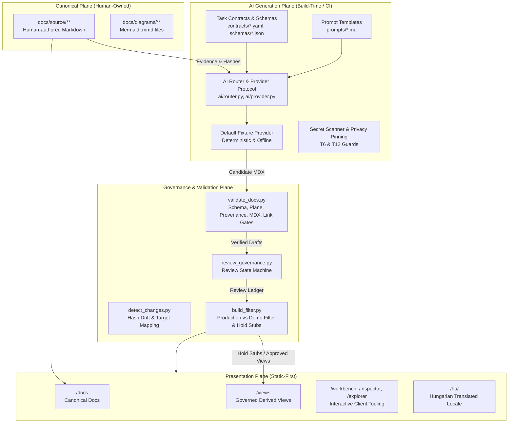

# DOCCAD Prototype Limitations & Architecture Disclosures

**Date**: 2026-10-01  
**Status**: Baseline Stabilized (Phase 0 Exit)  
**System Specification**: DOCCAD Prototype v0.2.0  

---

## 1. System Architecture

DOCCAD enforces a strict architectural boundary between human-owned canonical knowledge, build-time AI-assisted view derivation, and static site publication.

---

## 2. Four-Tier Capability Classification

To maintain absolute transparency and prevent unwarranted claims, DOCCAD categorizes every feature into one of four capability tiers:

### Tier 1: Implemented & Formally Verified Behavior
These capabilities are fully implemented in code and verified by automated tests in this repository:
1. **Two-Plane Separation**: Canonical pages (`docs/source/`) and generated views (`docs/generated/`) are strictly separated across Docusaurus docs plugin instances. Canonical content never imports or cites generated views (`TestPlaneSeparation`).
2. **Mechanical Drift Tracking**: Canonical source files are hashed using `sha256`. Provenance blocks in generated views record these hashes. `detect_changes.py` accurately identifies modified canonical sources and outputs a deduplicated regeneration plan (`TestHashDriftAndRegeneration`, `TestRegenerationPlanExecutable`).
3. **Strict Validation Pipeline**: `validate_docs.py` enforces JSON schemas via `jsonschema` with `referencing`, checks ID uniqueness, validates link allowlists (`contracts/link-allowlist.yaml`), and verifies provenance hashes.
4. **AST MDX Restriction Gate (T3)**: Generated MDX files are scanned and strictly prohibited from using `import`/`export`, `<iframe>`, `<object>`, event handlers, `data:` URLs, or arbitrary unallowlisted JSX (`TestMdxRestrictionGate`, `TestUnsafeMdxRejection`).
5. **Context Secret Sanitization (T6)**: `ai/router.py` automatically scans assembled prompts and evidence payloads for credential patterns (`sk-`, `AIza`, `ghp_`, PEM private keys) and aborts execution before any provider call (`TestContextSecretScan`).
6. **Hard-Pinned Privacy (T12)**: Tasks marked `privacy: private` route strictly to `local`. If local generation is disabled or fails, the router raises `PrivacyRoutingError` immediately with zero cloud fallback (`TestPrivateRoutingPolicy`, `TestRouterFallbackSemantics`, `TestPrivateChainConfig`).
7. **Production Publication Filter & Hold Stubs**: `build_filter.py` stashes unapproved and `approved-for-demo` files to `.work/stashed_unapproved/`, replacing them with valid, honest hold stubs (`type: stub`, `stub_version: 1`, explicit `hold_reason`, no fake approvals or mock generation blocks) (`TestProductionFilterValidity`, `TestBuildFilterExclusion`).
8. **Private Content Isolation**: Canonical and generated documents marked `visibility: private` are stashed prior to production static builds, preventing accidental data leaks (`TestPrivateContentExclusion`).
9. **Dual-Locale Static Publishing**: Docusaurus 3.10.2 builds static assets for both English (`/`) and Hungarian (`/hu/`) locales with `@easyops-cn/docusaurus-search-local` offline search indices for both languages (`npm run build`).
10. **Hungarian Fallback (D11)**: Untranslated canonical documents in secondary locales render localized navigation chrome and fall back gracefully to English source text without 404 errors.

### Tier 2: Deterministic Simulation
These capabilities are implemented as offline simulations for testing and demonstration:
1. **Fixture Provider (`fixture`)**: DOCCAD's default provider is `ai/fixture_provider.py`. It simulates AI generation using deterministic, pre-authored responses aligned with repo schemas. It requires zero API keys, no network access, and zero token spend. It is not an LLM.
2. **Simulated Approval (`approved-for-demo`)**: The CLI governance ledger (`.work/demo_reviews.json`) allows transitioning artifacts to `approved-for-demo`. This is explicitly a demo mechanism to demonstrate workbench workflows. It is never treated as human approval and is blocked from production publication by `check-production`.
3. **Browser Client Workbench**: The interactive Question Workbench at `/workbench` simulates retrieval, drafting, and review entirely in the user's browser client using client-side fixture state. It does not invoke the Python backend.

### Tier 3: Unverified Integrations
These components are implemented in code but have not been executed against external production infrastructure:
1. **Live Cloud AI Providers**: Adapters for Anthropic Claude (`ai/anthropic_provider.py`), OpenAI GPT (`ai/openai_provider.py`), and Google Gemini (`ai/gemini_provider.py`) are implemented. However, no live API requests were made during Phase 0 per run safety rules. Live execution is deferred to Phase 2 under owner credentials and spend caps.
2. **Local Model Provider**: The OpenAI-compatible adapter for local runtimes (`ai/local_provider.py`) is implemented but unverified against a live Ollama or vLLM daemon.
3. **GitHub Actions Workflows**: Workflow definitions for CI (`ci.yml`), generation (`generate.yml`), and deployment (`publish.yml`) will be created in Phase 1; live execution requires repository push to GitHub.
4. **Interactive Browser Verification**: Visual verification using the Antigravity 2.0 `/browser` slash command is an interactive human procedure and is documented as NOT RUN in automated CI logs.

### Tier 4: Deferred Production Work
These features are intentional design decisions deferred to future phases or owner approval:
1. **Automated End-to-End Browser Testing**: Integration of `@playwright/test` was evaluated and deferred per owner decision E6 (dependency minimization).
2. **Mermaid-CLI Pre-Compilation Gate**: CI-level diagram compilation via `@mermaid-js/mermaid-cli` is planned for Phase 1 (P1-08) but currently blocked awaiting owner dependency approval (E6).
3. **Cryptographic Human Approval Records**: Replacing `approved-for-demo` with mandatory human pull request approval metadata (`approval_record: {pr, approved_by, approved_at}`) is scheduled for Phase 1 (P1-05).
4. **Automated PR Dispatch Bot**: Automated generation PR creation using a GitHub App installation token is scheduled for Phase 1 (P1-06).

---

## 3. Requirement-to-Evidence Matrix

| Requirement | Description | Primary Implementing Files | Test Class / Verification | Status |
|---|---|---|---|---|
| **REQ-001** | Git Repository Source of Truth | `docs/source/**`, `prototype/` | Git branch `next-version`, file-based tracking | **VERIFIED** |
| **REQ-002** | Docusaurus 3.x Foundation | `docusaurus.config.ts`, `package.json` | `npm run build`, `npm run typecheck` | **VERIFIED** |
| **REQ-003** | Structural Plane Separation | `scripts/validate_docs.py` | `TestPlaneSeparation` | **VERIFIED** |
| **REQ-004** | AI in CI / PR-Gated Only | `scripts/generate_page.py`, `scripts/review_governance.py` | `TestBuildFilterExclusion`, `TestProductionFilterValidity` | **VERIFIED** |
| **REQ-005** | Provider Abstraction & Routing | `ai/router.py`, `ai/provider.py`, `ai.config.yaml` | `TestRouterFallbackSemantics`, `TestPrivateRoutingPolicy` | **VERIFIED** |
| **REQ-006** | Static Serving (Zero Runtime AI) | `docusaurus.config.ts`, `src/pages/index.tsx` | `npm run build && npm run serve` | **VERIFIED** |
| **REQ-007** | Task Contracts & Schemas | `contracts/*.yaml`, `schemas/*.schema.json` | `TestValidatorDependencyMode`, `TestLivePagePipeline` | **VERIFIED** |
| **REQ-008** | Mechanical Provenance & Drift | `scripts/detect_changes.py`, `scripts/validate_docs.py` | `TestHashDriftAndRegeneration`, `TestRegenerationPlanExecutable` | **VERIFIED** |
| **REQ-009** | Governed Derived Views | `docs/generated/recruiter/`, `docs/generated/interview/` | `npm run validate`, `npm run detect` | **VERIFIED** |
| **REQ-010** | Reader Trust & Non-Fabrication | `docs/source/security/prompt-injection-defense.md` | `TestDeterministicRetrievalAndGeneration`, P0-13 truth alignment | **VERIFIED** |
| **REQ-011** | Knowledge Discovery Tooling | `src/components/KnowledgeExplorer/`, `DriftInspector/` | `npm run build`, search local plugin | **VERIFIED** |
| **REQ-012** | Human Governance Ledger | `scripts/review_governance.py` | `TestReviewGovernanceStateTransitions` | **VERIFIED** |
| **REQ-013** | Hungarian Localization | `i18n/hu/**`, `src/pages/index.tsx` | `npm run build`, `GATE-HU-HERO`, D11 fallback verification | **VERIFIED** |
| **REQ-014** | Comprehensive Architecture Spine | `docs/source/architecture/`, `docs/diagrams/` | 29 canonical documents validated, 7 Mermaid diagrams | **VERIFIED** |
| **REQ-015** | Runnable Validated Prototype | `tests/test_doccad.py`, `VALIDATION.md`, `DEMO.md` | 75 unit tests (0 expected failures), `npm run validate` | **VERIFIED** |
| **REQ-016** | Security Architecture & Defense | `ai/router.py`, `validate_docs.py`, `link-allowlist.yaml` | `TestMdxRestrictionGate`, `TestContextSecretScan`, `TestExternalLinkAllowlist` | **VERIFIED** |
