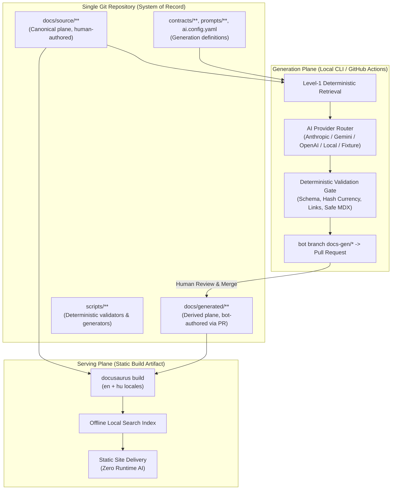

# System Architecture Spine

<!-- Archive mapping: Adapted from 04_ARCHITECTURE/SAD/ARCHITECTURE-SPINE.md -->

DOCCAD's architecture follows a single core paradigm: **docs-as-code, static-first, AI-in-CI**.

One Git repository is the system of record; the published documentation is a pure static build artifact; and AI is an isolated generation plane that only writes through pull requests.

## Architectural Spine Overview

## Architectural Tenets (AD-1 through AD-15)

1. **AD-1: Single Repository, Files Only**: No runtime datastore; anything the system knows is a versioned file.
2. **AD-2: Docusaurus 3.x Publishing Foundation**: Docusaurus MDX + frontmatter is the sole production presentation layer.
3. **AD-3: Two Structurally Separated Content Planes**: `docs/source/` (route `/docs`) and `docs/generated/` (route `/views`) are independent docs-plugin instances.
4. **AD-4: AI Runs Only in CI / CLI**: Generation runs in local shells or CI jobs; no serving-time LLM endpoints exist.
5. **AD-5: Thin Provider Abstraction**: A single ~40-line protocol without bloated multi-agent dependencies.
6. **AD-6: Task Contracts**: Generation is governed by typed YAML contracts (`contracts/*.yaml`).
7. **AD-7: Level-1 Deterministic Retrieval**: Files explicitly declared + frontmatter closures.
8. **AD-8: Provenance via Frontmatter, Drift via Hashes**: Every generated page records `sha256` source digests.
9. **AD-9: PR-Gated Persistence**: Generated files merge only through human-approved pull requests.
10. **AD-10: Deterministic-First Validation**: Schema, lint, and hash checks block merges before any advisory AI reviews.
11. **AD-11: Build-Time Career Views**: Recruiter and interview views are committed artifacts.
12. **AD-12: Filesystem i18n**: English canonical, Hungarian (`hu`) localized with fallback.
13. **AD-13: Build-Time Local Search**: Static offline search index; no third-party SaaS search required.
14. **AD-14: Static Deployment**: Site deploys to GitHub Pages or static web servers.
15. **AD-15: Untrusted-Content Boundary**: User input and repository files enter prompts strictly as data.
