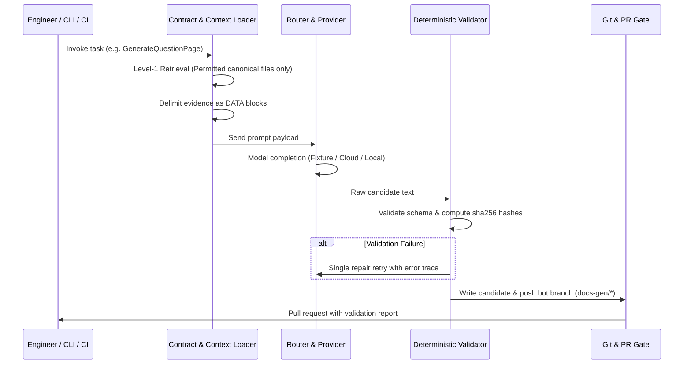

# Generation Pipeline Lifecycle

<!-- Archive mapping: Adapted from 06_AI_DOCUMENTATION/model-strategy/ai_architecture.md §5 -->

Every artifact generated in DOCCAD proceeds through an immutable eight-step lifecycle:

## Lifecycle Steps

1. **Contract Ingestion**: Load YAML contract from `contracts/` and verify requested input parameters.
2. **Deterministic Context Retrieval**: Gather canonical evidence matching `allowed_evidence` path globs. Reject any generated pages or files outside the allowlist.
3. **Prompt Compilation**: Assemble prompt template from `prompts/`. Wrap each evidence file in `<<<EVIDENCE-DATA` delimiters to prevent prompt injection.
4. **Router Execution**: Resolve the active provider chain from `ai.config.yaml`. Execute the primary provider (e.g. `fixture` in demo mode, or cloud provider with fallback).
5. **Output Parsing**: Extract YAML frontmatter and markdown body from model output.
6. **Deterministic Quality Gates**: Validate output against schemas, test internal links, ensure external links match the allowlist, and check for unsafe `<script>` constructs.
7. **Provenance Stamping**: Recompute `sha256` hashes for all evidence sources and stamp them into frontmatter alongside model, provider, and timestamp.
8. **PR Branch Persistence**: Commit candidate files to an isolated `docs-gen/*` branch and open a PR. Never commit directly to `main`.
