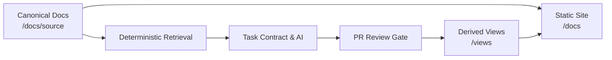

# DOCCAD — GitHub-Native AI Documentation System

<!-- Archive mapping: Adapted from 00_PROJECT_CONTROL/PROJECT_INDEX.md and 01_PROJECT_KNOWLEDGE/VISION.md -->

Welcome to **DOCCAD**, an open-architecture, GitHub-native documentation ecosystem designed for high-assurance engineering teams. DOCCAD transforms version-controlled canonical project knowledge into governed, evidence-backed derived views.

## The Core Philosophy

Traditional technical documentation suffers from two failure modes:
1. **Manual Drift**: Architecture documents, runbooks, and API guides slowly fall out of sync with actual code implementations.
2. **AI Hallucination & Pollution**: Ungoverned AI tools inject unverified assertions, imaginary metrics, and deprecated practices directly into source repositories.

DOCCAD eliminates both problems by establishing **Two Structurally Separated Content Planes**:
- **The Canonical Plane (`/docs`)**: Human-authored, reviewed, and immutable to automated generation. This is the single source of truth.
- **The Derived Plane (`/views`)**: AI-generated views (such as recruiter summaries, interview guides, and dedicated question answers) produced strictly from canonical evidence through PR-gated workflows.

## Key System Tenets

- **Docs-as-Code**: Everything is a version-controlled file in Git. No runtime database, no vector database, and no proprietary content silos.
- **AI-Free Static Serving**: The published documentation is a static website (Docusaurus 3.x). Readers and search engines access documentation with zero runtime AI latency, cost, or outage vulnerability.
- **Deterministic Level-1 Retrieval**: Context assembly uses exact file paths, frontmatter dependency closures, and keyword scanning. Retrieval is deterministic, reproducible, and verifiable in pull requests.
- **Hash-Based Mechanical Drift**: Every generated view records the `sha256` content hash of each canonical file used as evidence. When a source file changes, CI flags only affected derived pages as stale.
- **Anti-Overengineering**: The platform is designed to be operated and maintained by a single capable engineer.

## Architecture at a Glance

## Navigation Quicklinks

- **Architecture**: [System Overview](/docs/architecture/system-overview) | [Content Planes](/docs/architecture/content-planes) | [AI Generation Plane](/docs/architecture/ai-generation-plane)
- **Decisions**: [ADR-001: Source of Truth](/docs/decisions/adr-001-github-source-of-truth) | [ADR-002: Docusaurus 3.x](/docs/decisions/adr-002-docusaurus-foundation) | [ADR-003: Content Planes](/docs/decisions/adr-003-canonical-generated-separation)
- **Workflow**: [Validation Gates](/docs/validation/quality-gates) | [Drift Detection](/docs/validation/drift-detection)
- **Security**: [Trust Boundaries](/docs/security/trust-boundaries) | [Prompt Injection Defenses](/docs/security/prompt-injection-defense)
