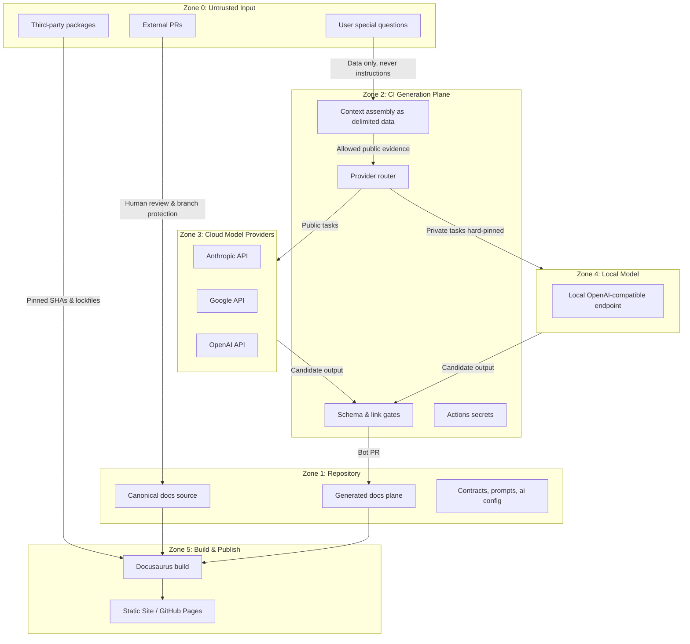

# Security Architecture & Trust Boundaries

<!-- Archive mapping: Adapted from 04_ARCHITECTURE/SAD/security_architecture.md -->

DOCCAD's security model is designed around a fundamental premise: **the published documentation is a static build artifact with zero runtime server footprint**. Attack vectors targeting live application servers, database injection, or serving-time LLM jailbreaking are eliminated by construction.

## The Six Trust Zones

DOCCAD divides the documentation lifecycle into six distinct trust zones:

## Boundary Crossing Invariants

1. **Z0 -> Z2 (Input to Context)**: User questions enter prompts purely as delimited string data (`<<<EVIDENCE-DATA`).
2. **Z2 -> Z3 (CI to Cloud)**: Only content explicitly classified as public may be transmitted to cloud providers.
3. **Z2 -> Z4 (Private Tasks)**: Tasks marked `privacy: private` are hard-pinned to local execution. Cloud fallback is prohibited.
4. **Z3/Z4 -> Z1 (Model Output to Repo)**: Generated text must pass schema validation and is persisted only through PR branches requiring human review.
