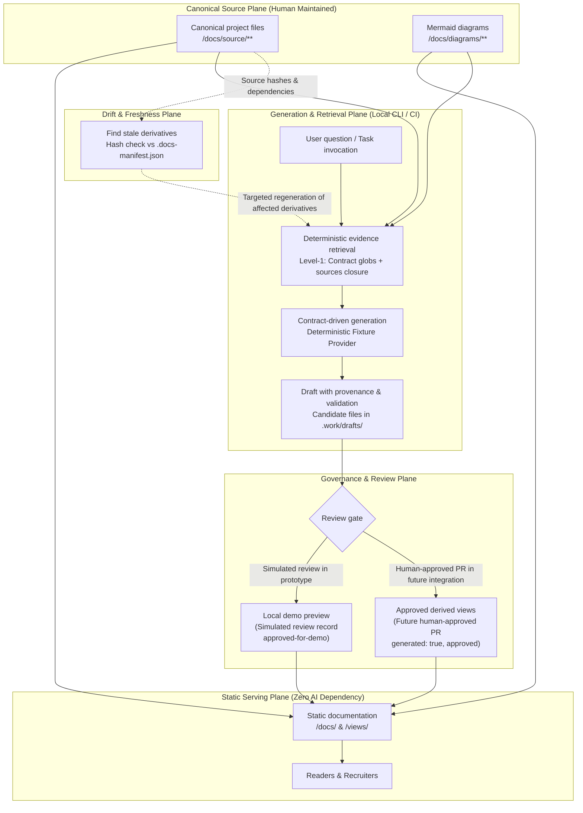

# DOCCAD Prototype Concept & System Architecture

Status: Prototype Design Baseline  
Environment: Antigravity 2.0 / Gemini 3.8 Flash (Execution Model)  
Target Mode: Offline Deterministic Demonstration (Fixture Provider)

---

## 1. Product Purpose

**DOCCAD** is a GitHub-native, AI-augmented documentation ecosystem engineered for high-integrity, evidence-grounded software documentation. It bridges the gap between versioned source knowledge (code, architecture documentation, decisions, and system diagrams) and audience-specific derived documentation (recruiter profiles, interview preparation, technical manuals, and dedicated question answers).

DOCCAD operates on four fundamental tenets:
1. **Docs-as-Code & Files over Databases**: The single source of truth is version-controlled files in Git. There is no runtime database, vector database, or dynamic backend.
2. **Two Structurally Separated Content Planes**: Canonical human-authored documentation (`docs/source/`, served at `/docs`) is strictly segregated from AI-derived views (`docs/generated/`, served at `/views`). Generated content can cite canonical content; canonical content never imports or depends on generated content.
3. **Static-First & AI-Free Serving**: The published documentation website is a pure static build (Docusaurus 3.x). Readers access documentation with zero runtime AI dependencies. If every AI provider is offline, reading, searching, and canonical authoring remain 100% functional.
4. **Governed, Evidence-Bounded Generation**: AI runs exclusively in CI or a developer's CLI. Every generation task is bound by a strict task contract, allowed evidence globs, deterministic retrieval (Level 1), schema validation, and human PR approval gates.

---

## 2. Reader Roles & Personas

| Role | Primary Objectives | Key Touchpoints |
|---|---|---|
| **Reader / Engineer** | Understand system architecture, installation, operation, and troubleshooting. Browse canonical knowledge with search, cross-references, and diagrams. | `/docs/**`, Local Search, System Spine |
| **Architect / Technical Lead** | Review Architectural Decision Records (ADRs), inspect trust boundaries, verify provenance, and trace system drift. | `/docs/architecture/**`, `/docs/decisions/**`, Drift Inspector |
| **Contributor / Developer** | Author canonical documents, run local validation, inspect evidence-bounded generation drafts, and contribute via PRs. | CLI Tooling (`validate_docs.py`, `detect_changes.py`), `/docs/development/**` |
| **Recruiter / Hiring Manager** | Quickly evaluate architectural skills, engineering rigor, and technical depth without reading internal noise. | `/views/recruiter/project-overview` (30s elevator pitch, 2min summary, deep-dive mode) |
| **Interviewer / Candidate** | Review grounded interview prep cards with verified tradeoffs, concepts, likely questions, and citations. | `/views/interview/**` (`<InterviewPrep>` components) |
| **Reviewer / Governer** | Audit generation runs, inspect evidence inclusions/exclusions, verify sha256 hashes, review candidate drafts, and enforce publication boundaries. | Question Workbench, Review Governance CLI, `.docs-manifest.json` |

---

## 3. Core Entities & Data Model

All entities are represented as versioned files, JSON schemas, or frontmatter contracts:

```
+------------------+         +------------------+         +----------------------+
|     Document     | 1     * | SourceReference  | *     1 |  DependencyManifest  |
|  (Canonical or   |-------->| (Path + sha256   |-------->| (.docs-manifest.json |
|    Generated)    |         |  Content Hash)   |         |    & impact.json)    |
+------------------+         +------------------+         +----------------------+
         | 1                          ^                              ^
         |                            |                              |
         v 1                          | (evidence closure)           |
+------------------+         +------------------+                    |
| GenerationRecord | 1     1 |  GenerationRun   |                    |
| (Frontmatter /   |-------->| (Execution Meta, |                    |
|  Provenance)     |         |  Provider, Time) |                    |
+------------------+         +------------------+                    |
                                      ^                              |
                                      |                              |
+------------------+ 1       1        |                              |
| QuestionRequest  |------------------+                              |
| (Text, Audience, |                                                 |
|  Privacy Class)  |                                                 |
+------------------+                                                 |
         | 1                                                         |
         v 1                                                         |
+------------------+                                                 |
|   ReviewRecord   |-------------------------------------------------+
| (draft | review  |  (Simulated Review in Demo;
|  approved | rej) |   PR & Branch Protection in Production)
+------------------+
```

1. **Document**: A Markdown/MDX page declaring stable `id`, `title`, `type` (`canonical` or `generated`), `audience`, `sources`, `owners`, `related`, and `last_validated`.
2. **SourceReference**: A canonical document or repository file cited as evidence, tracked with an immutable relative path and `sha256` content hash.
3. **GenerationContract**: A declarative YAML specification (`contracts/*.yaml`) defining allowed evidence paths, input parameters, output schemas, quality gates, and prohibited claims (invented metrics, ungrounded technologies).
4. **GenerationRun**: An executed generation session tracking contract version, prompt template, provider (`fixture`), model (`deterministic-demo-fixture`), mode (`demo`), evidence closure, and token metrics.
5. **QuestionRequest**: A structured user question query containing question text, target audience, and privacy classification (`public` vs `private`).
6. **ReviewRecord**: A governance ledger entry tracking draft state (`draft`, `in-review`, `approved-for-demo`, `rejected`), reviewer notes, and simulated approval timestamps.
7. **ValidationResult**: A structured report of deterministic checks (frontmatter schema, plane containment, ID uniqueness, citation resolution, link allowlist, and hash verification).
8. **DependencyManifest**: The repository-wide index (`.docs-manifest.json` and `impact.json`) recording the bidirectional graph between canonical sources, code paths, and derived views.

---

## 4. Module Boundaries & Content Lifecycle



### Boundary Rules
- **Canonical Independence**: Canonical documentation (`/docs`) can be built, published, and read completely independent of the generation plane.
- **Evidence Containment**: Generation tasks are strictly forbidden from retrieving or citing generated pages as evidence. Only human-approved canonical pages and allowlisted repository files can enter the context.
- **Privacy Hard-Pinning**: Tasks classified `privacy: private` are hard-pinned to local/fixture execution; any cloud provider fallback is blocked by policy and raises an immediate termination error.
- **Simulated vs Production Approval**: Simulated approvals within the prototype only modify the demo review record (`approved-for-demo`) and demo preview builds. Production publication builds strictly require verified human PR approval.
